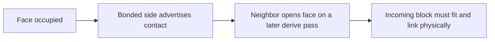

<!-- Literature survey made on 2026-09-25 by a research agent for this project. Web search worked but full-text fetching was
     blocked, so citations and headline results were checked against search abstracts; details marked (check) are from memory
     and should be verified before relying on them. -->

# Literature survey: mechanisms for emergent complexity under strict locality

**Historical context:** the original survey below predates translation and stacks.
Its statements that the project has only copying or one replication mode describe
that earlier state. See the dated updates and RESULTS 34–55 for subsequent tests.

**How this was researched.** WebSearch worked, but WebFetch was blocked for every host I tried (arxiv, PMC, PLOS, university sites), so no full papers could be read. Citations and headline results below were checked against search abstracts. Finer details, such as exact rule sets, come from my own knowledge of the papers and are marked "(check)" where they matter. No files in the repo were modified.

**How each item is judged.** Read against the repo's RESULTS 33, the current blockers are three:
- **Valley.** A new gene (`CDC` inside `PABAQ`) needs about three insertions that pay nothing until the gene is complete, and each insertion costs a bond that radiation can break.
- **Machines.** Every function so far is a *motif rule* acting on the strand that carries it. Nothing is built by a strand that is not a copy of it.
- **Coupling.** Only one replication mode exists.

Each item below is scored against these three.

---

## 1. Physical self-replication of passive units

**L.S. and R. Penrose, "Self-reproducing machines", *Scientific American* 200(6):105–114, 1959.** Also "A self-reproducing analogue", *Nature* 179:1183 (1957), and L.S. Penrose, "Mechanics of self-reproduction", *Ann. Hum. Genet.* 23:59 (1958). [SciAm](https://www.scientificamerican.com/article/self-reproducing-machines/), [Nature 1957](https://www.nature.com/articles/1791183a0)
- **Mechanism.** Plywood "tilt blocks" of types A and B slide on a shaken track. A lone unit cannot link to another lone unit. An interlocked AB (or BA) pair tilts its neighbours so that free units lock into a second AB pair, which then separates. That is one bit of heredity (AB begets AB, BA begets BA) with no program anywhere.
- **Later designs.** Penrose's later units store mechanical "energy" in a latch. The linked structure grows to double size, and the last unit to join trips the release, so it splits into two (check the exact trigger design in the 1958 paper).
- **Mapping.** This is the ancestor of the block world. The rule "a lone monomer cannot bond, a bonded one can" is the project's cooperative docking and `pUndock`. The one idea not yet used is the *triggered split*: a structure that grows by addition and splits in two when a local signal (a latch state) reaches the join. Here that would be one block state (`LATCH`), set when both lateral sides are bonded and relayed one block per pass. A bond breaks when two `LATCH` sides meet.
- **Risk.** In a 1-D strand world, template copying already does everything Penrose did. The latch idea matters only for a second, non-template assembly (see crystals, section 2).

**H. Jacobson, "On models of reproduction", *American Scientist* 46:255–284, 1958.** [ref](https://en.wikipedia.org/wiki/Homer_Jacobson)
- **Mechanism.** Toy train cars of two kinds (head and tail) circulate on a track with sidings. A head-tail "organism" uses fixed local switching rules to pull matching cars from sidings and assemble a copy.
- **Mapping.** Same lesson as Penrose: a sequence copied by local rules from parts drifting past. Nothing new for this project, except as a clean historical citation.

**S. Griffith, D. Goldwater, J. Jacobson, "Self-replication from random parts", *Nature* 437:636, 2005.** [Nature](https://www.nature.com/articles/437636a), [PDF](https://cba.mit.edu/docs/papers/05.09.Nature.pdf)
- **Mechanism.** Tiles float on an air table. Each carries a two-colour bit and a small state machine and bonds through switchable magnets. A seed string makes free tiles bond face to face where the colours match. Neighbours link, and a signal passed along the string releases the copy, which then copies itself (exponential). This is almost exactly what the block world does.
- **The link that matters: folding.** Griffith's follow-up work shows that a 1-D string of polygonal modules with per-joint angles can fold into *any* 2-D shape. That is a universal sequence-to-shape map: **K. Cheung, E. Demaine, J. Bachrach, S. Griffith, "Programmable assembly with universally foldable strings (moteins)", *IEEE Trans. Robotics* 27(4):718–729, 2011** ([paper](https://erikdemaine.org/papers/Moteins_TRO/)).
- **Mapping.** The project has `foldA..D` (a letter folds when its face is free). Moteins say that a small alphabet of fold angles, with the angle set by each letter, is enough for arbitrary shapes. Folded strands could then become functional parts: rings, hooks, pockets.
- **Risk.** A fold that does nothing is only a shape. It needs a physical consequence, such as a face hidden or exposed, or a pocket that holds a particle.

**V. Zykov, E. Mytilinaios, B. Adams, H. Lipson, "Self-reproducing machines", *Nature* 435:163, 2005 (molecubes).** [PubMed](https://pubmed.ncbi.nlm.nih.gov/15889080/)
- **Mechanism.** Actuated cubes, each carrying the whole program, stack copies of the robot from supplied cubes.
- **Relevance.** Low. The parts are smart robots and replication is scripted. It violates the "no copy rule" spirit.

**Freitas & Merkle, *Kinematic Self-Replicating Machines*, Landes Bioscience, 2004.** [online](https://www.molecularassembler.com/KSRM.htm)
- Encyclopaedic survey. Its taxonomy of replicators (template vs. constructor, passive vs. active parts, "vitamin" parts) is a useful checklist.

**Other passive-part replicators worth citing:**
- **Virgo, Fernando, Bigge & Husbands, "Evolvable physical self-replicators", *Artificial Life* 18(2):129–142, 2012** ([MIT Press](https://direct.mit.edu/artl/article/18/2/129/2705/Evolvable-Physical-Self-Replicators)). Magnet-bearing plastic pieces on an air-hockey table do enzyme-free template replication. They argue template replication is *the* route to hereditary variation. This is the closest real-world twin of this project.
- **Smith, Turney & Ewaschuk, "Self-replicating machines in continuous space with virtual physics" (JohnnyVon), *Artificial Life* 9(1):21–, 2003** ([arXiv](https://arxiv.org/abs/cs/0304022), [code](https://github.com/pdturney/johnnyvon)). Two kinds of codon particles with finite-state internals and spring physics. Strings replicate by templating, and replicators arise spontaneously from a soup. A follow-up makes strands self-assemble into meshes ("Self-replicating strands that self-assemble into user-specified meshes", [arXiv cs/0502087](https://arxiv.org/pdf/cs/0502087)). That is a template strand *building a different structure*, which is relevant to translation (section 3).
- **Zeravcic & Brenner, "Self-replicating colloidal clusters", *PNAS* 111:1748, 2014** ([PNAS](https://www.pnas.org/doi/10.1073/pnas.1313601111)). Spheres whose interactions switch on and off with time or state make clusters that template other clusters. The authors call it a realization of Dyson's exponentially growing metabolism. Replication of 2-D/3-D *shapes*, not strings, needs state-dependent stickiness, exactly the kind of "side state" the block world has.

---

## 2. Algorithmic tile self-assembly and crystal replication

**E. Winfree, *Algorithmic Self-Assembly of DNA*, PhD thesis, Caltech, 1998; Rothemund, Papadakis & Winfree, *PLoS Biol* 2:e424, 2004 (Sierpinski triangles).**
- **Mechanism.** Square tiles have four typed "glues". At "temperature 2" a tile attaches only where *two* of its sides match the growing crystal (cooperative binding). Each new row is then computed from the row before, like a cellular automaton written in matter.
- **Mapping.** Blocks are already squares with four sides. A tile kind needs:
  - a letter with glues on all four sides (F, K, L, R), say labels 0/1 on F and K plus a row label on L/R;
  - a bond rule "a free tile sticks only if two adjacent sides both match". This is local: each side reads its partner's state, and the block counts its own bonded sides.

  That is cooperative docking generalised to 2-D.
- **Risk.** The polygon physics must hold 2-D lattices together flush, and `snapCorners` helps here. Errors (a tile held by one matching side only) are the known enemy. Tile theory's fixes (proofreading tiles, snaked blocks) are all local.

**R. Schulman, B. Yurke, E. Winfree, "Robust self-replication of combinatorial information via crystal growth and scission", *PNAS* 109:6405–6410, 2012.** [PNAS](https://www.pnas.org/doi/10.1073/pnas.1117813109)
- **Mechanism.** The information is a sequence written *across* a ribbon's width. Growth copies it into every new row, as in a zig-zag ribbon. Mechanical scission (shear) breaks ribbons, and every fragment carries the full sequence, so each piece seeds new growth. The result is exponential replication with no strand separation and no product inhibition.

**R. Schulman & E. Winfree, "Simple evolution of complex crystal species", DNA16, LNCS 6518:147, 2011; *Natural Computing* 2012.** [PDF](https://www.dna.caltech.edu/Papers/simple-ca-evolution2011-LNCS.pdf)
- Scarcity of one monomer type drives the evolution of arbitrarily complex crystal patterns from 12 tile types.

**Mapping for both Schulman papers.** This is a second, *coupleable* replication mode, and it *inverts the fragment problem*. In a ribbon, the unit of heredity is a row. Breaking a ribbon lengthwise gives two full copies, not two halves of a genome. Blocks would need:
1. a "tile" state of letters (or a new type) in which all four sides bond, with typed glues;
2. cooperative two-side attachment;
3. scission by the existing `maxStrain` or radiation.

Coupling to strands: a template strand acts as the *seed row* (the tile's K side docks on a strand letter's K or F), so the strand's sequence nucleates a ribbon that carries it, the way a gene makes a crystal. Evolution then acts on ribbon width (information length) and on errors that change the rule.

**Risk.** Ribbons compete for tiles and may simply outgrow strands. Width is fixed once nucleated, so information length cannot grow except by rare width-changing errors. A ribbon also has no function beyond existing unless its shape does something (a wall, a trap).

**A.G. Cairns-Smith, *Genetic Takeover and the Mineral Origins of Life*, Cambridge UP, 1982** (and *J. Theor. Biol.* 10:53, 1966).
- **Mechanism.** The first genes were defect patterns in clay crystals, copied as layers grew and cleaved. Organic molecules first helped the crystal replicate, then became replicators themselves and took over.
- **Mapping.** Relevant as *two replication modes coupled*. A crude crystal replicator (above) could host strands that improve it, such as a strand that seeds or stabilises ribbons. Selection could then shift heredity from ribbon to strand. This is a scenario, not a rule, and it is hard to make happen on purpose.

**Signal-passing tiles:** Hendricks, Patitz & Rogers, "Replication of arbitrary hole-free shapes via self-assembly with signal-passing tiles", 2015 ([arXiv 1503.01244](https://arxiv.org/pdf/1503.01244)); Alseth, Hader & Patitz, "Self-replication via tile self-assembly", DNA27, 2021 ([DROPS](https://drops.dagstuhl.de/entities/document/10.4230/LIPIcs.DNA.27.3)); "Universal shape replication via self-assembly with signal-passing tiles", DNA28, 2022 ([DROPS](https://drops.dagstuhl.de/entities/document/10.4230/LIPIcs.DNA.28.2)).
- **Mechanism.** A tile turns glues on or off when another of its glues binds. That is the block world's "derived side state from bonds" rule, formalised. They prove that shapes, and a genome plus the shape it encodes, can be replicated this way.
- **Why it matters.** It is a rigorous existence proof that "genome plus constructed phenotype" replication is possible with *only* local glue-activation rules.
- **Risk.** The constructions are designed, not evolved, and use many tile types.

**Also:** Wang, Sha, Dreyfus, …, Chaikin, Seeman, "Self-replication of information-bearing nanoscale patterns", *Nature* 478:225, 2011 ([Nature](https://www.nature.com/articles/nature10500)). DNA tile "letters" template complementary seven-tile sequences, separated by temperature cycles. Later work gives exponential growth and selection in origami rafts (*Nature Materials* 2017).

---

## 3. Universal constructors, loops, and Hutton's chemistry

**J. von Neumann (ed. A.W. Burks), *Theory of Self-Reproducing Automata*, U. Illinois Press, 1966.** [SFI note](https://www.sfipress.org/28-von-neumann-1966)
- **Mechanism.** A tape (description) is used twice. It is *interpreted* by a constructor that builds whatever the tape describes, and *copied* uninterpreted. Because the constructor is built from the tape, mutations of the tape can make new machines, which is how complexity can grow.
- **Mapping.** The block world has only the copy half. The missing half is **interpretation**: a tape that builds something *other than itself*. Under strict locality the natural form is translation by adapters (see the shortlist, item 2). A two-faced adapter block pairs its F with a letter on a template and carries a different block type on its K. Adapters docked side by side link their cargo, and the cargo chain is a second polymer whose order the template sets. No rule says "translate": it is docking, lateral linking and release, as now.
- **Risk.** The genetic code (which adapter carries which cargo) is a fixed table, like `compat`. The cargo must *do* something to be selected (section 6).

**Cotler, Hongler & Hudcová, "Self-replication and computational universality", 2025** ([arXiv 2510.08342](https://arxiv.org/abs/2510.08342)). They build a Turing-universal cellular automaton that cannot sustain non-trivial self-replication. The caution: rich rules do not by themselves give constructors.

**Self-replicating loops:** C. Langton, "Self-reproduction in cellular automata", *Physica D* 10:135, 1984; J. Byl, *Physica D* 34:295, 1989; H. Sayama, "A new structurally dissolvable self-reproducing loop evolving in a simple cellular automata space", *Artificial Life* 5(4):343, 1999 (evoloops; also "Toward the realization of an evolving ecosystem on cellular automata", AROB 1999); Salzberg & Sayama, *Complexity* 10(2), 2004; Sayama & Nehaniv, "Self-reproduction and evolution in cellular automata: 25 years after evoloops", *Artificial Life* 31(1):81, 2025 ([MIT Press](https://direct.mit.edu/artl/article/31/1/81/124368/Self-Reproduction-and-Evolution-in-Cellular)).
- **What made evoloops evolve.** Two changes to Langton's loop:
  - *structural dissolution*: a state that erases stuck or dead structures, so there is turnover and free space;
  - robust local rules, under which collisions between loops change their gene sequence instead of just crashing.
- **What evolution did.** It went steadily to *smaller* loops, which replicate faster. Later genetic sequencing found far more hidden genotypic diversity than there were phenotypes.
- **Mapping.** A cautionary mirror: every local replicator world seen so far evolves toward the fastest, simplest replicator. The block world already has dissolution (fraying) and collision variation.
- **Risk.** Evoloops never grew complex. They are evidence *against* expecting complexity from a single replication mode.

**T.J. Hutton, "Evolvable self-replicating molecules in an artificial chemistry", *Artificial Life* 8(4):341–356, 2002 (Squirm3).** [MIT Press](https://direct.mit.edu/artl/article/8/4/341/2413/Evolvable-Self-Replicating-Molecules-in-an), [code](https://github.com/timhutton/squirm3)
- **Mechanism.** Atoms have a type (a–f) and a state (integer). About eight reactions of the form "type+state + type+state (bonded or not) → new states, bond made or broken" are enough. A strand `e8-a1-b1-…-f1` runs a state wave from the `e` end: each strand atom catches a free atom of its own type, the catches link, and at the `f` end the two strands separate.
- **Results.** Replicators arise spontaneously. Mutations come from collisions. Shorter replicators win.
- **Mapping.** Essentially the block world's chemistry, with the same length collapse.

**Hutton, "A functional self-reproducing cell in a two-dimensional artificial chemistry", *ALife IX*, 2004; "Evolvable self-reproducing cells in a two-dimensional artificial chemistry", *Artificial Life* 13(1):11–30, 2007; "Information-replicating molecules with programmable enzymes", HC-2003.** [MIT Press](https://direct.mit.edu/artl/article-abstract/13/1/11/2549/Evolvable-Self-Reproducing-Cells-in-a-Two?redirectedFrom=fulltext)
- **Mechanism.** The genome strip is decoded into enzymes. Each enzyme is a small molecule whose atom sequence *spells a reaction* (reactant types and states, product states, bond change), and the chemistry lets such a molecule catalyse that reaction where it touches (the "programmable enzymes" idea). A membrane loop keeps the enzymes with the genome that made them. Reaction rules also copy the genome and divide the membrane after replication (check the exact division rules in the 2007 paper).
- **Mapping.** The enzyme is a *sequence-parameterised universal rule*: one rule says "a strand whose letters read x, y, z catalyses reaction f(x, y, z) at the block it touches." It is local and mentions no organism, but it is an interpreter built into the physics. A milder version fits the project's existing motif rules: let the *identity* of the three letters around a back set *which* state change it catalyses on a docked particle, giving a combinatorial table instead of three hand-picked motifs (`ABA`, `CDC`, `BAB`). New functions then become reachable by point mutation.
- **Risk.**
  - The user may see "the sequence spells a reaction" as too designed.
  - Hutton's cells evolved little in practice.
  - Enzymes need compartments to stay private, and compartments have not paid here.

**M.W. Lucht, "Size selection and adaptive evolution in an artificial chemistry", *Artificial Life* 18(2):143–163, 2012.** [MIT Press](https://direct.mit.edu/artl/article/18/2/143/2708/Size-Selection-and-Adaptive-Evolution-in-an)
- **Mechanism.** In Squirm3, replicators produce quasi-universal enzymes. *Attaching the enzyme to its own replicator* lets 10-base replicators survive against zero-base parasites. An added pressure toward longer molecules then lets a replicator producing a useful enzyme evolve and dominate.
- **Why it matters.** It is the closest published precedent for the project's "private gene" results and length problem. It confirms that the *enzyme must stay tethered* to its gene, and that length needs its own pressure.
- **Worth checking.** Exactly how Lucht created the size selection.

---

## 4. Chemistry-based theory

**T. Gánti, *The Principles of Life*, Oxford UP, 2003 (chemoton, 1971 onward).**
- **Mechanism.** Three autocatalytic subsystems are coupled *stoichiometrically*: a metabolic cycle, template polymerization, and membrane growth. Template polymerization releases a by-product that the membrane needs, so the membrane grows in step with the genome. Division happens when the surface has doubled, and no controller is needed.
- **Mapping.** The coupling is the idea to take, not the membrane. Make each docking or re-arming step *release a conserved token*: the spent energy particle, or a new state on it, `MEMTOKEN`, that activates a raw membrane block. Then wall material appears where copying happens, at the rate of copying. This is local (a particle's state changes at a back, and that state is read by an M side), conserves blocks, and uses the existing `make` machinery.
- **Risk.** RESULTS 24–25 show walls fail on *speed and sealing*, not on location. The chemoton makes wall growth proportional to copying, which may be too slow.

**F. Dyson, *Origins of Life*, Cambridge UP, 1985 (*J. Mol. Evol.* 18:344, 1982).**
- **Mechanism.** Life had two origins: a metabolism first (self-reproducing but without exact heredity), later parasitised and then domesticated by replicators.
- **Mapping.** It suggests the random-chemistry search (RESULTS 32) should look for *metabolic* autocatalysis (block-state cycles), not heredity, and then add strands.
- **Risk.** Metabolism-first sets lack evolvability (Vasas 2010, below).

**M. Eigen, *Naturwissenschaften* 58:465, 1971; Eigen & Schuster, *The Hypercycle*, Springer, 1979.**
- **Mechanism.**
  - *Error threshold*: genome length is limited to about 1/(error per site) without error correction.
  - *Hypercycle*: n short replicators, each catalysing the next, share information without one long genome.
- **Mapping.** A hypercycle is exactly "several genes without long genomes". In block terms, strand X's motif arms or helps strand Y's kind, and Y helps X's kind. The difficulty is *specificity*, since lock-and-key binding failed (RESULTS 18). A cheap substitute is a pathway on a shared particle (shortlist item 1), where the "catalysis" is of a particle state, not of another strand.
- **Risk.**
  - Hypercycles in a well-mixed world are ruined by parasites.
  - In 2-D space they survive as spiral waves (Boerlijst & Hogeweg, *Physica D* 48:17, 1991), but only with slow diffusion. Here that means `mobS` low, and RESULTS 21 found that is not enough on its own.

**E. Szathmáry & L. Demeter, "Group selection of early replicators and the origin of life", *J. Theor. Biol.* 128:463, 1987 (stochastic corrector).**
- **Mechanism.** Unlinked genes in compartments that divide randomly; compartments with a good gene mix grow faster.
- **Mapping.** It needs dividing compartments, which the project has parked (RESULTS 16, 24, 25).

**Takeuchi & Hogeweg, "Multilevel selection in models of prebiotic evolution II: a direct comparison of compartmentalization and spatial self-organization", *PLoS Comp Biol* 5:e1000542, 2009.** They show 2-D spatial pattern alone can do much of the compartment's job. That is a reason to look for spatial coexistence before walls.

**Kauffman, *J. Theor. Biol.* 119:1, 1986; Hordijk & Steel, "Detecting autocatalytic, self-sustaining sets in chemical reaction systems", *J. Theor. Biol.* 227:451, 2004 (RAF sets).**
- **Mechanism.** A set in which every reaction is catalysed by a member and everything is built from food. Such sets appear with high probability once catalysis is common enough.
- **Counterpoint.** Vasas, Szathmáry & Santos, "Lack of evolvability in self-sustaining autocatalytic networks constrains metabolism-first scenarios", *PNAS* 107:1470, 2010. Vasas et al., "Evolution before genes", *Biology Direct* 7:1, 2012, found that RAF sub-cores can act as units of heredity, but only with compartments.
- **Mapping.** Use RAF detection as an *analysis tool* for the random tables of RESULTS 32. Treat block-state transitions as reactions and the blocks whose bonds enable them as catalysts, and ask whether a table has a closed, food-generated catalytic core.
- **Risk.** A RAF is not heredity. Vasas 2010 says not to expect evolution from it alone.

**Dittrich & Speroni di Fenizio, "Chemical organization theory", *Bull. Math. Biol.* 69:1199, 2007.** Organizations are sets closed under the reactions and self-maintaining. It is the same analysis tool, in a more formal version, useful to classify what random tables settle into.

**Minimal replicators and parabolic growth:**
- G. von Kiedrowski, "A self-replicating hexadeoxynucleotide", *Angew. Chem.* 25:932, 1986.
- Szathmáry & Gladkih, "Sub-exponential growth and coexistence of non-enzymatically replicating templates", *J. Theor. Biol.* 138:55, 1989.
- Sievers & von Kiedrowski, "Self-replication of complementary nucleotide-based oligomers", *Nature* 369:221, 1994 (cross-catalysis).
- Luther, Brandsch & von Kiedrowski, *Nature* 396:245, 1998 (SPREAD: templates fixed on a surface, released stepwise, which gives exponential growth).
- Tjivikua, Ballester & Rebek, *JACS* 112:1249, 1990.
- Lee, Granja, Martinez, Severin & Ghadiri, "A self-replicating peptide", *Nature* 382:525, 1996.
- Lee et al., "Emergence of symbiosis in peptide self-replication through a hypercyclic network", *Nature* 390:591, 1997.
- Lincoln & Joyce, "Self-sustained replication of an RNA enzyme", *Science* 323:1229, 2009 (two ribozymes ligate each other's halves, a cross-catalytic pair).

What they show:
- **Mechanism.** Templates that stay bound to their copies grow parabolically (as the square root), which lets *everyone survive* and blocks selection. Surface release (SPREAD) or strong product release restores exponential growth.
- **Mapping.** The block world already solved release (R1/bond holding), which is why selection works here. The warning applies to binding (`pHyb`, RESULTS 29): any rule that leaves strands paired brings back parabolic growth.
- **The useful lead: cross-catalysis** (Sievers 1994; Lincoln & Joyce 2009; Ghadiri 1997). Two *different* strands, each templating the other's formation from its pieces, give obligate coupling. `compCopy` (A docks on B) already makes every strand the cross-catalyst of its complement.

**Ligation-based replication and the separation problem:**
- **Toyabe & Braun, "Cooperative ligation breaks sequence symmetry and stabilizes early molecular replication", *PRX* 9:011056, 2019** ([APS](https://link.aps.org/doi/10.1103/PhysRevX.9.011056)).
- **Kudella, Tkachenko, Salditt, Maslov & Braun, "Structured sequences emerge from random pool when replicated by templated ligation", *PNAS* 118:e2018830118, 2021** ([PNAS](https://www.pnas.org/doi/10.1073/pnas.2018830118)).
- **Tkachenko & Maslov, "Onset of natural selection in populations of autocatalytic heteropolymers", *J. Chem. Phys.* 149:134901, 2018** ([AIP](https://pubs.aip.org/aip/jcp/article/149/13/134901/196988/Onset-of-natural-selection-in-populations-of)).
- **Fernando, von Kiedrowski & Szathmáry, "A stochastic model of nonenzymatic nucleic acid replication: 'elongators' sequester replicators", *J. Mol. Evol.* 64:572, 2007** ([Springer](https://link.springer.com/article/10.1007/s00239-006-0218-4)).
- **Juritz, Poulton & Ouldridge, "Minimal mechanism for cyclic templating of length-controlled copolymers under isothermal conditions", *J. Chem. Phys.* 156:074103, 2022** ([AIP](https://pubs.aip.org/aip/jcp/article/156/7/074103/2840795/Minimal-mechanism-for-cyclic-templating-of-length)).

What they show:
- **Mechanism.**
  - Short oligomers hybridise on templates and are joined, with heat cycles separating the strands. Sequence structure and elongation emerge.
  - Fernando et al. warn that long "elongators" soak up material.
  - Ouldridge's group shows how to get product release *isothermally*: use part of the linking free energy to break copy-template bonds *behind the growing edge*, and weaken the last bond.
- **Mapping.**
  - Copying currently goes monomer by monomer. Letting a *short strand* dock as one piece where its face sequence matches (templated ligation of oligomers) makes whole motifs the units of copying and recombination. A gene can then enter a genome in one event.
  - Ouldridge's "release behind the edge" is a purely local rule the project nearly has (R1 plus bond holding). Its extension, "a docked unit releases its face when *both* its lateral neighbours are linked", gives a processive zipper with product release during growth, which is the natural substrate for a walker or polymerase (section 6).
- **Risk.** Oligomer docking needs a check that the whole piece's faces all match. Locally, each block docks and holds only if its lateral neighbour also docked (cooperativity again), which is doable. Chimeras and elongator sequestration are the known failure modes.

**W. Fontana, "Algorithmic chemistry", *Artificial Life II*, 1992; Fontana & Buss, "The arrival of the fittest", *Bull. Math. Biol.* 56:1, 1994.**
- **Mechanism.** In AlChemy (λ-calculus molecules), *level 0* is dominated by self-copiers. When self-copying is *forbidden*, *level 1* self-maintaining organizations appear, and level 2 organizations of organizations follow.
- **Mapping.** The lesson is that suppressing the trivial replicator lets collective organizations appear. The project did exactly this with `endLoss` + bare caps, and a two-gene genome held (RESULTS 33). A further step in that direction: forbid a strand from templating its *own* kind at all (pure `compCopy`), so that every lineage is a two-member cycle, then look for longer cycles.
- **Risk.** AlChemy's organizations were not physical and had no space.

**N. Ono & T. Ikegami, "Self-maintenance and self-reproduction in an abstract cell model", *J. Theor. Biol.* 206:243–253, 2000** (also ECAL'99, [arXiv adap-org/9905002](https://arxiv.org/abs/adap-org/9905002)).
- **Mechanism.** Lattice particles with catalytic production and repulsion self-organise into cells that keep up their membrane and divide on their own. There are no designed division rules; the membrane precursor is made inside and repels water.
- **Mapping.** The cell is a reaction-diffusion structure made of *turnover*, not a fixed wall: membrane made continuously inside, decaying outside.
- **Risk.** It needs block conversion (particle A becomes membrane M). That fits "state change, not type change" if M-raw/M-active states are used, but all compartment work here has failed on speed.

**Czárán & Szathmáry (2000) metabolic replicator model; Könnyű, Czárán & Szathmáry, "Prebiotic replicase evolution in a surface-bound metabolic system: parasites as a source of adaptive evolution", *BMC Evol. Biol.* 8:267, 2008** ([Springer](https://link.springer.com/article/10.1186/1471-2148-8-267)); **Czárán et al., *J. Theor. Biol.* 2015 (overview).**
- **Mechanism.** Replicators sit on a mineral surface. Each type catalyses one step of a shared metabolism, and a replicator can copy only if *all* the needed enzyme types are in its local neighbourhood. Different genes coexist unlinked, held by the locality of metabolism alone, and new enzyme specialisations evolve from parasites.
- **Mapping.** This is the best-matched theory for "several genes without long genomes". See the shortlist, item 1.

---

## 5. How new genes and new functions arise

**Lenski, Ofria, Pennock & Adami, "The evolutionary origin of complex features", *Nature* 423:139, 2003 (Avida).** [Nature](https://www.nature.com/articles/nature01568)
- **Result.** EQU (a complex logic function) evolved *only* when simpler functions along the way were also rewarded. Some steps were even deleterious when they appeared, and the final step was one or two mutations.
- **Mapping.** RESULTS 33 ("a gene from nothing") failed because `CDC` pays nothing until complete. Make functions *graded*:
  - `shield` strength rises with the number of C–D lateral pairs (C next to D protects that bond);
  - `feed` gives half-arming for `AB` and full arming for `ABA`.

  Each insertion then pays a little. It is one rule change, local, and directly tests the Lenski result here.
- **Risk.** Graded benefit may just select for a *different* short optimum, such as `CD` alone.

**Bergthorsson, Andersson & Roth, "Ohno's dilemma: evolution of new genes under continuous selection", *PNAS* 104:17004, 2007 (innovation–amplification–divergence).** [PNAS](https://www.pnas.org/doi/10.1073/pnas.0707158104)
- **Mechanism.** A gene with a weak side activity is *amplified* (tandem duplication) because more copies give more side activity (a dosage benefit). The extra copies then diverge toward the new function, under selection at every step.
- **Mapping.** The capped world *already makes tandem duplications* (RESULTS 28: `PABBAQ` → `PABBBBAQ`). What is missing is a dosage benefit. If two `ABA` motifs in one strand arm it faster (each motif's `FEED` arms its own neighbours, so more motifs means more re-arming routes), duplicates pay. The duplicates then drift toward a second function, provided the second function shares letters with the first (a weak side activity). An example: `ABA` gives a trace of shielding, so `ABA` → `ABC` → `CBC` → `CDC` is a path of graded steps.
- **Risk.** Radiation's per-bond cost punishes duplicates. The dosage benefit must beat it, which is a measurable threshold.

**N.H. Horowitz, "On the evolution of biochemical syntheses", *PNAS* 31:153, 1945 (retrograde pathway evolution).** [PNAS](https://www.pnas.org/content/31/6/153)
- **Mechanism.** When an environmental nutrient X runs out, an enzyme making X from a precursor Y pays at once. When Y runs out, one making Y from Z pays. Pathways grow *backward*, one gene at a time, each step selected on its own.
- **Mapping.** A stepwise energy chemistry: the particle carries states `OFF` → `S1` → `S2` → `ON`, each step catalysed at a different motif's back. The environment supplies `ON` particles at first (the reload), then gets scarce.
- **Risk.** It needs an environment schedule (`--change`), but that is legitimate and already used.

**Neutral networks:** Schuster, Fontana, Stadler & Hofacker, "From sequences to shapes and back", *Proc. R. Soc. B* 255:279, 1994; Huynen, Stadler & Fontana, "Smoothness within ruggedness: the role of neutrality in adaptation", *PNAS* 93:397, 1996.
- **Mechanism.** When many sequences give the same phenotype, populations drift along neutral networks and reach new phenotypes one mutation away. Valleys are crossed sideways.
- **Mapping.** The current map is almost neutral-free: the `ABA` motif needs exact letters. A redundant code, where C behaves like A for `feed` purposes, or a fold-based phenotype (`foldA..D`) where many sequences give the same shape, creates neutral networks.
- **Risk.** Neutral drift also lets genes decay, as the shield gene did without radiation (RESULTS 33).

**Recombination from fragments:** Vaidya, Manapat, Chen, Xulvi-Brunet, Hayden & Lehman, "Spontaneous network formation among cooperative RNA replicators", *Nature* 491:72, 2012 ([Nature](https://www.nature.com/articles/nature11549)); Hayden & Lehman, *Chem. Biol.* 13:909, 2006.
- **Mechanism.** Fragments of the *Azoarcus* ribozyme assemble into the full ribozyme by recombination. Cooperative cycles of fragments outgrow selfish self-assemblers.
- **Mapping.** This is the reverse of the fragment problem: the pieces *are* the genome's supply chain. Recombination in the block world is *template switching*: a copy in progress whose two halves sit on two different templates links across. That is the chimera the `END` state was designed to prevent, and the source of the capped world's duplications. A knob `pSwitch` (the probability that a `STICKY` side bonds to an `END` side of a copy on a *different* template) makes recombination between coexisting genomes (`PABAQ` next to `PCDCQ`) a one-step source of `PABACDCQ`.
- **Risk.** It also makes junk chimeras. The RESULTS 33 assembly run shows the parts must be *alive at the same time and place*.

**Mizuuchi, Furubayashi & Ichihashi, "Evolutionary transition from a single RNA replicator to a multiple replicator network", *Nat. Commun.* 13:1460, 2022** ([Nature](https://www.nature.com/articles/s41467-022-29113-x)).
- **Result.** One self-encoded replicase RNA diversified into five coexisting host and parasite lineages, including cooperators.
- **Lesson.** Complexity grew as *ecology* (a network of replicators), not as one longer genome. Parasites were the raw material, as in Könnyű 2008.

**Tierra and Avida.** T. Ray, "An approach to the synthesis of life", *ALife II*, 1991.
- In Tierra, genome size went *down* and parasites appeared.
- What drove complexity in Avida was external rewards for computations, with stepping stones (Lenski 2003).
- **Lesson.** Neither system grows complexity from replication alone. The environment must reward graded function.

---

## 6. Other candidate missing links

**Division of labour between template and catalyst:**
- Takeuchi, Hogeweg & Koonin, "On the origin of DNA genomes: evolution of the division of labor between template and catalyst in model replicator systems", *PLoS Comp Biol* 7:e1002024, 2011 ([PLOS](https://journals.plos.org/ploscompbiol/article?id=10.1371%2Fjournal.pcbi.1002024)).
- Takeuchi & Hogeweg, "Evolutionary dynamics of RNA-like replicator systems", *Phys. Life Rev.* 9:219, 2012.
- Colizzi & Hogeweg, "Parasites sustain and enhance RNA-like replicators through spatial self-organisation", *PLoS Comp Biol* 12:e1004902, 2016.

What they show:
- **Mechanism.** In 2-D cellular automata, RNA-like sequences *fold*, and the fold decides whether a molecule is a replicase. Replicases copy neighbours. Parasites appear, and travelling waves and spirals keep replicases alive. When catalysing and being templated conflict, replicases specialise into "catalyst" and "template" roles, a division of labour.
- **Mapping.** A *trans-acting replicase* made of blocks, whose shape comes from sequence:
  - a strand folded by `foldA..D` whose free faces, now curled, can no longer be templated;
  - while folded, the strand acts as a catalyst: its exposed K sides show a state that makes docked monomers on a *touched* template link faster (lateral bonding probability raised where a block reads a `CAT` side on its K).

  The catalyst is a separate machine made of parts, and it helps whoever it touches. That makes it a public good held by space, the Hogeweg result.
- **Risk.** The project found public goods lost in open space (RESULTS 14, 17, 21). Hogeweg's models have slow diffusion and continuous local copying, and the block world's strands move faster. `mobS` low is needed.

**Processive walker or polymerase.**
- Kinesin-style DNA walkers exist, e.g. Yin, Turberfield, Sahu & Reif, "A unidirectional DNA walker that moves autonomously along a track", *Angew. Chem.* 43:4906, 2004.
- **Mapping.** A "P-block" (catalyst) with two sides that bind a template letter's back, K.
  - Rule 1: two docked monomers link *only* if the template unit under their shared joint has a P-block on its back (reads `POL`).
  - Rule 2: the P-block's hold on a template back lets go when the docked partner has linked on the far side, and its other side then binds the next back. That is a local hand-over-hand step read from neighbour states.

  Copying becomes directional and processive, and it needs a separate machine. Once that works, P-blocks could be replaced by folded strands (the replicase above), so the copier is itself genetically encoded.
- **Risk.**
  - This is the most engineering-heavy idea.
  - P-blocks shared by everyone help parasites.
  - It can stall on crowded templates.

**Lattice or HP-model folding.** H.P. Lau & K. Dill, *Macromolecules* 22:3986, 1989. Takeuchi & Hogeweg use RNA secondary structure instead, which is better suited to "sequence to function" with neutral networks.
- **Mapping.** In polygon physics, "hydrophobic" letters could stick weakly to each other through *non-bonded* contacts, so strands collapse into sequence-dependent shapes. The fold then hides faces (resistance to copying, protection from radiation) or makes pockets.
- **Risk.** Weak non-covalent contacts are a new physics term, and folded strands copy slowly (DESIGN 15 item 2). This is a phenotype map, not a replicator.

**Kinematic replication by piling up parts.** Kriegman, Blackiston, Levin & Bongard, "Kinematic self-replication in reconfigurable organisms", *PNAS* 118:e2112672118, 2021.
- **Mechanism.** Xenobots sweep loose cells into piles that become new xenobots. A C-shape (a physical fold) evolved in silico to do it better.
- **Mapping.** A curled strand (fold letters) that sweeps free monomers into its pocket raises the local monomer concentration around itself, a private good given by shape.
- **Risk.** In a jostling 2-D world, sweeping needs directed motion, which blocks do not have.

**Self-replicating supramolecular fibres.** Carnall et al., "Mechanosensitive self-replication driven by self-organization", *Science* 327:1502, 2010 ([Science](https://www.science.org/doi/abs/10.1126/science.1182767)); the Otto group's follow-ups on diversification and the emergence of catalysis.
- **Mechanism.** Macrocycles stack into fibres. Fibres grow at their ends and *break* under shaking, and each break doubles the number of growing ends. Shaking vs. stirring selects different replicators. Later work shows replicators diversifying and acquiring catalytic function.
- **Mapping.** The chemical twin of Schulman–Winfree (growth plus scission). Stack-type blocks bonding F-to-K into columns, with columns broken by strain, give a second replicator whose "species" is the ring size or shape. The environment (agitation, here `jostle`) selects between them.
- **Risk.** It carries little information (one species bit) unless the stack encodes a sequence.

**Nowak & Ohtsuki, "Prevolutionary dynamics and the origin of evolution", *PNAS* 105:14924, 2008.**
- **Mechanism.** Polymerization without replication already gives selection-like dynamics. When replication appears, it wins only if it beats the background of spontaneous synthesis.
- **Mapping.** A useful analytic frame for the random-chemistry "does it beget itself" tests (RESULTS 32).

---

**Tag-based cooperation and the Red Queen** (added 2026-09-25, night): Riolo, Cohen & Axelrod, "Evolution of cooperation without
reciprocity", *Nature* 414:441, 2001; the greenbeard literature (Jansen & van Baalen, *Nature* 440:663, 2006, "Altruism through beard
chromodynamics").
- **Mechanism.** Agents help others whose arbitrary tag is similar to their own. Cheaters that carry a common tag invade it; the
  cooperators that happen to change their tag escape; tags cycle and diversify without end.
- **Mapping.** A product carries its maker's key (translation), and with graded specificity binds strongly only where the key
  recurs, so a host helps whatever carries its key. A mimic is a strand with the key and no translation, which needs a start signal
  to be possible (`transStart`, 43). A host that mutates its key keeps its own catalyst (made from the new key) and leaves its mimics
  behind: an arms race whose space of keys is open, with no rule about keys. Crystal genes (Cairns-Smith, section 2 above) were
  built as `stack` (40).

## Ranked shortlist: most likely to produce emergent complexity here

**1. A stepwise shared pathway on the energy particle (Horowitz, the metabolic replicator model, Lenski's stepping stones).**
- **The change.** The particle gets states `OFF` → `S1` → `S2` → `ON`. Each transition is catalysed at the back of a *different* short motif (say `ABA` for `OFF`→`S1`, `CDC` for `S1`→`S2`, a third for `S2`→`ON`), and the environment reload is lowered in stages with `--change`.
- **Why first.**
  - Every new gene pays the moment it appears (retrograde evolution), which removes the valley that killed "a gene from nothing" (RESULTS 33).
  - Genes can coexist *unlinked* in neighbours before any genome carries two (the metabolic replicator model).
  - If intermediates wander off, genomes carrying consecutive steps together win, so linkage (operon formation) is itself selected, fed by the duplications and recombination the capped world already makes.
- **Cost and locality.** The rule stays local: a particle's state changes at a back, and nothing but the particle is read. It is a small extension of `motif` and `feed` behind one knob.

**2. Graded genes with a dosage benefit (Bergthorsson–Andersson–Roth IAD, Lenski 2003).**
- **The change.**
  - Shield strength per C–D contact instead of an all-or-nothing `CDC`.
  - `feed` whose effect adds up over motif copies.
  - A trace side activity shared between motifs.
- **Why.** Tandem duplications already occur in capped genomes. With a dosage benefit they are *kept*, and they then diverge under continuous selection. This is the textbook route to new genes, and it needs no copy rule, only the existing chimera-duplication.
- **Cost.** Cheapest of the five: it changes how existing motif rules are scored.
- **Risk.** Radiation's per-bond cost may outweigh dosage. The break-even threshold is itself a result.

**3. Recombination by template switching (Vaidya/Lehman; the capped-world chimeras; Braun's templated ligation).**
- **The change.** A rare `pSwitch` that lets a copy in progress link across two neighbouring templates, and optionally oligomer-level docking.
- **Why.** Genes then move between lineages as *modules* in one event: `PABAQ` next to `PCDCQ` gives `PABACDCQ` without three blind insertions. Combined with 1 or 2, it gives the population a way to put separately selected genes together, which point mutation cannot do.
- **Cost.** One knob on an existing bond pair (`STICKY` to `END`).
- **Risk.** Junk chimeras, and the parts must be alive at the same place and time.

**4. Translation by two-faced adapter blocks (von Neumann's tape/constructor split; Hutton's enzymes; Takeuchi–Hogeweg's template/catalyst division).**
- **The change.** Adapters pair a template letter on their face and carry cargo on their back. The cargo chain is a second polymer that folds (`foldA..D`, moteins) or is membrane (M blocks, so a wall of genome-set curvature).
- **Why.** This is the one idea that makes "a machine of independent parts built by a genome" possible, and it is the coupling of two polymer kinds the user asked about. It uses only docking, lateral linking and release, the existing grammar.
- **Risk.** Highest cost: new block types, a code table, and a product that needs a real function before anything is selected. Try it after 1–3 have given multi-gene genomes something to encode.

**5. A second replication mode: 2-D crystals by growth and scission (Schulman–Yurke–Winfree 2012; Schulman–Winfree 2011; Winfree; Carnall/Otto fibres), seeded by strands (Cairns-Smith).**
- **The change.** Tile states with cooperative two-side attachment, and strain scission via `maxStrain`.
- **Why.** Ribbon fragments carry complete information, which turns the fragment problem around. Monomer scarcity alone evolves complex patterns in theory. A strand that seeds a ribbon couples the two heredities, giving a concrete "two replication modes together" experiment.
- **Risk.** The physics must hold flush 2-D lattices. Ribbons may just outcompete strands for material. Information width is fixed once nucleated.

**Honourable mentions.**
- Chemoton-style stoichiometric coupling of copying to wall growth (if compartments are resumed).
- A processive P-block polymerase (engineering-heavy, but the cleanest "copier made of parts").
- COT/RAF analysis of the random tables in RESULTS 32 (a tool, not a mechanism).

**Overall reading of the literature.** No local-physics replicator world has shown open-ended growth of complexity from replication alone: evoloops, Squirm3 and Tierra all shrank. Where complexity did grow, it came from graded rewards for intermediate functions (Avida), from ecology and parasites (Mizuuchi, Könnyű, Hogeweg), or from coupling to a second system (Hutton's enzymes, Gánti, Cairns-Smith). The first three shortlist items target the first two causes at low cost. Items 4 and 5 are the bigger bets on the third.

## Release, lifetime and mechanical assembly (2026-09-26)

**Cabello-Garcia et al., "Information propagation through enzyme-free catalytic templating of DNA dimerization with weak
product inhibition", Nature Chemistry 17, 1179–1187 (2025).**
[Paper](https://www.nature.com/articles/s41557-025-01831-x), [open full text](https://pmc.ncbi.nlm.nih.gov/articles/PMC12313520/).
The authors couple dimerization to disruption of template binding. Their DNA system makes nine sequence-specific dimers,
with weak product inhibition and downstream reactions. This is engineered information transfer, not open-ended evolution.
The useful design lesson here is to distinguish assembling a product, releasing it, and getting it to do useful work elsewhere.
**Our inference:** a polygon changing its resting shape when a lateral bond forms could convert local assembly into strain
against its supporting surface. Unlike the present face-dependent folding, binding again would not automatically flatten it.
Monomers could stay flat for docking. Test small bends and measure assembly yield, escape and recipient catalysis separately;
do not infer fitness from escape alone. Section 44's delayed latches test the temporal alternative, not this shape mechanism.
**Local follow-up:** section 45 implements bond-triggered shapes in a research subclass, checks that the physical shape
really changes, and separates product flexibility from curvature with matched controls. This is a simulator result, not
additional evidence about the DNA system.

**Ralph P. Lano, "Mechanical Self-replication" (2024 preprint).**
[arXiv:2407.14556v2](https://arxiv.org/abs/2407.14556v2).
This theoretical model and its simulations decompose replication into block-built machines for sorting, copying and building,
and discuss spatial, timing and complexity constraints. It is a useful construction reference, not evidence that such machines
evolve spontaneously. For this project's stricter rules, any imported operation must reduce to a block's own contacts and
state; the existence of a working whole machine does not justify giving that machine a programmed action.

**Prediction from our experiments, not a claim of either paper:** local detachment must be matched to both product lifetime
and the rate of productive encounters. A short-lived released product is recycled; a long-lived but poorly rebinding one is
idle inventory. Section 44 measures these separately before proposing a larger evolutionary world.

## SpudCell: a coupled reproductive cycle, and its mechanical lessons (2026-09-26)

**Gaut et al., "A Chemically Defined Synthetic Cell Capable of Growth and Replication" (2026 preprint).**
[Authors' overview](https://www.biotic.org/research/spudcell/),
[authors' FAQ and limitations](https://biotic.org/faq),
[preprint](https://www.biorxiv.org/content/10.64898/2026.07.01.735724v1).
The overview reports genetically controlled recruitment of feeder liposomes, genome replication, and membrane division
driven by crowding. An introduced expression variant outcompeted its ancestor over five generations, especially under
resource scarcity. The FAQ describes outside provision of ribosomes and enzymes, unreliable inheritance of all genome
parts, and continuing peer review. This is engineered cycle integration and selection, not spontaneous open-ended evolution.
The preprint server blocked retrieval here; these statements are from the authors' accessible account, not an independent
evaluation of the underlying data.

**A physical precedent rather than a special "division machine".** Stachowiak et al.,
["Membrane bending by protein–protein crowding" (2012)](https://www.nature.com/articles/ncb2561), show that collisions
between surface-bound proteins generate lateral pressure and membrane bending; even a protein without a specialized
curvature function can bend a sufficiently crowded membrane. Snead et al.,
["Membrane fission by protein crowding" (2017)](https://pmc.ncbi.nlm.nih.gov/articles/PMC5402459/), extend this mechanism
to fission. This supports testing steric geometry as a source of collective behavior. It does not establish that our discrete
2D polygons can reproduce the fluid bilayer's topology changes.

**Persistence can also obstruct renewal.** In an
[interview with Kate Adamala](https://www.asimov.press/p/spudcell-adamala), she describes inherited surface decorations,
unresolved protein recycling, and uncertain effects on subsequent divisions. She also identifies random genome partition
as a limitation and proposes mechanical anchoring; that proposal is not an established SpudCell result.

**Our hypotheses and experiment order:**

1. **Surface attachment can become mechanical work.** Start with a small arc or ribbon and freely moving bulky blocks
   from a conserved pool. Test whether attachment on one side causes measurable bending or strain, using identical
   physics with attachment disabled and with smaller attached blocks as controls. No curvature or division command may
   depend on an assembly's size, identity, sequence, or counted attachments. The force must arise from existing contacts.
   This is distinct from prescribing a bond-triggered rest shape: test the steric mechanism separately first.
2. **Growth and fragmentation must close a cycle.** Only after the first assay succeeds, allow local recruitment and bond
   failure. Measure whether both descendants can recruit and split again. In 2D, snapping a ring makes arcs, not two closed
   compartments; closure and retention of contents need separate evidence. A growing ribbon whose fragments remain
   functional may be the smaller first target. More fragments alone is not replication of a functional assembly.
3. **Inheritance can give linkage a benefit.** Observe whether complementary functions stay together across fragmentation,
   and compare linked with unlinked material under the same local chemistry. Losing a necessary part should impair its
   actual physical function; there must be no global "complete genome" fitness check. This could make length pay through
   reliable inheritance, a different pressure from the existing motif rewards. It remains untested here.
4. **Select on a repeated cycle.** Couple resource capture to something an inherited sequence physically assembles, then
   compete variants for the same material. Measure descendant production and retained function, not just uptake or the
   first split. Include turnover: section 44 already shows that escape, lifetime and useful occupancy can move in opposite
   directions. Neither permanent binding nor faster breakage is automatically better.

SpudCell strengthens the case for coupling a few individually measurable physical functions. It does not supply a recipe
for complexity in this world. The immediate candidate is the controlled crowding assay; evolutionary claims wait for
repeatable growth, partition and renewed function.

## Constructors as local assembly operations (2026-09-26)

The useful distinction is **copying a description versus using that description to
build functional parts**. Translation already provides the second kind of output
here; a universal constructor would additionally need a sufficiently general
description-to-structure map and construction of the machinery that interprets it.
We have demonstrated neither universality nor that closure. A machine assembled
by a researcher is also different evidence from one arising through selection.

Primary sources checked in this session:

- **Lano, Mechanical Self-replication (2024), full text**, especially sections
  1.1, 2.1 and 6: [paper](https://arxiv.org/html/2407.14556v2).
  Sorting, copying, decoding and building are separate mechanical operations.
  Its assumptions include synchronized movement within a machine, no rotation,
  dissolving support blocks and effectively unlimited supplied parts. The author
  leaves coordination and material transport partly unresolved. We can borrow
  the decomposition into operations, but these assumptions do not meet our
  conserved-parts, contact-only world. This is a design reference, not a proof
  of spontaneous machine evolution or a drop-in mechanism for this engine.
- **Alseth, Hader & Patitz, Self-Replication via Tile Self-Assembly (2021),
  published abstract**: [paper](https://drops.dagstuhl.de/entities/document/10.4230/LIPIcs.DNA.27.3).
  Tiles activate or deactivate glues after other glues bind. Their STAM* model
  adds 3D geometry, flexible bonds and multiple shapes; engineered constructions
  can reproduce descriptions and the structures they encode. This supports local
  binding-triggered activation as a possible construction primitive. It does not
  establish that our four-sided polygons, noise or finite pool realize their proof.
- **Schulman & Winfree, Synthesis of crystals with a programmable kinetic barrier
  to nucleation (2007), primary paper**:
  [PDF](https://www.dna.caltech.edu/Papers/zigzag_ribbons.pdf).
  The DNA-tile experiments separate seeded growth from unwanted initiation using
  an assembly barrier. Our inference is to measure initiation and completed
  output separately. Suppressing initiation is useful only if productive growth
  survives; an empty surface is not evidence of efficient construction.

**Experiment derived from these ideas:** an armed block advertises its own face
occupancy through its bonded sides. A neighbor uses the previous-pass mark to
make its free face receptive. A free lateral edge supplies a starting location;
there is no sequence reader, global clock, machine identity or completion test.
Both directions are tested in `assembly_front.js`, outside the standard engine.

**Outcome (RESULTS 55):** both directions can assemble exact offspring, but neither
beats ordinary assembly in the two-seed screen. Curved output is 7/4 control,
3/2 with L gating, 3/4 with R gating. The criterion for confirmation fails.
This is a negative efficiency result for this primitive, not a rejection of
signal-passing construction. Multi-patch assembly was often productive already.

**Next worthwhile mechanical operation:** reversible placement of a linked part
without breaking that part's lateral structure. Section 54 distinguishes occupied
sites, placement exclusion and failed linking distance in a real stall. First use
a matched physical fixture to show that a conserved assembled part can detach,
reorient and reattach usefully under contact-only state changes. A prepared rescue
would establish an operation, not a constructor; only afterwards ask whether a
translated part can perform it, whether its production pays, and whether that
function survives into descendants. Do not add a universal interpreter or a
special completed-machine rule to skip these tests.
