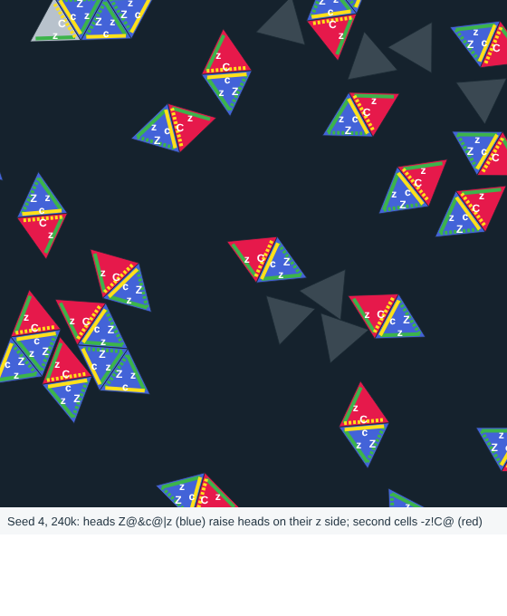

# Typed-triangle world

An artificial-life simulation built from one kind of block: the unit triangle. Each side carries a glue from
complementary pairs (`a` binds `A`), six side marks (close-only, attach, completion release, anchor, copy, lysis)
shape how it binds, and every rule is local. The goal is complex evolution from simple rules.

The current line is **the pair**: a two-cell body whose cells are copied by contact copying (a uniform food blank
touching a part becomes a copy of it, now and then with one side wrong) and whose second cell's seed site raises the
next head. In a world where deaths return blanks and parts decay, pairs vary, compete and change their body plan:
the nursery moved onto the head, cheats that raise nobody hold beside their hosts, and a site on the shared second
cell is a commons that a new class can take over until cheats on it turn it back. An earlier line grew three
generations of a 47-part cell kind with genome, pore, bud and cutters; it is frozen, and its genome copying (typed
chain copying) left the core on 2026-10-08 (git `1284bb4`). (An older line of
casting pockets, driven machines and kits was removed on 2026-10-03; it is in git at `7415fd4`.)



## Quick start
```
node tri/test.js                                   # fast checks (seconds)
PAW=1 node tri/demos.js pair 1 120000 runs/x       # the standard pair world (about 8 minutes): kinds arise by mutation
PAW=1 PAF= PA2='Z@&c@|z C@-z!' node tri/demos.js pair 1 240000 runs/x   # the head-nursery founder without stocks
node tri/check.js --cmd                            # every capability's world as one command
node tri/check.js --part 1/2; node tri/check.js --part 2/2   # one PASS/FAIL line per working capability (about an hour each)
```
Pictures appear in `runs/` (needs Chromium; see tri/render.js). Plain Node.js, no dependencies.

## Read more
- [docs/RULES.md](docs/RULES.md) — the complete rule set
- [docs/INNOVATIONS.md](docs/INNOVATIONS.md) — what has been built, with pictures
- [ROADMAP.md](ROADMAP.md) — the goal and what comes next
- [docs/IDEAS.md](docs/IDEAS.md) — ideas and design lessons
- [AGENTS.md](AGENTS.md), [docs/NEXT.md](docs/NEXT.md) — for coding agents continuing the work
