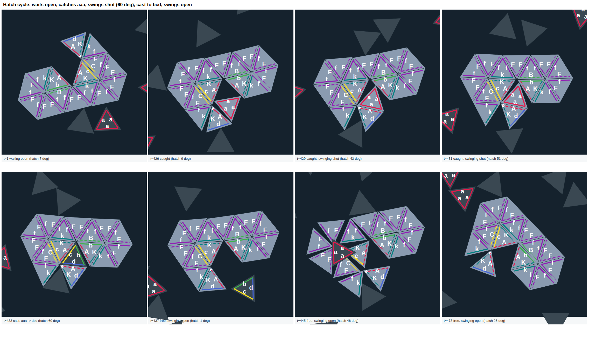

# Typed-triangle world

An artificial-life simulation built from one kind of block: the unit triangle. Each side carries a glue from
complementary pairs (`a` binds `A`), a few side marks make hinges, triggers and latches, and every rule is local.
From these pieces the world already has replicating chains, casting pockets that change triangle types, driven
machines (hatches, conveyors, doors, airlocks), energy carriers recharged by light, and a factory that makes the
parts a replicator needs. The goal is an organism that builds and feeds its offspring until it can split off.



## Quick start
```
node tri/test.js                        # fast checks
node tri/demos.js factory 2 40000 runs Aa   # pockets cast the parts for two generations of copies
```
Pictures appear in `runs/` (needs Chromium; see tri/render.js). Plain Node.js, no dependencies.

## Read more
- [docs/RULES.md](docs/RULES.md) — the complete rule set
- [docs/INNOVATIONS.md](docs/INNOVATIONS.md) — what has been built, with pictures
- [ROADMAP.md](ROADMAP.md) — the goal and what comes next
- [docs/IDEAS.md](docs/IDEAS.md) — ideas and design lessons
- [AGENTS.md](AGENTS.md), [docs/NEXT.md](docs/NEXT.md) — for coding agents continuing the work
