# Innovation log (typed-triangle world)

One entry per capability: what it is, the evidence, the picture, the command, what it enables. Newest first.
Status: **works** (does what was intended in demos), **partial**, **not yet**. Pictures from before 2026-10-01 were
made with the pre-port engine (experiments/, history before commit `cac79c9`, same rules); `node tri/demos.js NAME`
reproduces each demo with the current engine (`tri/`), except demos marked removed (their code is in git). Demo options cited
below and later removed are in git: `budpore`'s `BUDTOOTH`, `BUDPA`/`BUDPAG`, `BUDNOP`, `BUDDBGA`, `BUDNOCA`,
`BUDCAPL`, `BUDDC` at `7a98831` (removed in run 20261003-1351, cleanup); `budcycle`'s `BCHOLD`, `BCSEED`, `BCK`, `BCLK`
at `a2f3914` (removed in run 20261005-0251, cleanup). Results are from one or a few worlds; they show mechanisms,
not statistics.

## 2026-10-05 (autorun run 20261005-0721, explore)

- **A world that runs indefinitely with the existing core — not yet; the material economy measured.** Direction 1
  (NEXT). Idea: no core change, two labelled environment drives and kit choices: free kit parts decay into blanks as
  the monomer loop already does (`BCLK=q`), bodies die (a hazard `BCH=h`: each body, two or more bonded triangles, is
  hit at rate h per 100 steps from step `BCHT`, one random triangle of it lysed; the lysis rule takes the body apart, not
  across an `&` joint), and, so that decay does not empty a type, every living body a source of every part type
  (open walls `-`, `BCW=1`). No world ran on; each attempt failed for a measured reason:
  - **Closed walls (default kit) with slow decay and death** (`BCLK=0.0001 BCL=0.005 BCH=0.0001 BCHT=600000`, seeds
    1-4, stopped at 1.3-1.4M of a planned 4M): blanks 0 from 0.6-0.8M in 3 of 4, the pool's empty types 7-9 at
    1.3-1.4M, highest generation 2, 2, 2 (at 0.94M, 1.11M, 0.74M; budcycle-3 reaches 3 by 0.74-1.03M); seed 2 stalled
    from 0.37M to 1.3M with 88-108 blanks: one or two types empty, and with closed walls a type is made only at a growth front
    of that type, so an emptied type comes back only when a body that holds one dies. Where the material was: **52-60
    free strands** (leaked genome copies, about 40% of all triangles) in seeds 1, 3, 4. Faster decay (`BCLK=0.0005`,
    seeds 1-2) empties 6-9 types by 0.4M (17 by 0.5M) (fronts make too few). A per-triangle hazard (first version) killed the lone
    founder parent within 0.35M in 3 of 5 worlds (leaving at most one bud) and left 7-triangle strands 8x longer-lived than bodies: hence the
    per-body hazard and its start time.
  - **Open walls on the kind's ring** (`BCW=1`): inner-facing cells (about half; their wall faces the inside, reached
    only through the pore) are copied 3x (blanks scarce) to 20x (`BCLK=0.002`, 80-108 blanks) less than outer ones,
    whatever `pBond` (1 to 0.01: 0.9-1.1 vs 2.7-3.2 copies per cell in 100k); with decay their types empty (7-16 of 46,
    the bud stuck at cell 4, an inner type); without decay the walls take every blank (blanks 0, nothing let go in
    400k).
  - **A half ring** (`budKit(5, 27)`: a wider opening, odd above 7, makes the arc a C of 27 cells, every wall reachable
    from outside; anchor on cell 7, seed site on cell 24; `BCO=27 BCA=7 BCSC=24`; test "closure (budKit, half ring)").
    The geometry works: no overlap between bud and parent, the bud complete at 142-171k (the 47-cell kind in this run's
    worlds: 344-352k). Alone among 300 blanks the inner and outer walls are copied alike (854 vs 1054 per cell in 20k steps); but
    crowded (500 blanks and parts, as in the lineage world) one side's sites stay blocked (outer bottom cells 9-38
    copies vs inner 1000+; in the lineage the deep inner cells get 0-5), and 6-10 of 26 types empty by 0.27-0.6M at
    `BCLK=0.001-0.005` (4 worlds). The founder's first copy jams in 5 of 5 (no complete copy by 0.24-0.6M: docks 1-3,
    fills 0-2; the jam of run 2221): the walls around it take the blanks.
  - **A density-dependent decay** (a drive tried and removed: a free typed triangle that touches one of its own type
    becomes a blank, p = 0.05-0.2 per 100 steps; code in git at `f83351a`): worse; the blanks it freed went into leaked
    strands (66-86 free strands by 0.6M in 4 of 4).
  - **A scavenger for the strand sink** — designed and tested without motion, not yet in a world (NEXT step 1a): a
    prepared body of two welded triangles (labelled, never copied) whose side `Z@|!&` catches a free strand's high end
    (anchor), lyses it (`!`), stops the lysis at that bond (`&`) and keeps free monomers off (`@`), with a glued attach
    side `Ж@|` that no part matches so the `&` side always hears the open signal and is never spent. Test "scavenger":
    the strand it holds comes apart into monomers, the scavenger stays whole, its anchor free and unspent; without `&`
    the lysis comes back and the scavenger dies too; without `@` the freed high end glue-binds the side again every
    other pass. Existing core only. In the lineage (smoke test: `BCSV=8`, 8 scavengers on a circle around the parent,
    spared by the hazard, with the closed-wall drives above; seeds 1-3, stopped at 0.9M): free strands 0 throughout and
    blanks 18-70 (without scavengers 0 from 0.6-0.8M); but genome copying nearly stops (the parent's copies 0-1 by
    0.9M; monomers 0-9), because the leaked strands had also been where most monomers were made (seed 1 without
    scavengers: 1660 of 1894 genome copies at 0.6M on free strands). The founder's first copy jammed in 2 of 3 (the
    start-up jam of run 2221); seed 3 reached generation 1 (424k), seed 2's parent died (hazard). Next limit: monomers
    at the held strand.
  - **What it shows** (IDEAS, "Material flows by exposure, not by need"): every copyable side turns the blanks that
    reach it into copies of itself whether or not anything needs them, so the blanks end at the most exposure: leaked
    genome copies first, then surplus parts and monomers. A world that runs on needs a way back for every sink, a source
    of every part type in living bodies (or parts conserved), and sources limited by need. The strand sink is the
    largest and comes first. Default outputs are unchanged (100k-step `budcycle`, default and `BCQ=1 BCR=50 BCC=2`, byte
    for byte the same as `5480172`; and `lysis` 60k).
    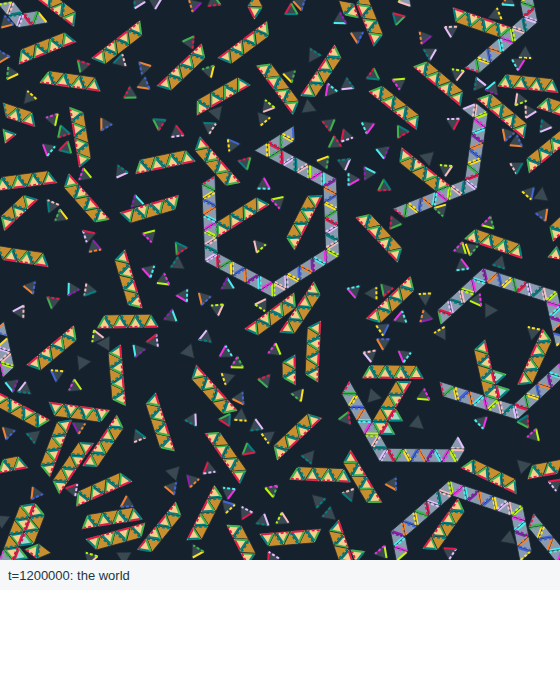
    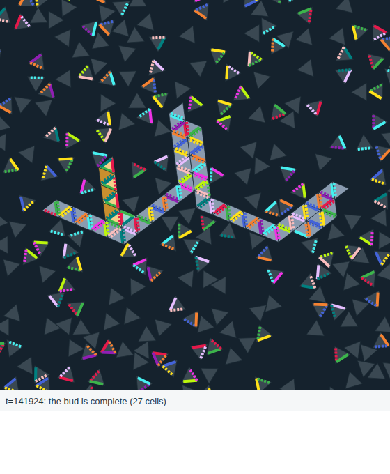
  - Commands: `BCLK=0.0001 BCL=0.005 BCH=0.0001 BCHT=600000 BCP=100000 BCAFTER=100000000 node tri/demos.js budcycle N
    4000000 runs/x` (the closed-wall worlds; `pop:` lines every 100k: bodies, blanks, pool, generations); `BCW=1 BCO=27
    BCA=7 BCSC=24 BCLK=0.002 BCL=0.005 ...` (the half ring).

## 2026-10-05 (autorun run 20261005-0321, build)

- **Does lysis make the lineage longer? No: every lineage stops when its food stock is spent** — a question settled
  by measurement (no capability, no code change). Long `budcycle` worlds without a generation stop
  (`BCAFTER=100000000`), seeds 1-4 (1-2 to 4M steps, 3-4 to 3M), the receptor with cutters (`BCQ=1 BCR=50 BCC=2`)
  against the default (budcycle-3's setup).
  - **Generations.** Default: highest generation 4, 3, 3, 3 (the last at 1558000, 977300, 735900, 827100); the last
    let-go of any bud at 1353500, 1525100, 1765900, 1200200. Lysis: 0, 4, 3, 4 (generation 4 at 1932000 and 1330200);
    buds lysed 88, 0, 2, 31. Seed 1's founder jam (run 2221) never ends: 88 waiting buds lysed and regrown from their
    parts to 4M with no strand ever leaving the parent. In sum lysis adds a generation in two worlds and loses four in
    the jammed one: not a longer lineage.
  - **Why: the lineage is limited by blanks, and lysis returns parts.** All 400 pre-food are fed by about 1.8M; blanks
    are 0 from 0.6-1.4M on in all 8 worlds, and free genome monomers 0 at the end, so the monomer loop (`BCL`) has
    nothing left to turn back. Without blanks no held strand is copied: adults sit holding strands they cannot copy.
    The pool freezes unbalanced (default: 4-10 of 46 types empty while others keep 14-24 parts; lysis 1-12 empty).
    Lysis only fires on a complete bud waiting for a catch; buds that stall incomplete for want of a part type have no
    last cell and so no receptor (seed 2: nothing lysed, 12 types empty). Where blanks go in default seed 1 (sinks):
    354 kit copies (parts, never turned back), 96 copies on held strands, 607 contact copies of free strands' sides
    (monomers the loop returns). Lysis does keep a world busy longer (seed 4 let-gos to 2954000): parts cycle, food
    does not.
  - **What follows.** An indefinite lineage needs blanks to come back, not parts: a steady supply drive and/or a way
    from surplus parts and strands to blanks (IDEAS 2026-10-04, "a way back to blanks"). This is the first step of the
    user's new direction (IDEAS 2026-10-05: complex evolution; NEXT): a world that runs indefinitely.
    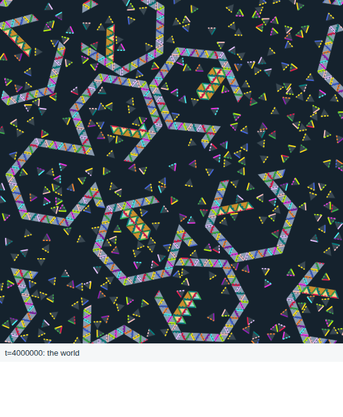
  - Command: `BCAFTER=100000000 [BCQ=1 BCR=50 BCC=2] node tri/demos.js budcycle N 4000000 runs/x` (about 2 hours per
    world at 4M; `t=` lines every 200000 steps show blanks and the pool).

## 2026-10-05 (autorun run 20261005-0251, cleanup)

- **Leaner `budcycle` and a shorter suite** — works (no capability change). Check `budcycle` retired (the doorway
  kind with budpool's harness, one generation; 600 s per world, 4 worlds): `budcycle-3` shows the same steps three
  times in the default setup (corner bud, closed walls, no harness). Removed with it the options only that setup used
  (`BCHOLD` the harness, `BCSEED` the seed cell, `BCK` the wall sides) and run 1021's `BCLK` (free kit parts back to
  blanks: setup C, 0 of 2); 21 to 17 `BC*` variables. Output byte for byte the same as main on four 150000-step
  worlds (default; receptor with cutters `BCQ=1 BCR=50 BCC=2`; `BCGATE=1 BCES=0 BCE=8`; `BCL=0 BCES=2 BCA=44 BCR=50`).
  docs/NEXT.md 191 to about 115 lines: run 0751's Direction condensed to its standing conclusions (full text in git at
  `a2f3914`), commands of retired setups dropped. Command: `node tri/check.js budcycle-3`.

## 2026-10-05 (autorun run 20261004-2221, build)

- **Lysis in the lineage: a receptor on the bud's last cell, so cutters take apart only complete buds waiting for
  their catch** — works as a selective mechanism in the lineage (check `budcycle-lysis`, 3 of 4 worlds); a longer
  lineage from it: not yet shown. NEXT priority 3a. A kit change, no core change: `budKit(..., receptor)` puts
  `Г@&` on E's outer side (a wall side `-|` before); cutters `г@!-|-|` (labelled, 2 per world) and openRange 50 (more
  than the 40 bonds from the anchor on cell 6 to E). E exists only once a bud is complete; its `&` side binds only while
  E hears an open signal, which on a complete bud only its waiting anchor sends; once the bud has caught, E hears none
  and the side is spent for good. So a growing bud (no E yet) and an adult (spent) are never targets, and the anchor
  stays on cell 6, where the founder's copies flow. Every parent's receptor is spent once it stands alone after its
  catch; a parent whose own bud is already growing then keeps it open (found by the test; buds that bud before they
  catch, run 1721).
  - **Evidence.** Test "receptor: ..." (no motion): a cutter placed at the receptor of a complete bud waiting for its
    catch binds it and the bud comes apart, the parent whole; a bud holding a stand-in strand has its receptor spent
    and nothing binds. `budcycle` with `BCQ=1 BCR=50 BCC=2` (budcycle-3's setup otherwise), seeds 1-4, 1.2M steps:
    generation 3 at 855000, 736900, 1083700 in seeds 2-4 (budcycle-3 on the same seeds: 977300, 735900, 827100);
    16 buds lysed, every one complete and waiting (47 cells: 8, 0, 1, 7 per world; check `budcycle-lysis` 3 of 4, the
    same numbers, 1758 s; the other 11 checks pass, `budcycle-3` reran with its recorded results); fewest free part type at the end
    6, 1, 3, 1 (budcycle-3: 1, 0, 3, 1). Seed 1 fails for another reason: its founder's first copy never completes
    (below), no strand ever leaves the parent, its buds wait for ever and the cutters return 8 of them to the pool. Control without cutters
    (`BCQ=1 BCR=50`, same seeds): generation 3 in 2 of 4 (seeds 2, 3: 989500, 937900; seed 1 reaches generation 2;
    seed 4's first bud waits for ever from t = 310500, where with cutters it was taken apart and the line reached
    generation 3); fewest type at the end 0, 1, 2, 6. So openRange 50 alone costs the lineage (budcycle-3 at range 9:
    4 of 4) and the cutters win part of it back by clearing a stuck bud: the first sign of what lysis is for, in one world.
  - **Priority 3a as written (anchor on cell 44, openRange 50, 0-2 cutters) fails, and why.** 12 worlds: with the
    anchor late the held founder hangs in or beside the parent's pore (cell 44: 2.65 from the pore's middle), its first
    copy docks within the first 3000 steps and then waits for a fill `-W-` (made when an incoming blank touches one of
    the founder's backs) that never comes: 5 of 5 cutter-free worlds never leak a strand in 1.2M steps; of 7 with
    cutters one never leaks and one leaks 2. The default (anchor 6) starts with the same jam and clears it at
    100-180k, when blanks from the supply reach the founder (traced: fills at 55933 and 113984 in seed 1). Anchor 40
    (the mirror of cell 6) and 38 jam too (4 of 4 to 360k); moving E's source outside (`BCES=2`) does not help (3 of 4
    jammed). With cutters at the late anchor: 0-11 waiting buds lysed per world (45-47 cells), generation 3 or more in
    4 of 7 by 1.2M (one of them via a free ring, below). The fewest free part type at the end follows the lysed count
    loosely: 7 and 11 lysed, 5 and 4; 3-5 lysed, 0-3; none, 0-1.
  - **The open relay's lag (candidate (o)) is in the default lineage too.** budcycle-3's four worlds (rerun on this
    code: generation 3 at 1031000, 977300, 735900, 827100, the recorded numbers) release 3-9 roots incomplete per world
    (14 of 22 at one cell); with openRange 50 and cutters 0-16. The released roots grow into free rings of the kind,
    and some catch a strand (seed 2 at anchor 44: generation 4 from a root released at one cell).
    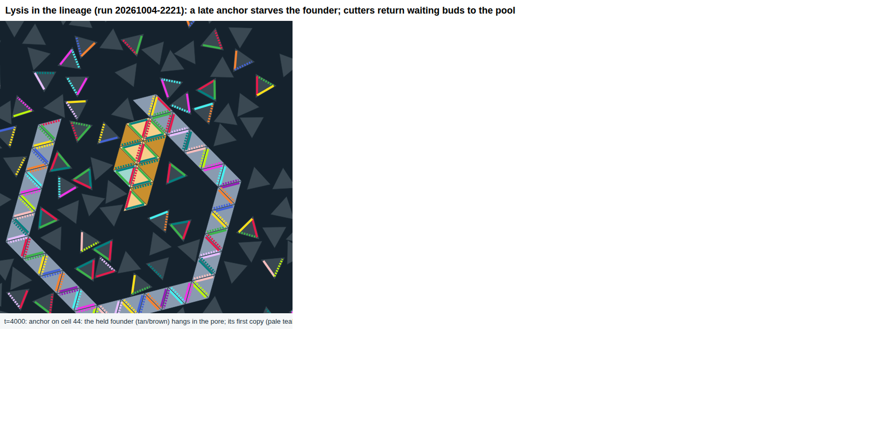
  - Command: `BCQ=1 BCR=50 BCC=2 BCGEN=3 BCAFTER=900000 node tri/demos.js budcycle N 1200000 runs/x` (about 30 minutes;
    `BCA` anchor cell, `BCT` cutter type; result line: cutBinds, lysedBuds, cuts, falseRel, lysedAt, poolMin).

## 2026-10-04 (autorun run 20261004-2051, explore)

- **A reverse path: the lysis side `!` takes a body apart into its parts, and a new bud grows from them** — works in
  isolation (core change, RULES Core changes; check `lysis`, 4 of 4 worlds); not yet in the lineage. The user's first
  choice for a reverse path (IDEAS, 2026-10-04: a type that cuts other bodies' bonds). One mark and one relayed bit: a
  triangle bonded to a partner's `!` side is lysed; lysis moves one bond per pass, never across a bond on an `&` side
  (the bud-parent joint); a triangle lysed for a pass cuts all its bonds, and once free it is fresh (spent sides
  cleared, hears nothing); a lysed triangle binds nothing. Who a `!` side lyses is chosen by its glue: the cutter
  `z@!-|-|` (labelled, prepared, never copied) is a part whose attach side complements a waiting anchor `Z@|`, so it
  binds only an anchor that holds no strand: a bud waiting for its catch (or still growing past its anchor cell), never
  an adult.
  - **Evidence.** Demo `lysis` (closed world, no food, no blanks: a prepared parent of the kind holding its founder, a
    complete bud of the kind stuck on its seed site waiting for a catch that cannot come, 4 cutters, no free parts;
    the anchor on cell 44, openRange 50), seeds 1-4, 1M steps: the stuck bud is apart (each of its 47 cells free, 48
    cuts in one wave of about 45 passes) at t = 4005, 10498, 4062, 5834; all 47 parts fresh and free; the parent and
    its founder untouched; a later bud on the parent's seed site is built from 45, 45, 46, 45 of the stuck bud's parts
    (then lysed in turn when its own anchor opens, at 642k-908k); check `lysis` 4 of 4 (135 s). Test "lysis: ..." (no motion): the wave, the fresh
    parts, the parent's seed site free and fresh, the `&` joint holding the parent out; control without `!`: nothing
    comes apart. Every existing world is unchanged (no kept structure carries `!`): 31 worlds of the 10 short checks
    byte for byte the same as main; `budcycle-3` 4 of 4 with the same results as runs 1021 and 1721 (generation 3 at 1031000, 977300, 735900, 827100; 0 stray; 1880 s).
  - **Two findings.** (1) *Where the anchor sits decides who dies.* With budcycle's anchor on cell 6, cutters kill
    every regrowing bud the moment its cell 6 attaches (seed 3, 4 cutters: five buds lysed at 7 cells in 480k steps);
    on cell 44 only a bud with two cells to go or waiting is exposed. Even then 4 cutters in a 30 x 30 world find an open
    anchor in about 4-10k steps, faster than the last two single parts arrive, so regrown buds die at 44-46 cells; with
    one cutter and the oracle below, a regrown bud of the stuck bud's parts completes in 2 of 4 by 2M steps (425020,
    1701490; 46 of 47 in the others). Kill rate against growth and catch time is the number a lineage must win. (2)
    *The open relay lags one pass behind a new bond.* A fresh root that re-binds the parent's seed site in the pass
    after it was freed, joined by its next cell in the following pass, hears 0 ("complete": both partners were free
    a pass before) and completion releases it at once (traced in seed 1: root binds 4006, cell 1 binds 4007, released
    4008, its seed side spent); the freed parts then grow a free arc off the parent until a cutter finds it too (seed
    1: about 380k steps). An oracle (`LYFIX=1`: a triangle that would hear 0 while a partner had not yet heard keeps -1)
    removes it: the first regrown bud starts on the seed site at once in 4 of 4 and reaches its anchor sooner (lysed at
    352-773k against 642-908k without it; seed 1 completes a second regrown bud, 47 of 47 parts, at 970310). The lag predates lysis (any root joined by its
    next cell in the next pass); it shows here because freed parts lie next to their old sites. Candidate (o) in NEXT.
    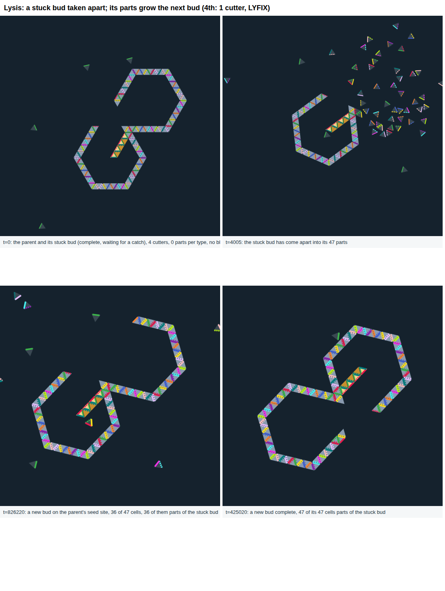
  - Command: `node tri/demos.js lysis N 1000000 runs/x` (defaults: 4 cutters `LYC`, anchor cell `LYA` 44, openRange
    `LYR` 50, world `LYS` 30; `LYP` free parts per type, 0; `LYFIX=1` the oracle; `LYT` the cutter's type); about 2.5
    minutes per world.

## 2026-10-04 (autorun run 20261004-1721, build)

- **Where the blanks go in the lineage, and why a bud's own copies fail: buds that bud before they catch** — a
  finding (no new capability; no rule change; the defaults unchanged). Target of the slice (NEXT priority 2): the
  chain's buds (generation 1 and 2 on the line to the last generation) copy their caught strand after let-go in 3 of 4
  worlds on the defaults, by kit or layout changes. Not met: no kit change tried keeps generation 3 and meets it.
  New observation in `budcycle`: `sinks` (each copy bind by its template: growth fronts, E source, seed sites, the
  parent's genome, buds' genomes, free strands; in every `letgo:` line and after the result) and `chain:` (from the bud
  that reached the last generation back to the parent: each bud's own copies after let-go, or `held` if it never let go).
  New options: `BCES=0` (no E source: E's pore side a closed wall; E parts from the pool, `BCE`), `BCES=2` (the E source
  on E's outer side; `budKit(..., eSource='out')`), the oracle `BCGATE=1` (below).

  Five setups, seeds 1-4, the check's settings (`BCGEN=3 BCAFTER=900000`, 1.2M steps):

  | setup | generation 3 | generation 2 | chain copies after let-go (gen 1, gen 2) | parent copies | pool types empty at the end |
  |---|---|---|---|---|---|
  | defaults (the same outputs as run 1021) | 4 of 4 (1031000, 977300, 735900, 827100) | 4 of 4 | 2 of 4 (seeds 2, 3: 1 / 3, 2 / 1); seeds 1, 4: a chain bud `held` | 3-6 | 0-2 |
  | `BCES=0 BCE=8`: no E source, 8 E parts | 2 of 4 (974400, 809600) | 4 of 4 (511k-770k) | both seeds reaching generation 3 (3 / 1, 4 / 4) | 3-12 | 4-13 |
  | `BCES=2`: the E source outside | 3 of 4 (955700, 892800, 848700) | 4 of 4 | 2 of 3 reaching generation 3 (1 / 3, 4 / 2; seed 4 held); seed 2 to generation 2: 6 / 5 | 5-7 | 0-10 |
  | `BCGATE=1` (oracle) | 2 of 4 (1179500, 1024900) | 3 of 4 | every chain bud, as far as reached (3 / 1, 2 / 2, 3 / 4, 2) | 4-12 | 0-9 |
  | `BCGATE=1 BCES=0 BCE=8` | 0 of 4 | 4 of 4 (546k-770k) | to generation 2: 3 of 4 (4 / 0, 4 / 2, 3 / 1, 5 / 11) | 3-10 | 2-13 |

  - **Where the blanks go** (copy binds per world, defaults): free strands 421-867 (monomers made on leaked strands;
    the loop returns most: looped 419-857), growth fronts 235-258 (kit parts: the pool's only renewal), the parent's
    genome 48-65, the E source 43-60 (one E used per bud), buds' genomes 17-36, seed sites 4-12. Without the E source
    the parent's genome gets about 1.7x the blanks (gP 94) and the buds' 3x (gB 79): the E source sits at the pore
    and takes the blanks that come in first. The cycle speeds up (first split 136k-419k instead of 395k-637k, seed 4 never), so the
    fronts wait less and make fewer kit copies (158-290 in all, against 297-330), while more buds start: the pool empties and generation 3
    fails. Outside, the E source eats more (71) and changes little.
  - **Every failing chain fails the same way** (defaults seeds 1 and 4, `BCES=2` seed 4): a complete bud waiting for its
    catch grows its own bud from its seed site (nothing stops a bud from budding while attached), and that bud catches
    the next leaked strand first; the waiting bud never lets go. Food is not what is missing. No layout stops it: on
    all 25 outer seed cells the posed bud's own seed site stays open (a root's place at least 1.0 from the parent;
    geometry script in NEXT).
  - **The oracle `BCGATE=1`** (not a rule: it reads whether the bud's root is bonded, about 40 bonds away): a bud's seed
    site is spent until the bud has let go. Every bud on a chain then copies its own strand after let-go (1-4 copies,
    4 of 4 as far as each world got: "lives on its own" in the goal's local sense), but the lineage slows
    (generation 1 at 432k-714k): a complete bud waits 100-400 thousand steps for a catch, because the parent copies only
    4-12 times and few strands leak. With the E source removed as well, catches come sooner (generation 2 in 4 of 4 by 770k),
    but the parent and every adult bud keep budding (7-8 complete buds per world, most of generation 1), and the
    fixed pool runs out before generation 3 (0 of 4).
  - **Meaning.** In a world that burns down its stocks, breadth (the parent and every adult budding again and again)
    starves depth (the next generation). The order "catch, let go, then bud" needs a rule (candidate (n) in NEXT: a
    seed site binds only while its triangle hears no open signal, with the seed site within `openRange` of the anchor);
    it pays only with a reverse path (candidate (m)), when parts locked in surplus buds come back.
    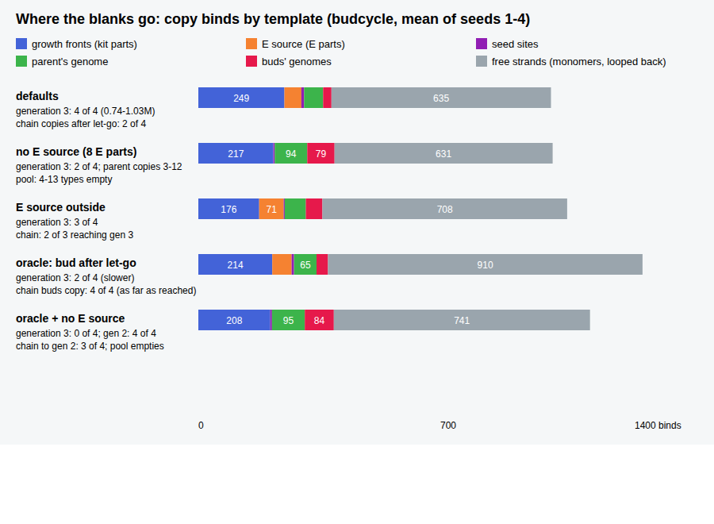
  - Command: `BCGEN=3 BCAFTER=900000 TRI_NOPIC=1 node tri/demos.js budcycle N 1200000 runs/x` with `BCES=0 BCE=8`,
    `BCES=2`, `BCGATE=1` (about 25 minutes per world with four running); `sinks` and `chain:` after the result.
  - Checks: 10 of 10 without `budcycle-3` (605 s); `budcycle-3`'s settings are the defaults row above (4 of 4, 0 stray).

## 2026-10-04 (autorun run 20261004-1421, harden)

- **Physics speed (fourth round, exact): lone-block moves** — works. The same output byte for byte (all 35 check worlds,
  `CHECK_SAVE` before at `ef7e74a` and after both commits, `diff -r` empty); the suite 11 of 11 in 2148-2155 s instead
  of 2530 s (1.17x, 4 processes); `budcycle-3` 2121 -> 1808-1812 s, `budpool` 196 -> 156-159 s, `budcycle` 367 -> 310 s,
  `imprint` 145 -> 118-121 s; one process on a `budcycle` world at t = 20000 (seed 3): 2.26 -> 1.65 ms per step
  (1.37x; at t = 250000, seed 2, with a second process running: 2.21 -> 1.91). No rule, physics or parameter change.
  - Profile before (`budcycle 3`, 200000 steps, one process): physics 91%, of it lone blocks (`_single`) 74%: about
    780 of the world's 842 triangles are free (400 inert pre-food, the part pool, blanks) and each makes a move and a
    turn trial per step. Per lone block: 8 grid cells, 11 candidates, 3 neighbours kept, 4 depth tests, 7 pair tests.
  - Changes (`tri/physics.js`): (1) a lone block's neighbours are those whose centres lie within two circumradii of
    its move's segment (the capsule), not within two circumradii plus the move's length of its start (the disk); every
    point a trial tests lies on that segment, so every overlap test gives the same answer; the depth sums of an
    overlap-reducing move (rare; their order matters to the last bit) still run over the disk list in grid order
    (`_nbDisk`, built only then); (2) the list is a kept `Int32Array` (an array emptied with `length = 0` and refilled
    by `push` cost about 90 ns per block); (3) the pair test reads the neighbour's corners in place and A's edge normals
    once per depth test (`eqDepthN`, the same operations as `eqDepth`); (4) `cos`/`sin` only when a pair is near, and
    none for a move trial (turn 0); (5) `Math.sqrt` for the trial length, with `Math.hypot` (slow in V8) only where its
    last bit could change a comparison (within 1e-9 of `direct` or of a sub-step multiple); (6) `_jostle`'s member list
    an `Int32Array` (lone blocks by id, bodies by index; the same shuffle swaps), not an array mixing numbers and arrays.
  - New test: lone-block moves with the capsule list equal those with the disk list, bit for bit, in a crowded world
    with overlapping starts (overlap-reducing moves taken); a capsule 0.2 too narrow fails it.
  - Tried, no measurable gain: a bounding-circle shortcut in the pair test and ternaries instead of `Math.min`
    (reverted); scanning only the cells that meet the capsule's box (kept: simpler than per-cell skips).
  - Command: `TRI_NOPIC=1 node --cpu-prof tri/demos.js budcycle 3 200000 runs/x`; the before/after comparison:
    `CHECK_SAVE=$PWD/runs/a node tri/check.js` in a worktree at `ef7e74a`, the same with `runs/b` here, `diff -r`.

## 2026-10-04 (autorun run 20261004-1021, build)

- **Three generations from the kit on a slow supply of copy blanks: a bud of the bud's bud complete, let go and
  holding a caught strand, in 4 of 4 worlds; the lineage still runs down its stocks** — works for three generations
  (check `budcycle-3`, 4 of 4 check worlds, generation 3 at 735900-1031000; the suite 11 of 11); not yet a lineage that does not burn down. No rule change. `budcycle`'s default is now
  the corner bud (seed site on cell 45, closed walls `-|`, no harness) on a slow supply (labelled environment drive:
  400 inert pre-food `---` in a 36 x 36 world, each turning into a copy blank with probability 0.0003 per 100 steps;
  "food" in these records means copy blanks, the untyped building blocks: user, 2026-10-04, IDEAS). New observation:
  a `letgo:` line for every bud (its generation, cells, completion, catch, and the stocks at that moment), the
  generations reached (a bud of generation g or later complete, let go and holding a caught strand; until now a bud
  that let go with no strand counted too), and `ownCopies` (each let-go bud's full copies of its caught strand after
  its let-go). New labelled drives `BCL`/`BCLK` (free monomers / free kit parts turn into blanks); pruned: the oracles
  `BCA`, `BCG`, the drives `BCW`, `BCWK`, `BCSTOP2` (in git at `7c9bbac`).

  Four setups, seeds 1-4, up to 1.2M steps, stopped at generation 3 (A-D with the monomer loop `BCL=0.002`):

  | setup | generation 3 | generation 2 | the lineage's own copies after let-go | what ran out |
  |---|---|---|---|---|
  | A: 20 blanks + 180 pre-food at 0.001 (world 32) | 1 of 4 (573400) | 3 of 4 | gen2 1 copy (seed 4) | blanks 0-12 at every let-go; seeds 1-3 stalled with none by 900k |
  | B: 20 blanks + 400 pre-food at 0.0003 (world 36) | **4 of 4** (735900, 827100, 977300, 1031000) | 4 of 4 | gen1 / gen2: 2 / 1 (seed 3), 1 / 3 (seed 2); seed 4's first bud and seed 1's second never let go (they budded while attached), the others copied 3-4 times | pre-food nearly all fed by the end; pool fewest 0-3 |
  | C: 200 blanks, no pre-food, + free kit parts back to blanks (`BCLK=0.0003`) | stopped at 360k | 0 of 2 | (parent about 15 copies by 360k) | kit decay empties the rarely copied types: 7 and 2 types at 0 |
  | D: 200 blanks, no pre-food | 0 of 4 | 2 of 4 | 0 | blanks gone by 180-360k, made into kit parts; the parent never copied in seeds 1, 3 |

  - **Where the blanks go.** Kit copies at the bud's waiting fronts (100-170 per world, its own type while it waits
    for the next part) and at the parent's E source (30-70), then into new bodies: in B 300 kit copies against 200-345
    parts used by the end; the pool's mean holds (10.5 -> 5.5-9) but its fewest falls to 0-3 (seed 2: two types at 0 at
    850k). Genome monomers made on leaked strands only churn under the loop (made, returned, made again: 420-860
    returned per world). The lineage's pace is the parent's genome copy rate (2-6 full copies per world), which needs
    blanks near the held strand; the fronts and the leaked strands take them first.
  - **Why the slow supply works:** blanks arrive while the buds grow and wait (0-19 free at every let-go, 120 -> 27
    pre-food left), so the first and second buds still find blanks after their split and copy their strands (A: the
    stock is gone by the first let-go). Generation 3 comes at 0.74-1.03M steps, 1.5-2.6x the first split.
  - **The monomer loop is what carries the third generation.** The same defaults without it (`BCL=0`, the check's
    first run): generation 3 in 0 of 4 by 1.2M, generation 2 in 2 of 4 (511100, 623500), although the buds split
    earlier (first split 146912-299850, against 394894-636560 with the loop) and copy their own strands more after
    let-go (0-10 copies per bud; 22 of 26 let-go buds copied at least once). Reading (the check keeps no census): unused
    monomers pile up as a stock that copies the genome fast, but nothing returns them to blanks, so the later kit copies
    and buds starve. The loop is now `budcycle`'s default (labelled drive).
  - **Still a burn-down** (the user, 2026-10-04: "the simulation will just run out"): only blanks change type; parts,
    leaked strands and finished bodies never return. Returning free parts by a drive empties types (C). An indefinite
    lineage needs a reverse path in the core (IDEAS: the user's ideas, a bond-cutting type, wider molding, molding one
    side at a time; NEXT, candidate (m)).
    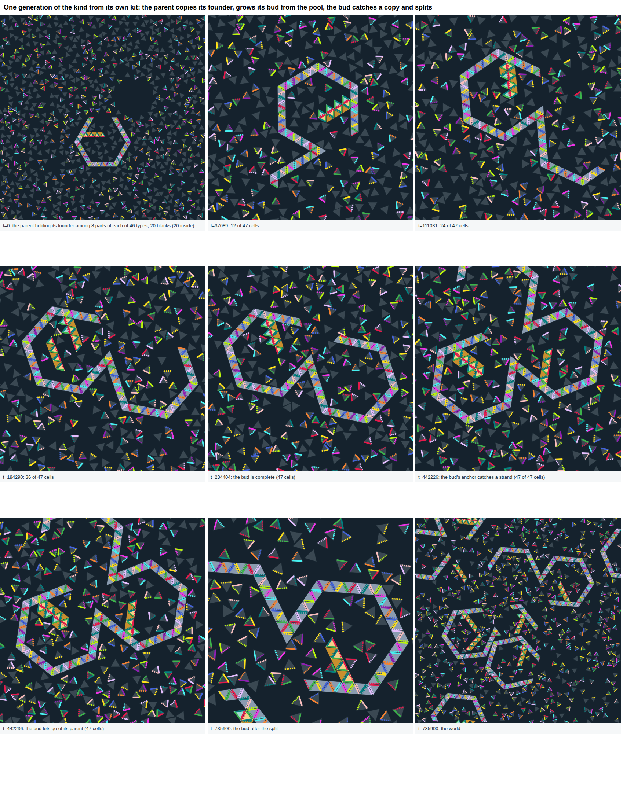
  - Command: `BCGEN=3 BCAFTER=900000 node tri/demos.js budcycle 3 1200000 runs/x` (setup B is now the default; the
    picture; about 30 minutes); `BCL=0` without the loop.

## 2026-10-04 (autorun run 20261004-0820, core-review)

- **Only a strand held by its high end is copied: the option `heldCopy` is the rule; the check suite halves** — core
  change (RULES, Core changes, two entries), no new capability. Zip now starts at a high end only while an anchor holds
  its spare edge, in every world; the core has no option left. Run 0050's narrowing (a free triangle's anchor side binds
  nothing) is removed: since run 0022 it decided nothing (all 35 check worlds byte for byte the same without it).
  - **Evidence:** the suite before (`882b7d4`, 23 of 23, 2849 s) and after (11 of 11, 1349 s, with `CHECK_SAVE`): the
    20 worlds of `ring`, `imprint`, `budpool`, `budcycle`, `budcycle-free` are byte for byte the same, and the new
    `imprint-pore` (a cell fed through a pore, held founder, 3 sterile rivals: 7 / 7 / 6 / 8 strands inside, wall 0)
    is run 1720's `imprint-held` byte for byte. `copy` on a held founder 4 of 4 (2-4 copies BBAABA); `imprint g` on a
    held founder 4 of 4, 11-15 strands from 200 blanks (free strands copied too before: 9-15).
  - **Retired** (layouts the lineage has left, or superseded by the held cell; code in git at `882b7d4`, entries below
    kept): the doorway pairs (`budpore`, `budpore-c`, `budpore-held`, `budpore-kind` and the demo), the sealed pair's
    last cell (`budpool-e`), the harness's two generations (`budcycle-2`), the sealed cell (`imprint-cell`, `-n`), the
    hooded pore (`imprint-hood`), the option's control and leak checks (`imprint-held-c`, `imprint-held-w`). Their last
    results on `882b7d4`: all passed (`budpore-held` 3 of 4, `budpore-kind` 4 of 4 with 11-13 bud copies after the split).
    Not checked anywhere now: a bud copying its caught strand after the split (it was `budpore-held`/`-kind`; in the
    lineage it is NEXT priority 2's measure).
  - New labelled starting condition: `createWorld` founders with `hold: 'z'` start held by their high end on an anchor
    cell `Z|` welded to a support (other sides closed `-|`, so blanks never copy them).
    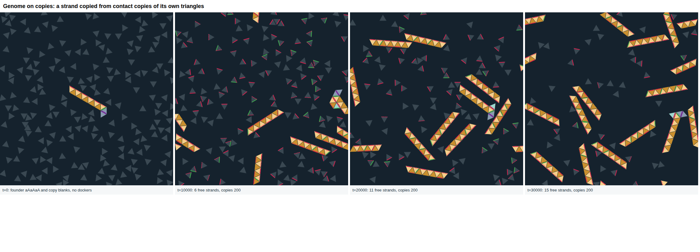
  - Command: `node tri/demos.js imprint 1 30000 runs g` (the picture); `node tri/check.js` (about 23 minutes).

## 2026-10-04 (autorun run 20261004-0751, review-intent)

- **Measurement: the two-generation lineage burns down its prepared food stock and part pool** — a finding (no new
  capability, no code change). Two worlds of the `budcycle-free` setup with the census (`BCDBG=1`, seeds 1 and 3,
  600000 steps, stopped at the second generation): first split at 270457 / 189061, second generation at 536700 /
  440000 (as in run 0621).
  - **Food:** 179-180 of 180 pre-food fed; free blanks fall from about 30 to 0-7 by the first split and stay at 0
    after it. The first bud copies its caught strand 0 / 1 times after the split: no food is left for it.
  - **Part pool** (free parts per kit type, 8 of each of 46 types at the start): mean 8.0 -> 4.2 (seed 1, two types
    at 0 near the end) and 8.0 -> 6.6 (seed 3, fewest 3); kit copies 114 / 148 in the whole run against about 290 /
    190 parts used by the first bud and the later buds (seed 1: 9 later buds, 4 of them complete). The copies come
    while food lasts: seed 1 made 91 by t = 150000, when the first bud's 47 parts were in place (about 2 per part used),
    and few after; the spread per type widens from the start (5-6 fewest, 15-21 most within one bud): copies go to
    the cells whose fronts wait longest, not to the types that run short.
  - Meaning (NEXT, Direction of run 0751): "two generations without the harness" lives on two stocks that end; an
    indefinite lineage needs food arriving for ever (in a closed world, material returning to food) and a pool whose
    copies keep up per type.
    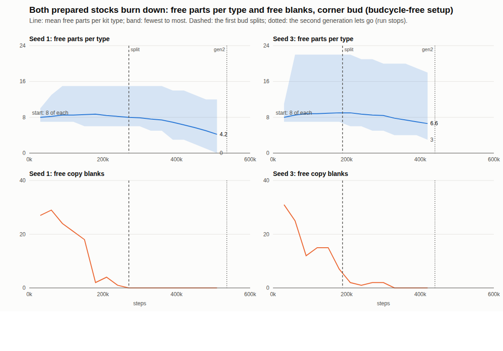
  - Command: `BCDBG=1 BCSEED=45 BCK=1 BCB=20 BCF=180 BCFP=0.001 BCHOLD=0 BCAFTER=300000 BCSTOP2=1 TRI_NOPIC=1 node
    tri/demos.js budcycle 1 600000 runs/ri` (about 20 minutes per world with two running; the `pool` field of the
    progress lines is fewest/mean/most free parts per type).

## 2026-10-04 (autorun run 20261004-0621, explore)

- **The bud grows off its parent's corner instead of across its pore: the pair is never sealed, and two generations
  without budpool's harness come in 3 of 4 worlds (6 of 8; the doorway kind 3 of 8)** — works (check `budcycle-free`,
  3 of 4). Kit change only, no core change: `budKit(..., seedAt)` puts the seed site `y` on any arc cell's outer side
  (E's outer side is then a wall side) and returns the bud's pose (`K.pose`, `K.unpose`: the motion that puts the
  root's seed side on the seed site). On cell 45 (beside E, the top-right corner) the bud hangs off the corner: its pore
  faces the parent's pore across an open 60-degree wedge (geometry: every outer cell's pose computed; none overlaps).
  Why it can work: with `heldCopy` a leaked strand is sterile but catchable, so the bud need not take its strand
  through a doorway; it catches one of the parent's leaked copies from open space. Test "closure (budKit, seed site on
  cell 45)" (signal logic: the bud holds until its catch and lets go in the parent's state). Check suite 23 of 23 (2437 s; defaults unchanged).

  Same setup as run 0251's best (`BCK=1 BCB=20 BCF=180 BCFP=0.001 BCHOLD=0 BCAFTER=300000 BCSTOP2=1`, 600000 steps):

  | seed | corner (`BCSEED=45`): first split / gen2 | parent copies | doorway (default): first split / gen2 | parent copies |
  |---|---|---|---|---|
  | 1 | 270457 / 536700 | 5 | run 0251: 4 of 4 split, gen2 2 of 4 (seeds 3, 4) | |
  | 2 | 457856 / not (its bud complete, waiting for a catch at the cap) | 3 | | |
  | 3 | 189061 / 440000 | 3 | | |
  | 4 | 369532 / 396600 | 3 | | |
  | 5 | 229334 / not | 5 | not (bud complete, sealed, no catch) / not | 1 |
  | 6 | 235440 / 382400 | 4 | 224013 / 487300 | 5 |
  | 7 | not / 310100 (the first bud's own bud let go; the first bud still waits) | 4 | not (bud 46 of 47, sealed) / not | 0 |
  | 8 | 156086 / 298900 | 4 | 163390 / not | 2 |

  - **The parent copies in every world** (3-5 full copies against 0-5 for the doorway kind): its pore stays open to the
    food while the bud grows and waits. The buds complete first (125-262 thousand steps) and wait 40-250 thousand steps
    for a catch without starving anyone; the catch is a leaked parent copy (2-9 leaked per world). Run 0251's first
    failure (sealed before the parent's first copy) is gone; the doorway kind showed it in 2 of 4 new worlds.
  - **Lineages branch:** seed 1 ended with 9 later buds (the parent's seed site budded three times, buds budded), several
    of them complete and free. The food supply is used up by the end (172-180 of 180 pre-food fed).
  - **Left:** the first bud copies its caught strand 0-2 times after the split (as before): the lineage still runs on
    the parent's copies and the supply's stock. A failed world waits for a catch (seed 2) or stalls a grand-bud (seed 5).
    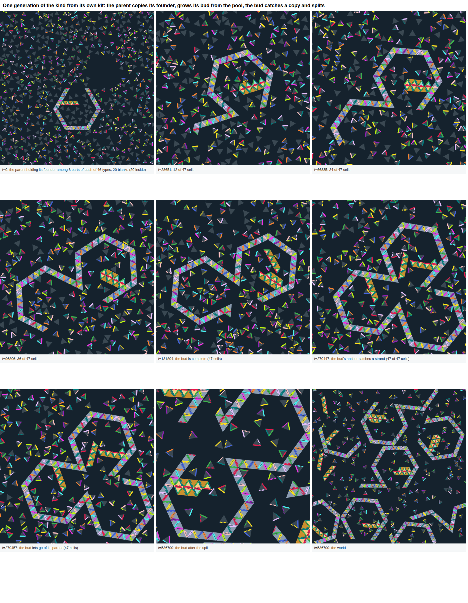
  - Command: `BCSEED=45 BCK=1 BCB=20 BCF=180 BCFP=0.001 BCHOLD=0 BCAFTER=300000 BCSTOP2=1 node tri/demos.js budcycle 1
    600000 runs/x` (about 10 minutes per world).

## 2026-10-04 (autorun run 20261004-0251, build)

- **The kind's cycle without budpool's harness: food, not the pool, is the limit; closed walls and a food supply
  bring two generations to 2 of 4** — partial (no check: no setup reached 3 of 4). No new rule. `budcycle` with
  `BCHOLD=0` (copies of kit parts stay parts), seeds 1-4, 600000 steps, `BCAFTER=300000 BCSTOP2=1` (the `budcycle-2`
  setup; with the harness: first split 4 of 4, second generation 4 of 4). New observation lines (`BCDBG=1`): the pool
  per type (in the progress line and at the end) and `kit copies by template` (parent or bud, cell, side).

  | setup (labelled drives in brackets) | first split | gen2 | kit copies | genome monomers |
  |---|---|---|---|---|
  | 200 blanks (20 inside), no harness | 3 of 4 | 0 of 4 | 149-170 | 30-51 |
  | + kit parts outside decay to blanks (`BCWK=0.0001`) | 4 of 4 | 1 of 4 | 143-285 | 68-189 |
  | + the same, `BCWK=0.00003` | 2 of 4 | 1 of 4 | 138-251 | 29-149 |
  | 200 blanks, no copy blank binds an `&` side (oracle `BCA=1`) | 3 of 4 | 1 of 4 | 144-157 | 43-56 |
  | 20 blanks inside + 180 pre-food outside (supply `BCF=180 BCFP=0.0005`) | 4 of 4 | 0 of 4 | 157-166 | 25-32 |
  | the same, 30 blanks inside | 0 of 4 | 0 of 4 | 115-169 | 33-80 |
  | supply + closed walls (`BCK=1`; byte for byte the oracle's runs) | 3 of 4 | 2 of 4 | 66-141 | 46-124 |
  | supply `BCFP=0.001` + closed walls | 4 of 4 | 2 of 4 | 86-160 | 37-113 |
  | supply `BCF=300 BCFP=0.0006`, world 34 + closed walls | 3 of 4 | 2 of 4 | 116-163 | 46-192 |

  - **Without the harness the 200 blanks are gone by t = 60000-90000, three quarters of them made into kit parts**,
    not genome monomers: the parent makes 0-1 strand copies after the first, the bud none after its split, so the
    second-generation bud completes from the pool (2 of 4) but has nothing to catch. The pool itself is not the limit
    over two generations: at the end 4-7 parts of every type are left (8 at the start), types 0-9 hold 13-76.
  - **Where the copies come from** (census, 150000 steps): about 90% from the first bud's cells 0-9, on their `-&` wall
    sides while they hear the open signal (the front and, from cell 6 on, the waiting anchor keep cells 0-15 open);
    the young bud sits in the doorway, in the food stream to the parent. The rest from the parent's E source.
  - **Which sides are copyable does not set the amount.** With the oracle (no copy blank binds an `&` side) the kit
    copies move to the `@` fronts and stay about 150: with a stock, the copies made per part used go as blanks / parts
    near the front (run 1221's law), so the fronts that exist while the stock lasts take it. Decay returns food but the
    kit copies take it again, and the decay empties types that no front copies (1-2 types at 0 by the end).
  - **A supply plus closed walls works best.** Food that arrives over the run (inert `---` pre-food turning into
    blanks: an environment drive) alone changes nothing (the open walls still take it); with walls nothing copies,
    the kit is copied only at fronts and the parent's founder gets the food: gen2 in 2 of 4 in each of three supply
    settings. Closed walls need no core change: a wall side `-|` (the anchor mark with no glue) catches nothing, and no
    copy blank or free triangle binds it (`budKit(..., wall)`, test "closure (budKit, anchor on cell 6, closed walls
    -|)"); its runs are byte for byte those of the oracle.
  - **Two failures remain.** (1) The pair seals before the parent has a copy (the bud completes first, the pores face
    each other, no blank inside): no catch, ever (1 of 4 in two of the three supply settings). (2) The second-generation bud is still
    growing, or the bud has no copy to offer it, when the supply runs out.
    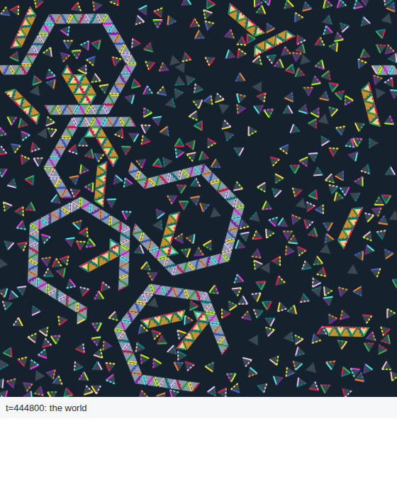
  - Commands: `BCHOLD=0 BCDBG=1 BCAFTER=300000 BCSTOP2=1 node tri/demos.js budcycle 1 600000 runs/x` (harness off);
    `BCK=1 BCB=20 BCF=180 BCFP=0.001` (closed walls and supply); `BCWK=q` (decay), `BCA=1` (oracle).

## 2026-10-04 (autorun run 20261004-0022, explore)

- **Only grown triangles bind by glue: no more glue caps on strand ends, and the genome monomers are used** — works
  (a narrowing of the core: RULES, Core changes; `node tri/check.js` 22 of 22 after one setup fix, below). A strand end's seed now binds only by an
  anchor's catch; a released back binds nothing by glue; zip's `&` case (a high end held by a completion side) is gone
  with it, since nothing but an anchor can hold a strand end.
  - **What limited the bud's copies.** Run 2221 read "food after the split" (200 blanks gone by t = 75000). A census of
    every contact copy in `budcycle` (`BCDBG=1`: the copied triangle's type, role and side) shows the blanks becoming
    genome monomers 5x faster than copying used them (seed 1: 194 made, about 40 used by t = 70000) and in the wrong
    mix: awz : Awz : --W = 30 : 64 : 100 made where a copy uses 2 : 2 : 3. The cause was one binding: a free back
    monomer `--W` glue-binds a strand's low-end seed `w` (the docker's prev glue, which a fill binds), which hides the
    low end's own copyable spare (4 copies of it against 36 of the high end's spare) and is itself a grown triangle
    with two free sides (5 caps made 61 of the 100 back monomers in seed 1). So `awz` ran out first (4 left at the end,
    against 38 `Awz` and 49 `--W`).
  - **Candidate (g) withdrawn** (free strands not contact-copied, run 2221): its non-local oracle (`BCG=1`: no copy
    blank binds a free body without a kit cell; the most any local rule could do) does not save food. The blanks are
    copied at the held strands instead (seed 1: all 186 genome copies from held bodies, against 27 of 194 without it),
    and seed 2's parent made only 2 copies and its bud never caught.
  - **With the narrowing** (`budcycle`, seeds 1-4, 300000 steps; before in brackets): monomers made about 1 : 1 : 1
    (1 : 2 : 3.3), used in copies 47-86% of those made (17-46%); full copies, parent and bud together, 10 / 11 / 13 / 13
    (12 / 8 / 8 / 4); leaked strands 9 / 17 / 16 / 15 (11 / 6 / 4 / 1), so the bud catches earlier: split at 144301 /
    127592 / 58302 / 73532 (47081 / 217572 / 145137 / 217631); the bud's own copies after the split 1 / 6 / 8 / 7 (8 / 2
    / 3 / 0); every bud complete, 0 stray bindings. Seed 1 is the one loss (its bud split late, at 144301).
    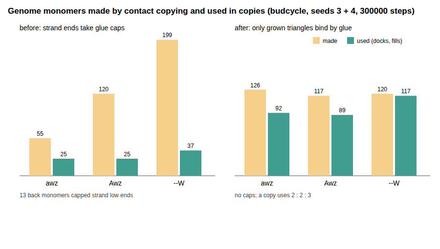
  - **Elsewhere** (check suite, old code against new): `copy` 3 -> 4 of 4, `budpore` 3 -> 4, `budpore-c` 6 -> 7 of
    8, `budpore-held` 4 -> 3, `imprint-cell` 4 -> 3 (a sealed cell with 60 blanks now runs short of back monomers, which
    the caps' copies had supplied), `imprint-held-w` 3 -> 2 of 4: there the founder started free and in some worlds
    left through the 7-cell pore before the anchor caught it (1 of 8 seeds on the old code, 3 of 8 on the new). The
    `imprint` `z` variants now start with the founder held (labelled, as in `budcycle`): 8 of 8 seeds in all three
    held checks on both codes; check suite 22 of 22. The 20 worlds where nothing can glue-bind a strand are byte for
    byte the same.
  - Commands: `BCDBG=1 node tri/demos.js budcycle 3 300000 runs` (the census lines `genome copies by source`, `by type`
    and `genome triangles bound`); `BCG=1` for the oracle. Tests: "binding: a strand end's seed and a strand's back
    bind no free triangle by glue", "anchor: a free triangle's anchor side binds nothing" (now against a grown side),
    "heldCopy option" (the `Z&` hold dropped).

## 2026-10-03 (autorun run 20261003-2221, build)

- **One and two generations of the kind from its own kit, with no stand-in** — works (check `budcycle` 4 of 4, 331 s; 8 of 8 seeds 1-8 split
  after a real catch and complete their bud, 0 stray bindings). No new rule. Labelled: the prepared parent holding
  its founder, the seeded pool, the 20 blanks inside the parent and budpool's harness (kit copies back to blanks). Demo
  `budcycle` joins `budpool` and `budpore-kind`: a prepared parent of `budKit(5, 7, null, true, {at: 6, glue: 'Z'})`
  holds its founder `aAaA` by the high end on arc cell 6, option `heldCopy`, openRange 9, in a 32 x 32 world with 8
  free parts of each kit type but E (none: the parent's E source makes them) and 200 copy blanks (20 inside the
  parent). The parent copies its founder from blanks that come in through its pore, a root part binds its seed site
  `y`, the bud grows from the pool, its anchor catches one of the parent's copies by the high end, and completion
  releases its root.
  - **The bud usually catches before it is complete, and that works.** In 7 of 8 worlds (range 9) the bud's anchor
    catches a passing copy while the bud is still growing (at 8, 11, 21, 41, 42, 42, 45, 45 cells); once its front is
    more than 9 bonds from the root, the root hears nothing and lets go 10 steps after the catch. The released arc,
    holding its strand, goes on growing alone from the pool and completes (8 of 8 within 300000 steps once the run
    goes on after the split). Its last site then opens to the outside, so any E part finishes it (E parts leak from
    the parent's E source): the sealed pair's last-cell problem (run 1420) does not arise. The test "closure (budKit,
    anchor on cell 6)" covers only the other order (complete first, catch after); both end in the parent's state.
  - Evidence (300000 steps, defaults; split at / catch at cells / complete at / full copies on the bud's caught strand
    after the split): seeds 1-4: 47081/21/158979/7, 217572/42/233092/1, 145137/42/194909/1, 217631/45/224952/0; seeds 5-8:
    157404/45/163988/1, 153639/41/184616/1, 52122/11/215146/5, 36890/8/206993/9. Afterwards both seed sites take new
    roots in 8 of 8 (the parent's next bud and the bud's own bud, 5-47 cells by the end); in seeds 7 and 8 the
    parent's second bud completed all 47 cells.
  - **Two generations** (600000 steps, `BCAFTER=300000`; the `later buds:` line lists each later bud as seed site
    (P: the parent; k: bud k), cells, and `free` once its root let go, which a bud of 7+ cells does only after its
    anchor caught): a bud grown on a bud's seed site completed all 47 cells and let go in 6 of 6 worlds (seeds 1, 2, 3,
    4, 7, 8; in 5 of them the first bud's own bud, in seed 8 a bud of the parent's second bud). Seed 1: `P:47 free,
    0:47 free, P:46 free, 1:47 free, P:17 free, 0:19 free, 1:8`; seed 7: `P:47 free` three times, `0:47 free, 1:47
    free, P:18 free, 1:10 free`. The parent itself buds 2-4 more times. Most catches after the first are leaked,
    sterile strands (10-15 lie outside by the end): with `heldCopy` a leak is not lost, the next bud that passes holds
    it and it copies again. Check `budcycle-2` (stops at the first such bud): 4 of 4 (seeds 1-4: let go at 397900 / 414300 / 420600 / 506500, 0 stray; 702 s). Picture (seed 1 at t =
    458979: the parent, its buds and their buds, all grown from the pool):
    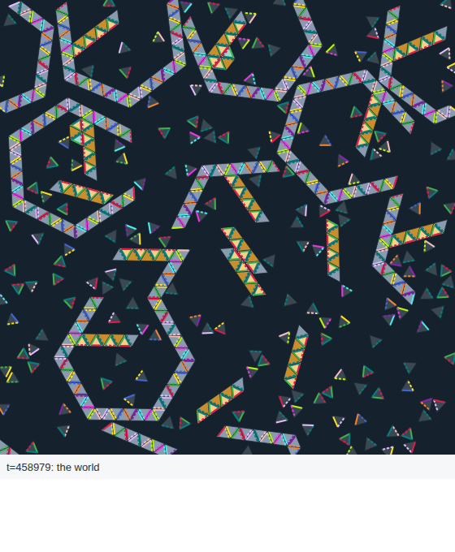
  - **openRange 50** (the root hears the front anywhere on the arc, so it lets go only after both completion and a
    catch; `BCR=50`, with the waste drive below at 0.05), seeds 1-4: the designed order in seed 1 (catch at 34
    cells, complete at 138342, split 51 steps later with all 47 cells; both seed sites then took roots); seed 2 stops
    at 46 of 47 (no E part inside at sealing, as in run 1420); in seeds 3 and 4 the founder never finished a copy.
    With the whole bud unspent while it grows, blanks copy its wall 1700-2900 times (200-900 at range 9). Range 9 is
    the default.
  - **Food is the limit after the split.** The 200 blanks are gone by t = 75000 (about 180 genome copies: blanks
    copy the sides of every strand, held or free, and the copies pile up as free face and back triangles that only a
    held strand can use). A bud that splits late finds no blanks and copies its strand about once; seeds 1, 7 and 8,
    split before t = 53000, copied 7, 5 and 9 times. A labelled waste drive (`BCW=p`: every 100 steps each free genome
    triangle outside both cells becomes a blank with probability p) at 0.05 starved the copies instead (the parent's
    face copies drift out of the pore and were recycled before docking: seeds 3, 4 stalled at 3 docks); at 0.005
    (seeds 1-4, 100000 steps after): 4 of 4 split and complete, but still about 1 copy per bud (the blanks are copied
    into free strand triangles again).
  - Picture (seed 1 with `BCR=50 BCW=0.05`, the designed order: 12 / 24 cells, the catch at 34 cells, complete,
    split, the bud 50000 steps later and the world with both new buds starting):
    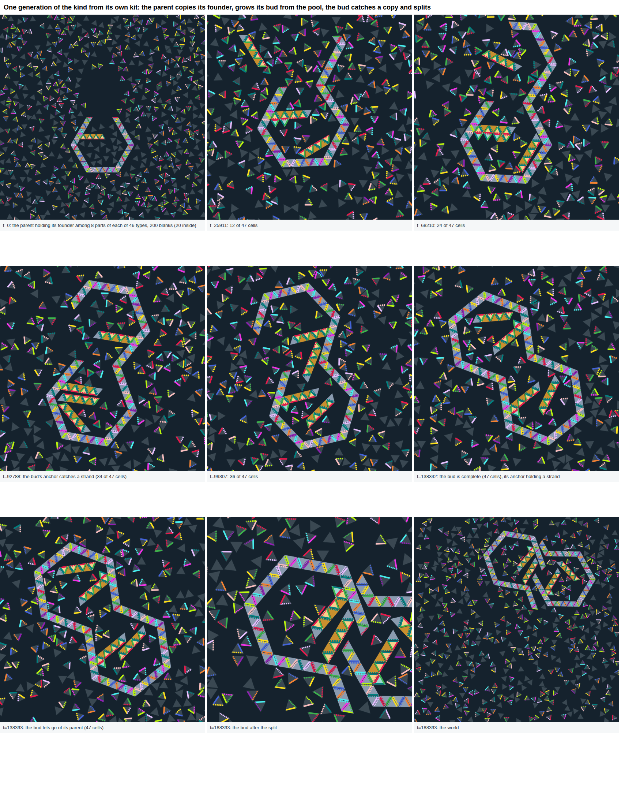
  - Commands: `node tri/demos.js budcycle 1 300000 runs` (extra: parts per type, 8; `BCB` blanks, 200; `BCI` of them
    inside, 20; `BCS` world size, 32; `BCR` openRange, 9; `BCE` E parts, 0; `BCAFTER` steps after split and
    completion, 50000; `BCHOLD=0` no harness; `BCW` waste drive, 0); check `budcycle`.

## 2026-10-03 (autorun run 20261003-2121, core-review)

- **The core without the casting lineage** — works (a simplification: same capabilities on the copy lineage, a third
  of the core). Removed: casting and stamps, hinges and flaps, triggers, latches, heard triggers, the lock and hear
  signals, energy (charge, fuel, light), proofreading (`pLoose`); the 18 demos and 24 checks that used them
  (`lid`, `factory`, `energy`, `conveyor`, `gate`, `import`, `grow`, `stamp`, `heir`, `cycle`, `wrap`, `cells`, `live`,
  `cell`, `grown`, `bud`, `split`, `budgrow`; their entries below stay as history, the code is in git at `7415fd4`).
  Left: 5 marks (`. @ & | ?`), 3 relayed signals, 4 exposed values, 3 states, 1 option; `tri/sim.js` 336 -> 231 lines,
  `tri/` about 1300 lines shorter. Two narrowings close the last exceptions: a spent anchor side catches nothing, and
  an attached close-only side takes no dock or fill (binding has no exception left). Case and reasoning: RULES, Core
  changes ("Removal: the casting lineage leaves the core").
  - Evidence: `node tri/check.js` on the 20 kept checks before (`7415fd4`) and after: 20 of 20 both times; all 69 worlds' whole outputs byte for byte the same; `closure`, `pool 4` (20000 steps) and `budpool` seed 2 (30000) too. Check time 1086 s (was 2438 s for 44 checks in run 1921).
  - An independent review (deep-reviewer, read-only) stepped `copy`, `imprint g`, `pool` and an imprint ring world old
    and new side by side (every kept array and the random generator's state every 250 steps: identical), parsed 177
    type strings of the kept kits both ways (identical), and found two leftover calls to removed functions (`budpore`'s
    setup, `closure`'s signal passes), fixed before the check run.
  - Tests: 29 (`node tri/test.js`); the two narrowings' tests fail when their condition is reverted.
  - Command: `CHECK_SAVE=$PWD/runs/new node tri/check.js`, the same at `7415fd4` (another worktree, with the
    `CHECK_SAVE` lines added to its `tri/check.js`), then `diff -r`.
  - Enables: shorter checks and a core small enough to read in one sitting; the next core question is whether
    `heldCopy` becomes the rule (NEXT, candidate (e)).

## 2026-10-03 (autorun run 20261003-1921, build)

- **The kind's own layout copies after the split, with its anchor off the pore's edge** — works on prepared rings of
  the kind's geometry (4 of 4 check worlds; labelled: the prepared pair, 20 blanks and 2 free strands inside P, 300
  outside). No new rule. `budpore 300c` with R 5 rings and 7-cell pores (`BUDRP=5 BUDRD=5 BUDPG=BUDDG=-1.75,1.75
  BUDLX=2`: the doorway bond is the bud root's seed bond on the parent's E), `heldCopy`, both anchors `Z` (high ends).
  - Dry-run (new: `BUDDRYP=1` snaps the founder onto every inner side of P, as `BUDDRY` does for D; `BUDPA=cell:side`
    puts P's anchor there): on the root's pore side, where `budKit` puts the anchor, a strand held by its high end
    stands **out** of the cell into the doorway, in P and in D alike. Sides two to six bonds round the arc hold it
    inside; the best (back sites 2.31 and 1.53 from the wall, face sites 3.46 / 2.65 / 1.73 / 1.00) is arc cell 6 (P
    `16:0`, D `90:2`).
  - Evidence (200000 steps; split at, full copies on the bud's caught strand after the split): anchors on the roots
    (`BUDPF=-1.75 BUDA=84:2`, the kind as designed), seeds 1-4: never split (the founder jams the doorway, the strands
    pile up in P). On arc cell 6 (`BUDPA=16:0 BUDA=90:2`), seeds 1-8: 15000/11, 15000/5, 10000/5, 20000/3, 10000/7,
    10000/10, 10000/8, 15000/9 (8 of 8 split, 7 of 8 with 5+ copies; check `budpore-kind`, 3+). On arc cell 4 (`14:0`,
    `88:2`), seeds 1-4: 1, 2, 4, 4 copies (face sites nearer the wall). With 100 blanks outside instead of 300 the bud
    copies 0-2 times: every blank becomes a free copy triangle by t = 25000-50000 (most on leaked, sterile strands, 5-11
    outside at the end), and the held strands use those slowly.
  - Without the two free strands (`BUDPS=0`: only copies the founder makes can cross), seeds 1-8: 8, 5, never split, 7,
    never split, never split, 0, 10 copies (4 of 8). Each failure that never split is the held founder's first copy
    stalling (3-4 docks, 2 releases, no fill): the 20 blanks inside are all copies by t = 5000, none of them a back
    copy. The two strands stand for a parent that copied before its bud sealed the pair (labelled).
  - In the kit: `structures.budKit(R, pore, letters, eSource, {at: k, glue: 'Z'})` puts the anchor `Z@|` on arc cell
    k's inner side (even k: odd cells' free side is outer) and the root's pore side becomes `-&`; the open range must
    reach the root from cell k. Test "closure (budKit, anchor on cell 6, Z@|)": with openRange 9 the bud holds while it
    grows and waits, lets go after its catch and is then in its parent's state (with openRange 6 it lets go while
    growing, at cell 6). `budpool` with the moved anchor (`BPA=6`, openRange 9; `BPES=1 BPE=0 BPB=16`), seeds 1-4:
    complete and split at 132120 / 100402 / 96550 / 242955, 0 stray bindings, every last cell from the E source. Cost:
    copies during growth 169-228 against 54-67 with the root anchor (openRange 1: fewer cells hear, so more sides are
    spent), but more types refilled (34-39 of 47 against 18-26).
  - Picture (seed 1: anchors on the roots, t = 50000, jammed; anchors on cell 6, the split at 15000; the bud at 200000
    with its caught strand and a released copy beside it, leaked strands outside):
    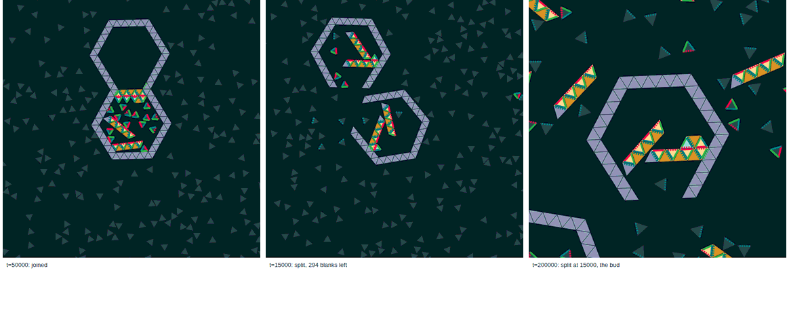
  - Commands: `BUDRP=5 BUDRD=5 BUDPG=-1.75,1.75 BUDDG=-1.75,1.75 BUDPFE=z BUDLX=2 BUDAG=Z BUDNI=20 BUDPS=2 BUDPA=16:0
    BUDA=90:2 TRI_PARAMS='{"heldCopy":true}' node tri/demos.js budpore 1 200000 runs 300c`; dry-runs `BUDDRYP=1` (P)
    and `BUDDRY=1` (D) on the same line; `BPA=6 BPES=1 BPE=0 BPB=16 node tri/demos.js budpool 1 250000 runs`.
- **A held founder's first copy made reliable on the open pair** — works (`budpore-held` 4 of 4, was 3 of 4). The
  P dry-run on `budpore 300` (R 7): the default anchor (bottom wall, x = -0.5, `48:1`) has back sites 1.73 / 1.53 from
  the wall. Seeds 1-8 per side (copies on the bud's strand after the split): `52:1` (x = +1.5; backs 2.31 / 1.53,
  faces 3.46 / 2.65 / 1.73 / 1.00): 9, 14, 6, 10, 9, 10, 10, never split (7 of 8; seed 8: a partial copy jammed against
  the wall, 3 docks); `54:1` (x = +2.5, a face site 0.58 from the wall): 4 of 8; `9:2` (right wall by the doorway,
  same distances as `52:1`): 4 of 8; `13:0` (top wall beside the doorway, backs 3.00 / 2.00): 1-2 docks in 60000 steps, seeds 1-4
  (stopped). The distances are needed, not sufficient (near the doorway the copies leave). Check `budpore-held` now
  uses `BUDPA=52:1`.

## 2026-10-03 (autorun run 20261003-1720, explore)

- **The bud copies its genome after the split (M2), with `heldCopy`** — works in 3 of 4 check worlds (5 of 8 seeds
  1-8 with the parent's default anchor; every world that split, 9 of 9, got 10-15 copies). `budpore 300` (the open pair:
  the parent P and its bud D share an opening to the outside; 300 blanks) with both anchors on high ends (`BUDAG=Z`:
  D's catching anchor `Z@|`; `BUDPFE=z`: P's anchor `Z|` holds the founder's high end) and the option. Leaked copies
  of the parent stay sterile outside, so the food that remains after the split goes to the strand the bud caught.
  - Evidence (200000 steps; split at / blanks left / full copies on the bud's caught strand after the split): with
    the option, seeds 1-4: 65000/3/12, 30000/203/11, never split, 45000/149/11; with D's anchor on cell 103:1
    (`BUDA=103:1`, back sites 2.31/1.53 in the dry run, against 1.73/1.53 for the automatic 101:1): 70000/2/11,
    30000/209/14, never split, 40000/145/13; seeds 5-8: 25000/205/12, never split, never split, 30000/215/15. P's
    anchor at x = +1 (`BUDPX=b1`, new): seeds 1-4 45000/42/10, 20000/222/11, 35000/130/10, never split. Without the option,
    same anchors, seeds 1-4: 55000/147/1, 20000/232/1, never split, 80000/14/0 (earlier runs: one full copy in 2 of 8).
  - Failure mode, every one: the parent's founder never finishes its first copy (four docks, no fill: its backs face
    the wall's wedge, and with free strands sterile no back copy exists anywhere until the held strand has made one),
    so no copy reaches the bud. Not yet fixed: a dry run of P's anchor sides (as `BUDDRY` does for D's) is the next
    step.
  - Picture (seed 2: the pair, the split at 30000, then the bud copying on its caught strand; leaked copies outside):
    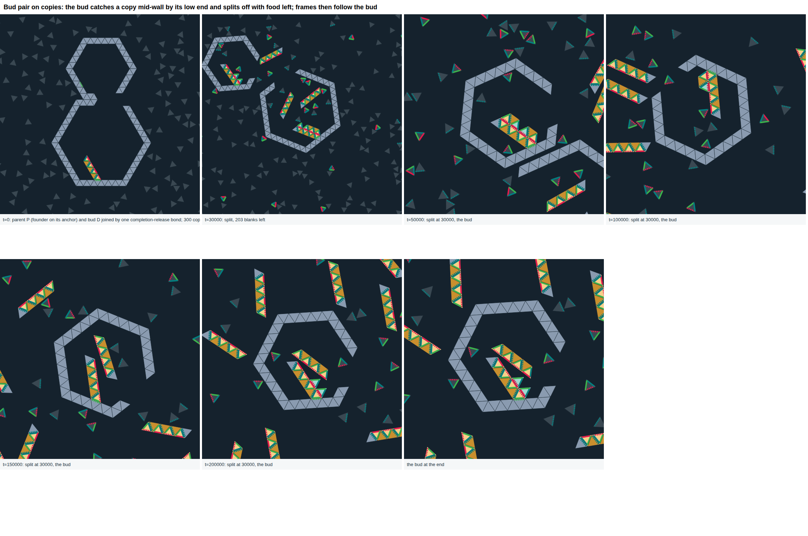
  - Commands: `BUDAG=Z BUDPFE=z TRI_PARAMS='{"heldCopy":true}' node tri/demos.js budpore 2 200000 runs 300`; check
    `budpore-held` (3 of 4 needed: 5+ copies on the bud's caught strand).
- **Only a held strand is copied (option `heldCopy`)** — works in isolation (core change through the gate: RULES, Core
  changes, run 1720; an option, off by default). A strand's high end starts the zip relay only while its spare edge is
  held (bonded, not to a `&` side), so a free strand is never copied: leaked or rival strands are sterile and cannot
  outrun a cell. Why: on paper none of the three designs for the kind's opening works in `budKit`'s geometry (IDEAS,
  "The kind's opening: the parent cannot see its bud finish"); with sterile free strands a leak costs only the strand,
  so the kind may keep its 7-cell pores.
  - Demo `imprint` cell flags (with `p`): `z` the anchor is `Z@|` and holds a strand by its high end (`@`: a free face
    copy carries `z` and capped a plain `Z|` before the founder came, 4 of 4 worlds in the first batch; openRange 1:
    the anchor's signal reaches no wall side), at x = +1 (the mirror of `W|`'s x = -1: a high end leans the other way;
    x = 0 and x = +2 also tried, 3 of 4 each); `o` the option; `w` a 7-cell pore.
  - Evidence (150 blanks outside, 100000 steps; strands inside / in all): **three rival strands outside** (`150pzox`,
    seeds 1-4): 7/12, 7/11, 7/11, 6/10 with the option (the rivals stay 3 sterile strands; the rest are the cell's
    leaked copies); without it, same anchor (`150pzx`): 2/17, 2/15, 3/18, 2/13 (the rivals copy outside; with `W|`,
    `150px`: 2/18, 1/15, 2/17, 2/12). **7-cell pore** (`150pzow`): 2/16, 0/1, 2/11, 1/8: the held founder keeps
    copying (11-15 copies), its copies leave and stay sterile; seed 2's founder left before it was caught (a free
    founder is sterile too). **Lone cell** (`150pzo`, seeds 1-8): 6, 7, 7, 1, 8, 7, 0, 6 inside (6 of 8 with 6+;
    seed 4 stalled at its first copy: 3 docks and no fill, backs in the wall's wedge; seed 7's founder left uncaught);
    the free-copying cell (`150p`) has 8-9: food, not the number of templates, limits the count at 150 blanks.
  - Costs: copying inside a cell is linear (one held template); a founder must be caught before it copies anything,
    so the anchor's lean decides more (a first copy whose backs face the wedge never gets fills: in a lone cell no back
    copy exists anywhere until the held strand has made one); sterile strands pile up outside and their free sides are
    still contact-copied (dockers and fills, which any held strand can use).
  - Picture (seed 2 without and with the option, seed 1 with a 7-cell pore, t = 100000):
    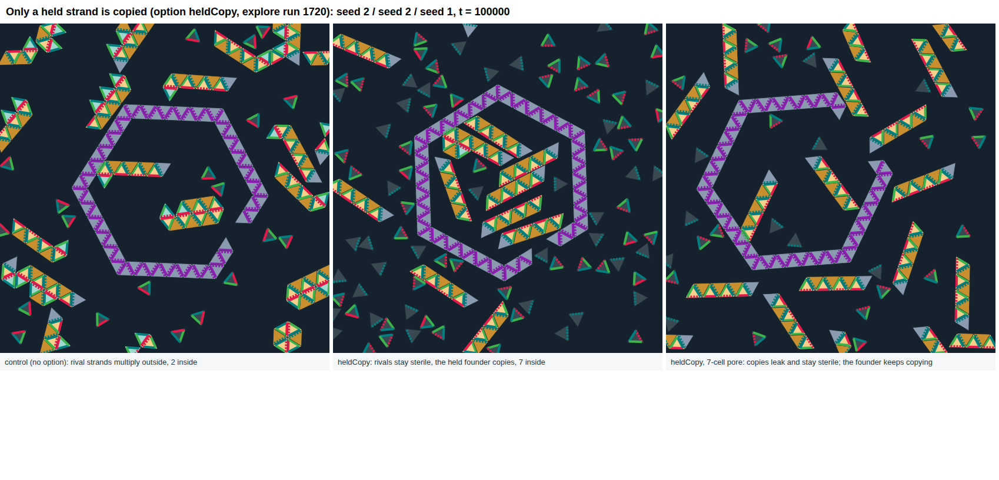
  - Commands: `node tri/demos.js imprint 2 100000 runs 150pzox` (`150pzx`: control; `150pzow`, `150pzo`); checks
    `imprint-held` (3 of 4 needed: 4+ inside), `imprint-held-c` (control), `imprint-held-w` (5+ strands made);
    test "heldCopy option".

## 2026-10-03 (autorun run 20261003-1650, build)

- **The kind's last cell from an E source inside the pair** — works in isolation (4 of 4 check worlds; labelled: the
  prepared parent, seeded pool, harness and stand-in catch of `budpool`). No new rule. The last cell E's pore side is
  plain (`structures.budKit(R, pore, letters, eSource)`: `-` instead of `-&`): never spent, so every copy blank that
  reaches the pore copies E there. Once the bud has grown round, the pore is inside the sealed pair, where the bud's
  last site opens (run 1420: only an E part inside at sealing can finish the bud). Demo option `BPES=1`: the kit with
  the source; the harness keeps the copies made at an E's pore side as parts (every other copy still turns back into a
  blank).
  - Evidence (`budpool`, 250000 steps): no E part in the pool, 16 blanks (`BPES=1 BPE=0 BPB=16`, check `budpool-e`):
    complete and split at 147463 / 128963 / 140908 / 95150 (4 of 4), every last cell a copy of the parent's E, 12-14
    such copies per world, 0 stray bindings. With 8 E parts like every other type (`BPES=1 BPE=8`, seeds 1-4): 4 of 4
    (175782 / 115275 / 186322 / 91343), each last cell from the source; without the source the same pool completed 2 of
    4 (run 1420). No E part and 8 blanks (`BPES=1 BPE=0`, seeds 1-7): 5 of 7; seeds 4 and 5 stop at 46 of 47 with no
    blank and no E copy inside after sealing (source copies 5 and 8, the last at 31867 and 84659; sealed at 107340 and
    111109). In the 16-blank worlds the finishing E was made long before sealing and was inside at sealing by drift.
  - Meaning for the kind: its pool needs no E parts, since each parent makes its bud's last cell. Cost (not measured
    with a fed parent): the plain side is copied at rest too, a food sink at the pore, and E parts accumulate.
  - Picture (no E part in the pool, seed 4: the parent among the pool, 12 / 24 / 36 cells, complete at 95148, split):
    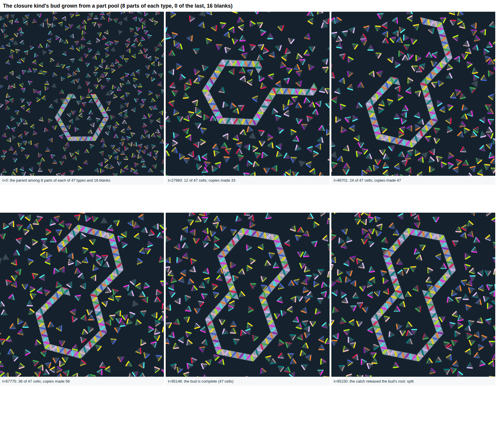
  - Commands: `BPES=1 BPE=0 BPB=16 node tri/demos.js budpool 4 250000 runs`; `node tri/check.js budpool-e`. Check
    entries can now set environment variables (`env`).
- **The kind's opening: one opening per body, and only silence widens one** — analysis (IDEAS, same title): a cell
  whose wall is one body has at most one opening, so a hood cannot rejoin a ring cut by pore and doorway, and a doorway
  beside a feeding pore exists only while the bud joins the wall pieces; the only release (completion release) fires
  on silence, and a cell at rest is silent, so an opening narrowed at rest widens again only through a resting emitter
  whose silence marks the bud's completion; the bud's root anchor emits from its binding to its catch, so near the
  junction the parent cannot be released before the split. Outline of a cycle with the existing core (replaceable
  narrowing parts, three parity orderings) and a core candidate (a release by signal) left for the next `explore`.

## 2026-10-03 (autorun run 20261003-1520, harden)

- **Hooded pore made reliable: the anchor one side over** — works (no new rule; prepared layout, labelled). Check
  suite on main before the change: 38 of 38 pass (1926 s); `imprint-hood` 3 of 4 and `budpore-c` 6 of 8 at their
  margins, `imprint` and `budpore` 3 of 4.
  - Failure modes (`imprint k 100000 runs 150ph`, seeds 1-14, anchor at x = 0): 10 of 14 pass. Seeds 4 and 14 stall:
    the founder, caught by its low end, leans 60 degrees onto the anchor's wall with its backs underneath; caught
    before any of its backs was copied, it gets no fills (seed 14: every free copy a docker, no back copy until about
    t = 75000; 0 releases in 70000 steps; 3 and 1 strands at the end). Seeds 11 and 13: 7 of 8 inside, the eighth not
    lost but standing in the pore (half in). No strand passed the hood in any world.
  - Dry-run (the founder snapped onto every inner side; distance of each back site to the nearest wall cell): the back
    next to the anchor is always in the corner (0.58); at x = 0 the other two are 1.53 and 1.73, at x = -1 1.53 and 2.31.
  - Fix: the anchor on the inner side nearest x = -1 of the wall opposite the pore (`imprint p`, `ph` and controls).
    `150ph` seeds 1-14: 14 of 14 with 5-9 strands inside and every strand inside (copies 125-131); check
    `imprint-hood` 4 of 4. Plain pore `150p` seeds 1-8: 8 of 8 with 4+ inside, wall copies 0 (check `imprint-pore` 4
    of 4); it still loses 5-11 strands in 4 of 8 (seeds 5-8), which is what the hood is for. Controls `150pc`, `150pn`
    unchanged in outcome.
  - Picture (seed 14, t = 50000: left anchor x = 0, 1 strand, no fills; right x = -1, 6 strands):
    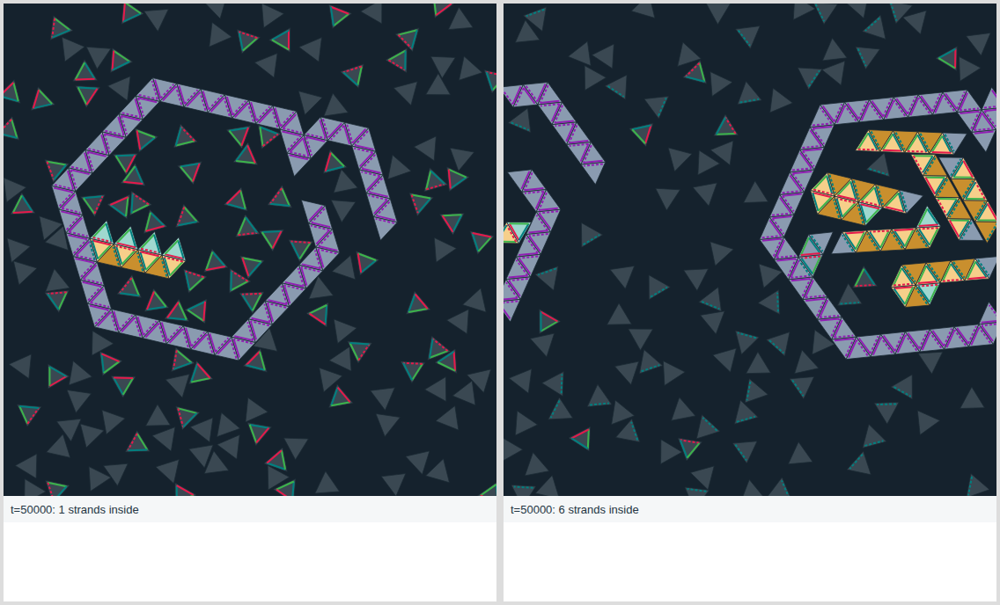
  - Command: `node tri/check.js imprint-hood imprint-pore imprint-pore-c imprint-pore-n`; the dry-run code is in git
    (`IMPDRY`, commit 941aded).
- **Margins named, not fixed (frozen layouts):** `budpore-c` seeds 2 and 3 are blocked, not slow (no split at 300000
  steps): the 80 blanks inside P are used up by t = 12500; in seed 2 nine strands crowd P in front of the doorway and
  none passes, in seed 3 two or three strands reach D and its anchor catches none. `budpore`'s layout is frozen (run
  1321's decision), so no fix. `imprint` (contact-copied ring) seeds 1-7: 5 of 7; seed 4's second ring stops at 28 of
  30 with 11-59 free parts of every type: the closed first ring lies across its last two sites (crowding of two
  large bodies, not a shortage); seed 6 also stops at 28 of 30 with 12-74 of every part, the rings far apart (not
  diagnosed). Both use up their 400 blanks by t = 25000-50000.

## 2026-10-03 (autorun run 20261003-1420, build)

- **The closure kind's bud grown from a part pool, in isolation** — works (4 of 4 check worlds, 8 of 8 with the
  default pool; labelled: a prepared parent, a seeded pool, a harness that holds the pool's composition, and a
  stand-in catch at the end). Demo `budpool`: a prepared parent of `structures.budKit(5, 7)` (no food, no strands; its
  anchor holds a stand-in end, so every wall side is spent) in a 30 x 30 world with 8 free parts of each of the kit's
  47 types (40 of the last cell E) and 8 copy blanks; openRange 1 (the anchor on the root). A root part binds the
  parent's seed site `y`, and the bud grows one unique cell after another from the pool; every copy a blank makes is
  counted by the cell it copied and turned back into a blank at a random place (harness, `BPHOLD=0` turns it off).
  When the bud is complete, a stand-in strand end is put on its anchor: completion releases its root (split).
  - Evidence (seeds 1-4, check): complete and split at 143156 / 147804 / 199771 / 137179 steps; 0 stray bindings;
    copies made 66 / 68 / 81 / 55 for 47 parts used (seeds 5-8: complete at 183967 / 135692 / 107395 / 153495, 87 / 62 /
    54 / 43 copies). Copies per used part 0.91-1.85 (mean 1.37) at one part of each type per blank, as run 1221's law predicts;
    about 45 percent of the types get no copy in one generation, and the copies of type k follow the wait for part k+1
    (correlation 0.56-0.78), not the count of k (IDEAS: the pool has no per-type regulation). Waits per cell 8-32000
    steps (median 1500-2500).
  - Failure found and explained: with 8 E parts like every other type the bud completed in 2 of 4 worlds (seeds 1, 3 at
    99194 / 99492), and stopped at 46 of 47 in the other two. The last site opens only into the sealed pair (its seed
    side lies on the parent's root by the pose's symmetry, its third side faces the doorway), so only an E part inside
    at the moment cell N-2 binds can finish it: E parts inside then were 1, 0, 1, 0, and 1-7 in the 8 worlds with 40.
    This holds for every kind whose pores face each other (IDEAS, run 1420).
  - Without the harness (a stock of 100 blanks, seed 1): complete at 157048, but the seed site, the root and the first
    7 cells took 70 of the 99 copies and the last 12 types none (IDEAS).
    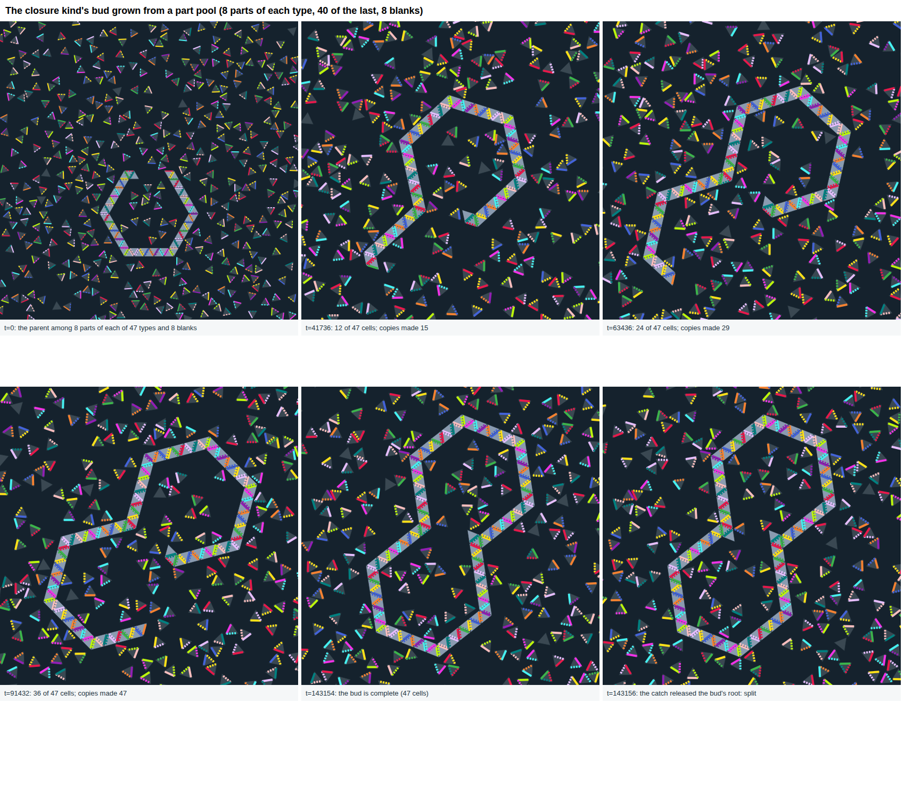
    
  - Check: `budpool` (seeds 1-4, 250000 steps, need 3; about 3 minutes per world). Renderer: zoomed pictures are now
    clipped to their frame.
  - Command: `node tri/demos.js budpool 1 250000 runs` (extra: parts per type, 8; `BPE` E parts, 40; `BPB` blanks, 8;
    `BPS` world size, 30; `BPR` openRange, 1); the stall: `BPE=8 node tri/demos.js budpool 2 130000 runs`.

## 2026-10-03 (autorun run 20261003-1351, cleanup)

- **Leaner `budpore`, streaming checks** — works (no capability change). Seven dead-end `budpore` options removed (24
  to 17 `BUD*` variables; list and commit in the header above); output byte-identical to main on 11 runs covering
  every kept command. `tri/check.js` prints each check when its last world finishes. NEXT's pitfalls moved to
  docs/IDEAS.md. Command: `node tri/check.js budpore budpore-c`.

## 2026-10-03 (autorun run 20261003-1221, explore)

- **Core narrowing: a copy blank binds no anchor side** — works (rule built; case in RULES, Core changes). An anchor
  side `|` is now a catch side only: attached it catches strand ends, free it binds nothing (run 0050), and no copy
  blank binds it, so a waiting anchor is never a template. Candidate (c) (a copy blank binds no `@` side) is withdrawn:
  it would leave every cell whose only free sides are `@` uncopyable (the closure kind's root, any in-wall anchor
  cell, each front's forward link) and cut the lineage.
  - Evidence (same seeds, baseline vs rule; identical in every world where no blank touched an anchor):
    `budpore 300` (the bud's anchor waits beside the parent's food; seeds 1-4, 200000 steps): copies of the waiting
    anchor 22 / 22 / 35 / 28 -> 0; genome copies 278 / 278 / 265 / 272 -> 300 / 300 / 300 / 300 of 300; split with 50+
    blanks left 3 of 4 both (baseline seeds 1, 3, 4: 165 / 170 / 183 blanks; rule seeds 1-3: 183 / 262 / 161, seed 2
    at 10000); the bud's own copying after the split unchanged (0-1 full copies: M2 still open).
    Worlds with 0-1 anchor copies change only by divergence: `budpore 100c` seeds 1-16: 13 identical, of the 3 others
    one splits earlier (seed 14: 37500, was 92500) and two no longer split (3, 15): 12 of 16 (was 14 of 16; check
    budpore-c seeds 1-8: 6 of 8, need 6). `imprint 150p` seeds 1-8: seed 2 6 strands inside (was 1: the founder caught
    early), seed 5 same strands; 8 of 8 with 4+ inside (was 7 of 8). `imprint 150ph` seeds 1-8: seed 4 3 inside (was 7),
    seed 7 5 (was 7), others identical; 7 of 8 with 4+ inside (was 8 of 8).
  - Test: "copy side: a copy blank binds no anchor side (a waiting anchor is no template)" (fails on the old code);
    the copy-side test now copies marks through a close-only side instead of an anchor side.
  - Check suite: `node tri/check.js` 37 of 37 pass (`grown` partial as before); budpore-c 6 of 8 (need 6) and
    imprint-hood 3 of 4 (need 3) are at their margins.
    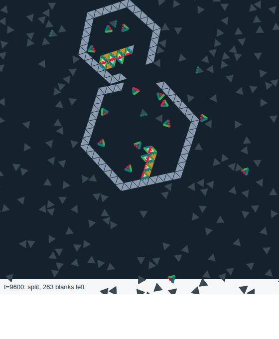
  - Command: `node tri/demos.js budpore 2 12000 runs 300` (the picture); the comparisons: seeds 1-4 at 200000 steps.
  - Hook used for the measurements (recreate as `runs/noanc.js`): wrap `TriSim.prototype.bind` to count binds whose
    free partner side has `?` and whose attached side has `|`; print the counts on exit; load with
    `NODE_OPTIONS="-r $PWD/runs/noanc.js"`. The baseline is the parent commit `4238aea` (main before this run).
- **What a part pool costs (closure kind)** — the law measured on one front; the pool for the whole kind designed, not
  demonstrated (IDEAS "Closure: what a part pool costs"). While a front waits for its next part, blanks reach it at
  the same rate per triangle as parts do, so each cell gets copies in proportion to blanks / parts of the next type.
  Demo `pool` (a prepared front `fb@-&` on a support, B copy blanks, n next parts `B@c@-&`; a harness turns each copy
  back into a blank and cuts each bound part, so B and n stay fixed; seed 1, 100000 steps, 190-840 parts bound per run):
  copies at the front's forward site per bound part 9.04 / 4.83 / 10.32 / 2.47 for B/n = 10 / 5 / 10 / 2.5 (B/n pairs
  20/2, 20/4, 40/4, 20/8) when it is the body's only copyable side (`POOLISO=1`); 5.53 / 2.68 / 4.98 / 1.21 when three
  more copyable sides are beside it (they take blanks first: about half), plus as many again at its `&` side. So a
  steady pool needs about r + 1 parts of each type per blank near the growing bud (r = openRange), up to a factor two
  for neighbouring sites: of the order of 46 to 92 parts per blank for the R 5 kind with the anchor on its root. With
  this run's narrowing the anchor cell follows the same law (before, a waiting anchor was copied for as long as it
  waited). Command: `POOLB=20 POOLISO=1 node tri/demos.js pool 1 100000 runs 4`.

## 2026-10-03 (autorun run 20261003-1121, build)

- **Closure by design: one organism kind whose bud is the same kind** — designed, not demonstrated (signal logic
  checked deterministically; the doorway step tried in 4+4+4+4 worlds). No new rule. Design and reasoning: IDEAS,
  "Closure by design"; kit `structures.budKit(R, pore)`, pose `structures.budPose`.
  - The kind (R 5): a one-row ring with a 7-cell pore in its top wall, grown from its root one way round to its last
    cell E; every cell its own type (46 bond letters). Root (the pore's left edge): outer side `Y@&` (attaches to a seed
    `y`, lets go on completion), pore side `W@|` (the catching anchor; afterwards it holds the cell's founder: one
    anchor, both roles by time). E (the pore's right edge): outer side the seed site `y` (plain glue: never spent,
    emits nothing, a parent can bud again). Every other free side `&`. A bud's root on its parent's E puts the bud at
    the parent turned 180 degrees about the pore: the two pores face each other (a doorway joining the two cells only)
    and the bud's E lies on the parent's root, covered until the split.
  - Deterministic check (`node tri/test.js`, test "closure (budKit)"; no physics, cells bonded in growth order with
    signal passes between, a stall of 300 passes half way, openRange 3): the bud holds on to its parent while it grows
    and while its complete ring waits (only its anchor emits; 3 cells hear it), lets go within 10 passes of its catch,
    and is then cell for cell in the parent's starting state (types, bonds, spent sides), with the parent's seed site
    free again. Control: the root's anchor without `@` (it emits nothing) lets go during growth (the test fails).
  - Why every cell is unique (analysis, IDEAS): growth cannot count motif repeats, so a ring grown from a periodic
    motif ends only by closing onto a cell already there; it cannot stop beside a pore. A periodic ring needs door
    cells released at ring closure while the root is held until the catch, which with one open signal races the other
    growth front (about 1 in 10 buds lost for the smallest anchor distance). Cost: 46 letters, so R 5 is the largest
    such cell (R 7 would need 70).
  - The doorway, tried on `budpore`'s options (prepared rings of the kit's geometry, R 5 both, 20 blanks and 3 strands
    inside P, 100 blanks outside, 100000 steps, seeds 1-4; new options below):
    3-cell pores (a waist one unit wide, two rows long): 0 of 4 split with the founder on P's root at the doorway, 0 of
    4 with it on P's bottom wall; no strand entered the bud in any world. 7-cell pores with the founder on P's bottom
    wall: 4 of 4 split (15000 / 5000 / 17500 / 17500) with 1-2 strands in the bud; a full copy on the bud's caught
    strand after the split in 3 of 4; both 7-cell pores then let strands out (0 / 11 / 7 / 9 outside). The designed
    layout (founder on P's root, i.e. on the doorway's corner): 1 of 4 split (12500, a full copy in the bud after it);
    in the others the founder hangs into the doorway and a second strand jams beside it.
    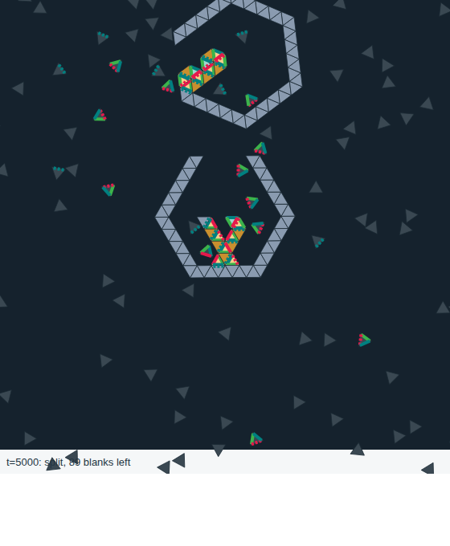
    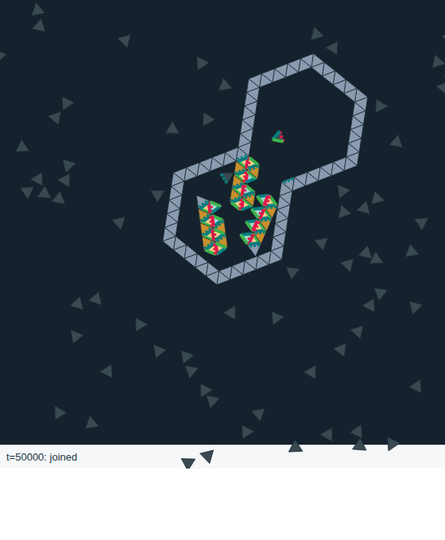
  - Picture (`node tri/demos.js closure`, no physics): 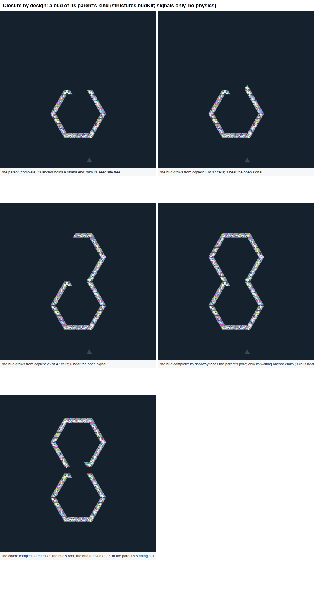
  - Findings beyond the kit: candidate (c) (copy blanks bind no `@` side) would make a cell whose free sides are all
    `@` uncopyable: the root (`W@|Y@&b@`) has none other, so the next generation could never get a root from copies
    (NEXT, candidates). A close-only attach side `@.` with glue emits the open signal until a ring closes onto it
    (existing rules): a closure signal, used in the periodic alternative (IDEAS).
  - New `budpore` options (diagnostics, default output unchanged): `BUDPS=n` (n <= 2 more strands start in P),
    `BUDPFE=w` (with `BUDPF`: P's anchor holds the founder's low end), `BUDLX=x` (the doorway bond is the P-D contact
    nearest x), `BUDAG=Z` (D's anchor catches the high end; also in the dry-run), `BUDA` may name the doorway cell
    itself; the dry-run prints each side's position. Commands: NEXT.

## 2026-10-03 (autorun run 20261003-0950, harden)

- **Physics speed (third round, exact)** — works. The same output byte for byte, 1.34x faster on the whole check
  suite. Changes (no rule, physics or parameter change): (1) torus wrap `((x % W) + W) % W` and minimum image
  `d - W round(d / W)` computed without a float modulo in the usual case (V8 runs a float `%` as a library call),
  bit for bit equal, signed zeros included (tested on 2e7 random and edge values); (2) `formBonds` allocates nothing
  per pair (`_active` returns a bit set; the anchor loop has no array literals); (3) `derive` copies the previous
  pass into kept buffers instead of eight new arrays per step; (4) pair candidates sorted by insertion; (5) the cell
  grid is one `Int32Array` with a count per cell (same order within cells as the old arrays of arrays). Evidence: all
  37 check configurations run 12000 steps on the old (`bb3152e`) and new code give identical output; the full suite
  gives identical result lines (37 of 37 pass, `grown` partial as before) in 1701 s instead of 2286 s (4 processes);
  per world: `budpore 300` 253 -> 178 s, `budpore 100c` 90 -> 62 s, `split o` 459 -> 311 s, `budgrow g` 399 -> 297 s,
  `imprint` 171 -> 136 s. One process, 30000 steps of `budpore 300`: 28.7 -> 21.9 s. Profile now (same world):
  `_single` 22% (its neighbour gather over about 10 grid cells), `_overlap` 12% (ring bodies: most cells it scans hold
  the body's own blocks), `_pairs` 9%, `eqDepth` 8%; no single hot spot left. Command: `node --cpu-prof tri/demos.js
  budpore 1 30000 runs 300` (TRI_NOPIC=1).

## 2026-10-03 (autorun run 20261003-0751, build)

- **Cap release: the parent plugs its own half of the doorway after the bud's catch and before the split** — partial
  (splits in 2 of 4 worlds; the parent then keeps its strands; M2, the bud copying after the split, still 1 of 4). No
  new rule; prepared structure (labelled).
  - Design (`BUDCAP=-2.75 BUDRP=9 BUDNI=160 BUDPG=-2.75,2.25 BUDPX=b BUDRD=7 BUDDG=-1.75,3.25 BUDA=146:1 node
    tri/demos.js budpore k 100000 runs 100c`): a parent of radius 9 with 160 blanks inside and its founder on the
    bottom wall; its half of the doorway is 10 cells. Its two leftmost cells are a free cap: bonded only to the
    doorway cell left of them, by `&` on the cap's side and a catching anchor `Z@|` on the parent's side, and touching
    the bud's wall unbonded. While the bud's anchor waits, its open signal holds the cap and the doorway bond (`&` on
    the parent's side only). When the bud catches, the signal decays: with openRange 6 the cap (4 bonds from the bud's
    anchor) hears 0 one pass before the doorway cell does (the decaying value is R - t or R - 1 - t by the parity of
    the distance), so the cap is cut first; the parent's freed `Z@|` emits and holds the doorway until it catches a
    strand by its high end, which lies in the parent's row (its plug, a 3-cell pore left); then the doorway is cut.
  - Evidence, seeds 1-4: split at 40000 / 60000 / - / - with two catches each; at the end the parent keeps 8 / 7
    strands inside and 2 / 3 are outside (the same pair with the doorway cut at once, run 0320's plug layout: 1-2
    inside, 7-13 outside). Seed 1: a full copy on the bud's plug after the split (6 releases); seed 2: 1 release.
    Seeds 3-4: the bud never catches; its waiting anchor is copied 66-69 times (the wide passage lets the parent's
    food reach it) and the parent's food runs out. With the narrowing below as a diagnostic hook: splits 3 of 4
    (100 outside) and 4 of 4 (300 outside), the parent keeps 8-14 strands, full copies in the bud 1 of 4 and 0 of 4.
    Costs: the bud's freed doorway side is plain (an `&` there would be cut in the same pass as the cap) and is copied
    11-38 times (100 outside) or 60-115 (300); both plugs face in and expose their backs to the outside food (the
    parent's plug backs take 33-87 copies after the split). Pictures: at the split, each plug in its own row
    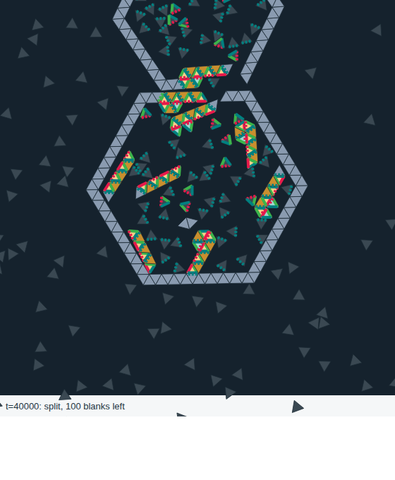 and the parent at t=100000, plug in its top row, 8
    strands inside 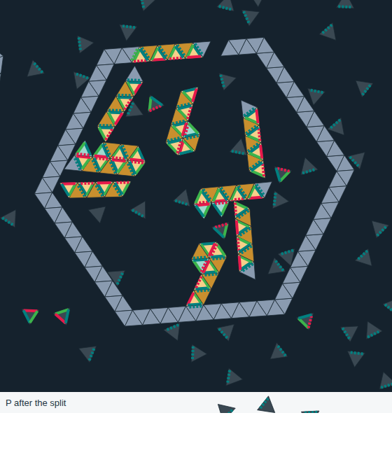
- **Plugging the parent's half: what fails** (measured, seeds 1-4 unless noted; demo options only, default outputs
  unchanged). Run 0320's plug layout as is (`BUDRD=7 BUDDG=-1.75,3.25 BUDA=126:1 ... 100c`): reproduced, a full copy
  in the bud in 1 of 4; with 300 blanks outside also 1 of 4 (the parent's leaked strands copy 280-297 outside).
  - *More food in the parent* (option 1): a radius-7 ring holds about 80 blanks (200 cannot be placed). A radius-9
    parent with 160 (`BUDRP=9 BUDNI=160`) splits at 5000 in 3 of 4 with 144-165 blanks left, but the bud carries none:
    after the split 0 copies inside the bud, 58-65 in the parent, 86-100 outside; full copies 0 of 4.
  - *The founder as the parent's plug* (option 2, `BUDPF=-2.75`, half 12 cells, 5 left open): 1 of 4 split. A strand
    lying in a wall faces the fed interior with its faces only: all 80 blanks became face copies, 12 docks, no fills.
  - *The founder right of the doorway* (option 3, `BUDPX=3` or 4 in a radius-9 parent): it lies under the passage
    facing in (fills 0) or makes no copy at all.
  - *A catching anchor waiting in the parent* (`BUDPA=-1.75 BUDPAG=Z`, radius 9, 160 blanks): 0 of 4 split; its
    `Z@|` is copied 29-47 times and the bud's `W@|` 33-37 (`BUDDBGA`: copy binds on the `@` sides themselves). With
    copy binds on `@` sides refused (`BUDNOCA`, a diagnostic hook, not a rule): splits 3 of 8, full copies in the bud
    in 3 of 8 (2 / 1 / 1), the parent keeps 5-14 strands; the other 5: the parent's plug catches first and its 3-cell
    pore lets no strand reach the bud. A wider parent half (edge -2.75, 5 left open): 1 of 4; the bud anchor cell's
    lower side is then exposed and, hearing its own signal, copied 60-68 times. A catch at -2.25 stands at 60 degrees
    (only edges at -2.75 / -1.75 / -0.75 lie in the row).
  - *A tooth* (`BUDTOOTH=-2.75`: the two cells bonded to the bud, the parent's anchor freed only by the split): the
    parent catches about 10000 steps after the split; meanwhile 3-5 strands escape and copy outside (14 outside at
    the end); no full copy in the bud. First try with a plain `Z|`: never caught, because a non-`@` attached anchor
    takes lone face copies by glue catch (capped). A narrower half with the cap (edge to 0.75, 5 cells open): 0 of 4.
  - Diagnosis: any parent strand outside after the split starves the bud (the bud alone made a full copy in 3 of 4,
    run 0320), so the parent's half must be shut by the split, by a catch after the bud's (cap release does it); and
    a catching anchor near food is a food sink (candidate narrowing, docs/NEXT.md). What remains is the bud's food:
    after the split the outside blanks meet exposed templates (plug backs, the freed doorway side) sooner than they
    pass the bud's 3-cell pore.

## 2026-10-03 (autorun run 20261003-0320, build)

- **Hooded pore: a cell fed through a pore keeps every strand in** — works (8 of 8 worlds with 4+ strands inside, 7 of
  8 lose none; check `imprint-hood`). No new rule; prepared structure (labelled).
  - Design (`imprint ... 150ph`): `imprint p`'s cell (R 6, 3-cell pore, spent walls, anchor `W|` opposite the pore,
    150 copy blanks outside) plus a hood: a strip one row thick lying two rows above the wall over the pore, from x = -2
    to the top wall's corner, held by a strut of 4 cells at its left end (13 cells, all sides spent). Blanks reach the
    pore along the corridor under it (two rows high, open at the right). A strand is a rigid strip about 4 long: to
    leave it must pass the pore nearly upright and then lie nearly flat in the corridor (within about 12 degrees), and
    it cannot turn between the two. A unit triangle can.
  - Evidence (`imprint k 100000 runs 150ph`, seeds 1-8): strands inside / in all 7/7, 4/4, 7/7, 6/6, 6/6, 7/7, 5/6,
    6/6; copies 113-135 of 150 (the corridor slows intake). Plain pore (`150p`, same seeds): 4/13, 1/1, 7/7, 6/10,
    7/7, 5/5, 6/11, 6/6, copies 134-150: in 3 of 8 worlds 4-9 strands leave. Seed 2's founder, caught while busy
    with its backs to the wall in the plain cell (1 strand), copies in the hooded one (4).
  - What it does not do: it does not help a cell compete. With 3 rival strands placed outside (`150phx`, seeds 1-4)
    the hooded cell keeps only its founder (1 inside of 12-19); the plain one 1-2 of 12-17 (`150px`). The rivals take
    all 150 blanks in under 10000 steps. The hood's job is not to make rivals (IDEAS, 2026-10-03).
  - Picture (seed 1, t=50000: 5 strands inside, the hood at the upper right; the run ends with 7 of 7 inside):
    
- **The bud's genome as its plug: a caught strand lies in the bud's gap and closes it but for a pore** — partial: the
  bud's half works (the plugged bud alone makes a full copy in 3 of 4 worlds); the parent's half still leaks.
  - Design (`BUDRD=7 BUDDG=-1.75,3.25 BUDA=126:1 node tri/demos.js budpore k 100000 runs 100c`): the bud is the
    parent's size (R 7; the radius must be odd like P's or the two lattices do not meet) and its half of the doorway
    is 10 cells; its catching anchor `W@|` is the slanted side at the gap's left edge. Dry-run (`BUDDRY=1
    BUDDRYPIC=126:1`): a strand caught there by its low end lies exactly in the bud's wall row, faces into the bud,
    backs out, and leaves a 3-cell pore; at the right edge it stands out at 60 degrees. The catch is the one-way step
    the reversibility argument asks for: the doorway is 6 cells wide until the catch, the bud's opening 3 cells after.
    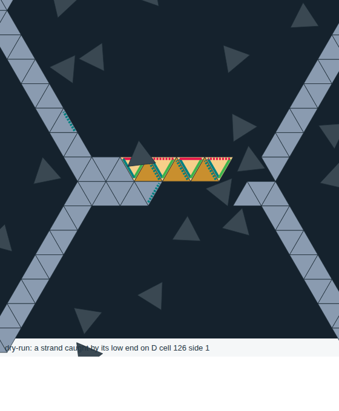
  - Evidence, seeds 1-4: split at 12500 / 17500 / 7500 / 20000 (4 of 4) with 3 / 4 / 0 / 4 strands inside the bud
    besides the plug. With the parent as is, its half (6 cells) lets its strands out (7-13 outside at the end) and
    they take the food: one full copy on the plug strand in 1 of 4. The bud alone (`BUDNOP=1`): strands inside grow to
    7 / 7 / 3 / 6, 7-20 releases inside after the split, a full copy on the plug strand in 3 of 4 (releases 6 / 4 / 6 /
    3); without the plug the bud alone made one in 1 of 3. Picture (the bud alone, seed 1, at t=100000: 7 strands inside,
    the plug strand in the wall at the lower right beside the pore): 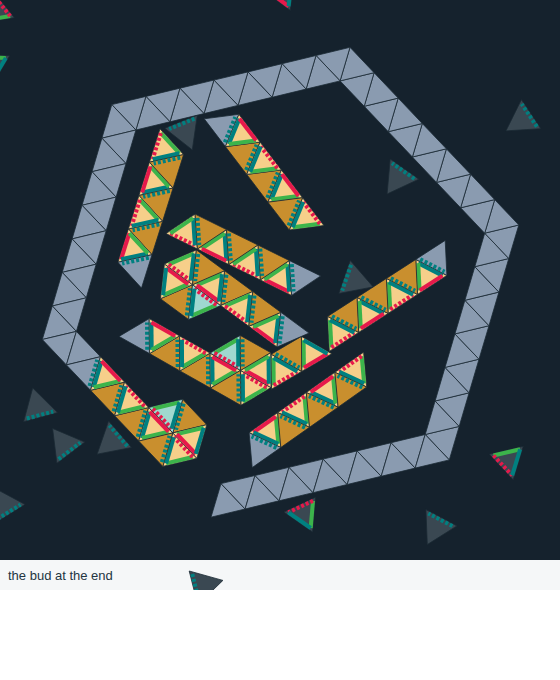
  - The parent's half (not solved): low-end catches on either edge of a 10-cell parent half stand at 60 degrees; a
    high-end catch (`BUDPA=-1.75 BUDPAG=Z`: a `Z@|` anchor catching the `z` end) at the left edge lies in P's row with
    faces into P, at the right edge faces out. 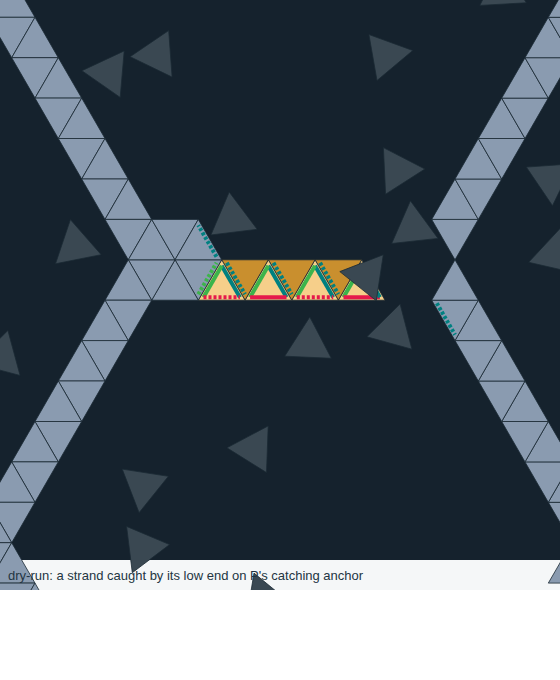 Run with it
    (founder moved to P's bottom wall, `BUDPX=b`, since the left edge is taken): blanks inside P copy the waiting anchor
    cell (36-44 of 80 copies), P makes 1-2 strands, 1 of 4 split. Next step: docs/NEXT.md.
- **M2 on the sealed bud pair (`budpore ... 100c`): not met; no doorway width works** (measured, seeds 1-4, 100000
  steps, `DBGC=1`; demo options only, default outputs byte-identical to main).
  - As is: split 37500 / - / 20000 / 30000 with 1 / - / 3 / 3 strands in the bud; genome copies after the split in the
    bud 2 / - / 4 / 24, outside 84 / - / 96 / 70 (the parent's strands leave through its half of the doorway); no full
    copy on the bud's anchored strand (releases 2 / - / 0 / 1).
  - More food (300 blanks outside, `300c`): outside 257-282 copies, the bud 9-32; one full copy in 1 of 3 splits.
  - The bud alone (`BUDNOP=1`, a diagnostic: at the split every bonded triangle outside the bud is made inert and
    spent, as if the parent's genome were gone): the bud makes 62 / - / 22 / 30 genome copies but its own strands and
    copies leave through its half too (outside 30 / - / 78 / 40); one full copy in 1 of 3. So even without the
    parent the bud's 6-cell opening loses what it makes.
  - Narrower halves (`BUDDG` / `BUDPG` = x range of D's / P's half): the bud's half 3 cells: 0 of 4 split (no strand
    reaches the bud in 100000 steps); 4 cells (`BUDDG=-0.25,1.75 BUDA=104:1`): split 3 of 4 with 1 strand in the bud
    each, outside 57-97 copies, one full copy in 1 of 3. The parent's half 3 cells (`BUDPG=-0.75,0.75`) or both halves 4 cells
    (`BUDDC=1.25`): the founder's top backs face the wall, P makes 0-1 copies, 0 of 8 split.
  - Two anchors in the bud (`BUDA=104:1,114:2`, both `W@|`, the doorway waits for both): 0 of 4 split; strands reach
    the bud 0-3 times in 100000 steps and the second anchor never catches.
  - Rivals: `imprint p` with 3 free strands outside (above): the cell ends with 1-2 strands.
  - Why (IDEAS, 2026-10-03): the physics is reversible, so the opening a strand used to enter the bud is still there
    after the split and lets strands and copies out; free strands outside take the food. The bud needs an opening that
    a binding event narrows after the strand is in. Next step: docs/NEXT.md.

## 2026-10-03 (autorun run 20261003-0050, explore)

- **The bud lets go by completion release: `budpore`'s doorway bond is an `&` bond cut when the bud's anchor has
  caught** — works (same splits as the latch; no rule change). The copy lineage no longer uses trigger `*`, hear `+`
  or latch `~`.
  - Design: the doorway bond (leftmost P-D contact) carries `&` on both sides and no glue. D's anchor `W@|` emits the
    open signal while it waits (an unbonded `@` side with glue); `openRange` is the anchor's distance to the doorway
    cell + 3, so both sides of the bond hear it. When the anchor catches a strand its `@` side is bonded, the signal
    fades (one bond per pass) and completion release cuts the bond; both freed sides are then spent and never copied.
    The walls start spent (labelled starting condition: one completion pass while only the anchor hears its own
    signal, then the range is set; spent sides stay spent). Replaces the latch `~` on the bond, the anchor's trigger
    `*` and the 4-bond hear chain `+` (code at `e2634fb`).
  - Evidence, sealed pair (`budpore k 100000 runs 100c`, seeds 1-8, `DBGC=1`, before the anchor narrowing below):
    split at 37500 / - / 20000 / 30000 / 12500 / 20000 / 5000 / 40000, the same as the latch version in every seed;
    copies of wall types 0 / 0 / 1 / 0 / 0 / 0 / 0 / 0 (latch version: 15 / 0 / 20 / 30 / 57 / 12 / 8 / 24, mostly
    copies of the freed latch side `-~--+` and of P's freed side): all 180 copies go to the genome. Copies made inside
    the bud after the split 2 / - / 5 / 24 / 25 / 0 / 12 / 16 (latch: 6 / - / 1 / 12 / 12 / 0 / 4 / 7); a full copy on
    the bud's anchored strand still only in seed 7. Open pair (`budpore k 200000 runs 300`, seeds 1-4): split at
    35000 / 30000 / 60000 / 45000 (as the latch) with 182 / 199 / 124 / 150 blanks left (latch 176 / 193 / 113 / 136).
  - Earlier `&` hold (run 1921, variant 3) lost 190-210 blanks to the walls: every wall cell hearing the anchor kept
    its free side unspent. Starting the walls spent removes that; the caveat for a grown bud is recorded in IDEAS
    (its walls must be complete before its anchor emits).
  - Picture (seed 6 at the split, t=20400: the bud, top, leaves with 4 strands; the doorway bond is cut, its sides
    spent): 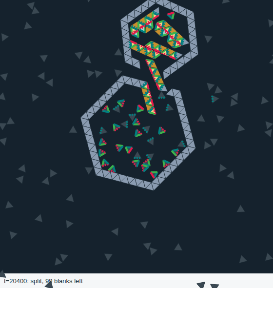
- **Core change (narrowing): a free triangle's anchor side binds nothing** — works as intended; M2 not moved.
  - Before: free copies of the waiting anchor cell (`W@|`, parts) glue-bound strand low ends `w`, capping them, and
    were copied again once attached. Gate entry in RULES (Core changes); test "anchor: a free triangle's anchor side binds
    nothing" (fails on the old rule). Tried first, wider: no anchor side binds by glue, attached ones too; identical in
    `budpore`, but `imprint p` seed 4 then lost most strands through the pore (3 inside of 13, was 6 of 10;
    imprint-pore 2 of 4), so the rule was kept to free triangles (seed 4 identical to before).
  - Evidence (`budpore k 200000 runs 300`, seeds 1-8, both with the completion-release doorway): copies of wall types
    22 / 22 / 35 / 28 / 22 / 30 / 31 / 20, only direct copies of the waiting anchor (old rule: 62 / 65 / 84 / 71 / 84 /
    94 / 47 / 64, of which 14-43 copies of anchor copies bound to strands); genome copies 265-280 of 300 (old 206-253).
    Split at 35000 / 50000 / 40000 / 35000 / 20000 / 45000 / 35000 / 35000 with 165 / 0 / 170 / 183 / 233 / 170 /
    147 / 155 blanks left (old: all 8 with 118-199 left; seed 2 caught late, after the food was gone). Full copies on
    the bud's anchored strand after the split: seeds 5, 6 (old: seeds 1, 2, 7). M2 is still food going outside: after
    the split 89-161 genome copies outside, 2-54 inside D.
  - Full check suite (`node tri/check.js`, with the rule as kept): 36 of 36 pass (`grown` partial as before).
    Coverage hook on `budpore 300`, `budpore 100c`, `imprint`, `imprint 60m`, `imprint 150p` (3000 steps): marks
    present `. @ & | ?` only.

## 2026-10-03 (autorun run 20261002-2321, build)

- **Sealed bud pair (`budpore` option `c`): the parent feeds from food inside and fills its bud with genome copies;
  splits in 7 of 8 worlds** — works as a split (check `budpore-c`); the bud's own copying after the split is still
  1 of 8 (M2 not yet). No new rule; prepared layout (labelled).
  - Design: the doorway joins P and D only (contact cells removed for -0.75 < x < 2.25; the walls touch, unbonded, on
    both sides of it, held rigid by the one latch bond), so nothing gets in or out while joined. 80 copy blanks start
    inside P, 100 outside. P's anchor `W|` is the side of P's wall facing into the doorway at its left edge: the founder
    hangs under the doorway, and the copies made on it are released at the way into D, where D's mid-wall anchor
    catches one and the latch lets go. Each half of the doorway is then a pore.
  - Evidence (`node tri/check.js budpore-c`: `budpore k 100000 runs 100c`, seeds 1-8): split at 37500 / - / 20000 /
    30000 / 12500 / 20000 / 5000 / 40000, strands in the bud at the split 1 / - / 3 / 3 / 1 / 4 / 1 / 3. Before the
    split the food goes to the genome: 150-172 of 180 copies are genome triangles in 6 of 8 worlds (open layout: 107-193
    of 300), and about half are back copies, so fills no longer starve. Controls: the same sealed layout with P's anchor
    in the middle of P's far wall: 0 of 4 split (seeds 5-8; strands seldom pass the doorway); 2-unit doorway: 0 of 4.
  - Still missing (M2): after the split both halves of the doorway are 3-unit pores; P's 4-9 strands leave P and take
    the outside food (out 24-87 genome copies, the bud 0-10); one full copy in the bud in 1 of 8 (seed 7). With 300
    blanks outside: out 66-253, the bud 6-27, still no full copy on the bud's anchored strand.
  - Dropped: the founder hanging from the doorway's right edge stands up into D, but its backs face P's wall: no back
    copies at all (fills 0, 80 face copies) in 4 of 4.
    A second plain anchor `W|` in P beside the doorway (to hold one of P's copies back): splits fall to 2 of 8 (right of
    the doorway, x = 3.5) or 5 of 8 (left, x = -2.5), and as much food leaks out (out 61-86 genome copies).
  - Picture (seed 6 at the split, t=20000: the bud, upper right, leaves with 4 strands, several with partial copies on;
    P keeps the founder and many unused face copies): 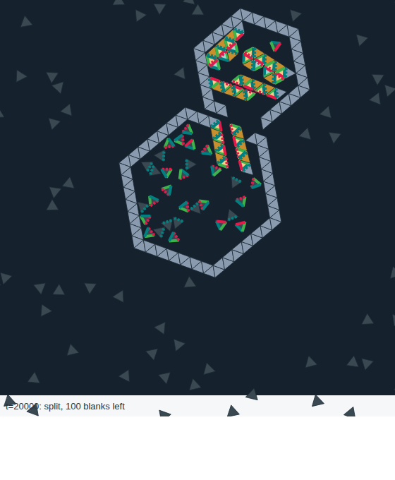
- **M2 (`budpore`: the bud copies its genome after the split): not yet; what limits it is food, not the anchor's
  geometry** (measured). No rule change; the default demo output is unchanged.
  - Dry-run of the catch (`BUDDRY=1 node tri/demos.js budpore 1 10 runs 300`): a strand caught by its low end `w` is
    placed on each inner side of D exactly as the anchor rule places it (`_snapBody`), and each back and face site's
    distance to the nearest wall cell is printed. On every flat-wall side the first back site shares an edge with a
    wall cell (0.58); at the corners the strand lies along the wall (all backs 0). Only side 106:1, next to the latch
    cell, where the acute wedge opens into the doorway, has every back clear: 1.00 / 2.00 / 2.65 (the anchored end's own
    face site is then the one at 0.58).
  - With that anchor (`BUDA=106:1`, seeds 1-4, 300 blanks, 200000 steps): split 4 of 4 (25000-70000), releases on the
    bud's anchored strand 0 / 0 / 0 / 1: no copy. With 600 blanks: 1 / 2 / 0 / 1, no copy, although 300-410 blanks were
    left at the split. Where the food goes after the split (`DBGC=1`): inside D 2-17 genome copies, outside 118-256
    (P's copies leave P through the opening, are free strands with open backs and copy fast in the open food), plus
    freed latch sides (up to 82) and anchor-cell copies (up to 106). The bud's interior is one small target beside an
    exponentially growing population of free strands.
  - Copy economy (seed 3, `DBGC=1` prints copies by type): face copies (`wza`, `zAw` and rotations) 130, back copies
    `-W-` 60, fills 60, docks 122: with `latGlue` every back copy becomes a fill, and fills, not dockers, limit copying
    everywhere. Docked dockers expose their own free sides, so face copies breed at the strand while backs do not.
  - Dropped (measured): `latGlue` off (default anchor): fills from any blank, but wall copies 166-191 and no full copy
    in the bud; 20 blanks placed inside D at t=0: they go to copies of the anchor cell before the catch (wall copies
    135-159), one full copy in 1 of 4; a closed doorway joining P and D only with P's anchor where it was (80 blanks in
    P): P makes 3-5 strands (70% of copies on the genome, nothing leaks out), but strands seldom pass the internal
    doorway: 0 of 4 split (2 units), 1 of 4 (3 units); fixed by moving the founder under the doorway (entry above). Code for `d` at commit `1a77906`; the sealed layout became option `c` (above).
  - Picture (seed 3, anchor 106:1, t=60000, the bud 37500 steps after its split: its strand beside the pore with
    dockers on, waiting for fills; almost no blanks inside): 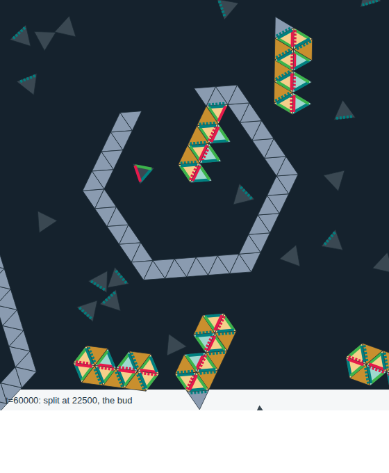

## 2026-10-02 (autorun run 20261002-1921, build)

- **`budpore`: the bud catches mid-wall by the strand's low end and splits with food left** — works (8 of 8 seeds);
  **M2, the bud copies its genome after the split: not yet** (2 of 8 seeds make one full copy). No new rule.
  - Design (fewer exposed sides, same core): D's anchor `W@|*` sits in the middle of D's lower-left wall (the inner
    side farthest from D's corners within 5 ring bonds of the latch cell); the 4 cells from the latch cell towards the
    anchor carry a hear side `+` towards it, so the latch cell hears the anchor's trigger signal (sigRange 6) and lets
    go. The anchor catches a strand's **low** end `w` (the same glue as P's anchor `W|`, which holds the founder): the
    high end, where copying starts (zip), stands free in the bud. The latch bond and every prepared wall side carry no
    glue (prepared bonds need none).
  - Evidence (`node tri/demos.js budpore k 200000 runs 300`, seeds 1-8): split at 35000 / 30000 / 60000 / 45000 /
    65000 / 45000 / 40000 / 45000 with 176 / 193 / 113 / 136 / 106 / 157 / 165 / 139 blanks left (before: 4 of 8,
    70000-135000). Releases of copy triangles on the bud's anchored strand after the split: 5 / 3 / 4 / 1 / 2 / 2 / 0 /
    3 (a full copy of `aAaA` releases 4 dockers): one full copy in seeds 1 and 3. Check `budpore` (seeds 1-4, split
    with 50+ blanks left; the line also reports the bud's copies).
  - Variants measured and dropped: (1) mid-wall anchor catching the high end `z`: 1 of 4 split (the caught end is the
    one copying starts from, pinned at the wall); (2) low-end anchor at the old corner place: splits, but the bud
    makes 0-2 releases (its strand lies along the wall); (3) no latch, an `&` hold two bonds from the anchor (openRange
    3): every cell hearing the anchor keeps its free side unspent and was copied, 190-210 wall copies before the split,
    late catches (56000-151000); (4) the mirrored layout (opening and latch on the other side, anchor on D's
    lower-right wall): 2 of 4 split, no copies; (5) "replicate before dividing": the mid-wall anchor without trigger,
    its anchor side also a latch side (an unbonded latch side emits the lock signal, so the latch holds until it has
    caught), and a second, triggering anchor 2 bonds from the latch cell: the first caught in 4 of 4, the second never
    (no split in 200000 steps).
  - **Why the bud does not copy yet (measured).** First, where the strand's backs face: caught by its low end, the
    strand stands at 60 degrees to the wall with its backs towards the acute wedge (seed 1: back sites 0.58, 1.00 and
    1.53 from the nearest wall cell centre, the first covered by a wall cell; faces 1.0-2.5). Backs there get no
    copies, so fills are rare: the strand docks (seed 1 with weld glue: three dockers by 100000 steps) and waits. Even
    while joined with food around (two-anchor variant below) the bud's strand got 0-3 releases in 100000+ steps.
    Second, food (`DBGC=1`): the blanks are gone by about 80000 steps. After the split the food goes to
    (a) the two latch sides, freed and unspent (with weld glue: seed 1, 105 of 172 blanks; their copies glued into
    crystals on P, now inert), (b) copies of the anchor cell made before its catch: parts `W@|*` that glue-bind strand
    low ends `w` (5-17 per world) and are copied again from their free sides (30-80 copies), (c) most of all, P's copies
    outside, which keep copying (out: 50-100 copy events with 300 blanks; 170-270 with 600). With 600 blanks the bud
    still made at most one copy (seeds 1-4: 0 / 1 / 0 / 0): the bud's interior is a small sink beside many templates.
  - Picture (seed 3: split at 60000 with 113 blanks left; the frames then follow the bud, which makes one copy of its
    strand): 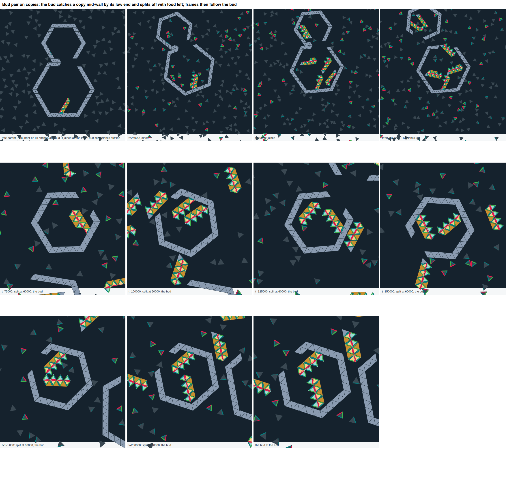

## 2026-10-02 (autorun run 20261002-1551, explore)

- **An anchor catches a strand while it is being copied (core change)** — works; `budpore` (bud pair on copies) is
  still partial, now 4 of 8 seeds instead of 0 of 4. Rule: an anchor side `|` catches a strand end whose spare edge
  is unbonded and carries the complementary glue, whether or not the strand is busy or its end face is docked; the
  strand and its partial copy move as one body into the flush place (RULES, Core changes, with the case). The anchor
  reads less than before (no busy relay, no face bond).
  - Evidence, `node tri/demos.js budpore k 200000 runs 300` (300 blanks outside): seeds 1-4 split at 70000 / 100000
    / no / 95000 with 100 / 81 / - / 83 blanks left; seeds 5-8: no / 45000 (122 left) / 135000 (0 left) / no. Before
    the change, seeds 1-4 never split with 300 blanks (run 0921). A variant that kept "the end's face is free" split in
    2 of 4 (seeds 1, 2). Partial check `budpore` (seeds 1-4, split with blanks left).
  - Cost: `imprint ... 150p` seed 2 now fails (1 strand instead of 7): its lone founder was caught at step 1001 in its
    first copy, before any back had been copied; pinned at the wall its backs face a narrow wedge blanks do not
    reach, so no fill triangle exists and the copy stays docked for good (pictures below). Seeds 1, 3-8 pass (5-8
    identical to before): 7 of 8. A strand caught busy finishes its copy only with fills made elsewhere.
  - Not yet: the bud copies its genome after the split. D holds 1-2 strands at the split and 1 at the end: its anchor
    sits beside a corner (the caught strand lies along the wall, no back exposed). Next: a mid-wall anchor in D.
  - Pictures: `docs/pictures/budpore_busy.png` (seed 1: the bud catches a busy copy at 70000 and leaves, food left);
    `docs/pictures/anchor_busy_deadlock.png` (imprint p seed 2: the founder caught mid-copy, no fills).
  - Checks: all 34 pass with the change (`imprint-pore` 3 of 4), plus partial `budpore`.

## 2026-10-02 (autorun run 20261002-1351, build)

- **Grown bud catches a genome copy** — works: 3 of 4 check worlds at 300000 steps; 6 of 8 seeds at 400000 (5 of 8
  at 300000). `budgrow` with
  `split g`'s content: the bud ring grows on the parent's seed as before, but carries an anchor instead of a cap, and
  the parent holds the genome. No new rule; three existing pieces combined (grown bud, anchor `|`, stamp-cast dockers).
  - Set-up (`node tri/demos.js budgrow k 400000 runs g`, labelled start): the parent P of `budgrow` with the founder
    `aaaa` held by an anchor `W|` (an inner side mid-wall, far from the pocket and the door; placed there at t=0) and
    its stamp pocket casting the founder's dockers `Ay.z` from 40 blanks `xxx` (24 fills `Y--`; `latGlue`), so P makes
    copies `AAAA` whose high end exposes the seed `z`; the bud kit outside. `grownBud({anchorGlue:'Z'})` puts `Z@|` on an
    inner side of an early wall-front cell (cell 6) in the middle of a flat wall: like the cap seed it emits the open
    signal, which holds the pair together until the anchor catches a copy's `z`; then nothing is open, the root's `&`
    lets go, both doors shut and the bud leaves with the copy.
  - Evidence (seeds 1-8, 400000 steps; `events:` lines): ring closed at 133500-229600; doors open 150 steps later; copy
    anchored 29400 / 83150 / - / 35350 / 66700 / 61450 / 209750 / - steps after opening; split 100-150 steps after
    the anchor caught; both doors shut in all 6; no early release. The two failures (seeds 3 and 8) are still open
    with 8-9 idle copies in the parent: a copy must drift through the doorway into the bud with its high end first;
    nothing is wrong at the anchor (copies are not busy: nothing copies `AAAA`). Check `budgrow-g` (seeds 1-4, 300000
    steps, need 3).
    Picture (world 4: growth, open doorway, the bud leaving with its anchored copy; a second bud then starts on the
    parent's seed): 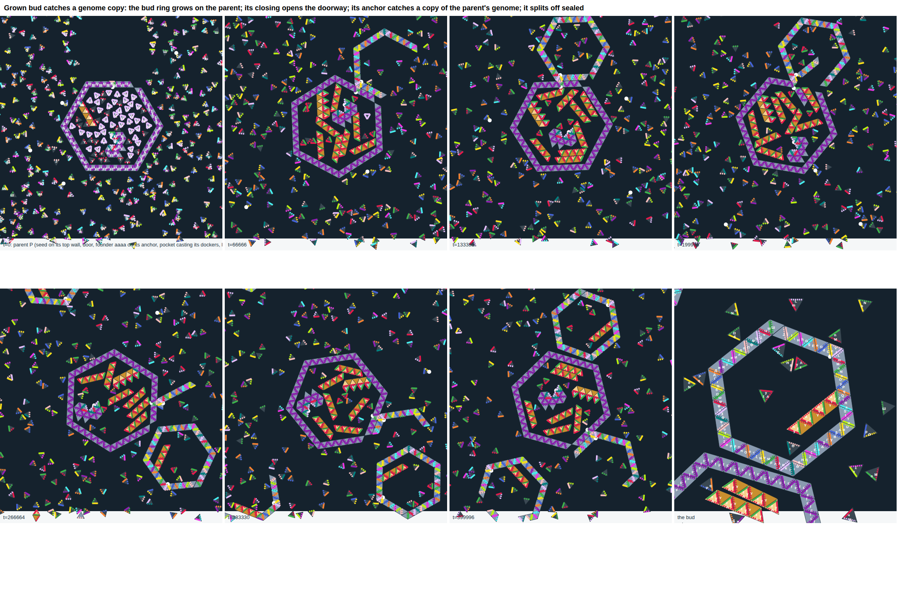
  - **Three design points.** (1) The bud's seed glue must differ from the genome's letters: with the default seed `z`
    a free anchor part `Z@|` bound the parent's seed side in place of the root (the demo passes `seed: 'v'` to `grownBud`; the
    genome uses `a y z w`). To find the letters, the parent's panel welds (prepared, never released) now share the weld letter `f`,
    as kit welds do (54 letters left for the bud; the glue code is Int8: 63 letters in all). (2) **An early anchor and
    a supply race:** after the 7-cell panel front is complete only the anchor emits the open signal, so if the panel
    finished before the anchor's cell arrived, the root let go and the half-grown bud drifted off (seeds 1 and 2 of the
    first run, at 29200 and 33400; a new bud then regrew on the freed seed). The anchor is the earliest mid-wall side
    (cell 6; cells 2 and 4 are beside a corner or in a door sweep) and the wall-front cells up to it get three times
    the supply (as `kitRace`): no early release in 8 worlds. (3) Leftover anchor parts trapped in the bud when it
    closes carry `Z@`, and a copy's seed `z` catches them (one copy per world lost that way); harmless while copies
    are plentiful.
  - Observed, not yet measured: after the split the parent's seed latch is free and a second bud starts growing on it
    from the remaining kit parts (world 4; also in the cap variant). The old `budgrow` report looked up any bonded root
    and so read that second bud after the split: world 1's "door open after the split" was this misreport (same
    events on the old code, doors shut); the report now follows the bud the events track, and `budgrow` is 4 of 4.
  - Limits: the parent and its door, pocket and founder are prepared; the bud carries one copy and nothing that copies
    it (next: food for the bud after the split, as `imprint p` or `split o`); transport through the doorway has a long
    tail.

## 2026-10-02 (autorun run 20261002-1050, harden)

- **Physics: no block passes a gap narrower than itself (midpoint check merged)** — works; capabilities rebuilt on
  it by layout and supply changes only (no rule change). A direct move longer than a sub-step (0.8) now needs a clear
  midpoint as well as a clear end. Before, a block sitting in a one-row wall's hole hopped across the wall (95 of 2000
  kicks of 0.95), and six checks relied on such hops (run 0721's core review). A probe (`runs/pinch.js`, scratch;
  logic: wrap the midpoint check, log every move it blocks and the lone blocks that bind within 3 steps after one)
  and pictures located each site:
  - **budgrow** (1 of 4 -> 3 of 4): the bud ring's last site q began exactly at the parent's top-right corner apex,
    so the only way in was a channel exactly one block wide (0.866) between the parent's slanted wall and q's
    neighbour. `grownBud` now requires the last site's approach (q mirrored across its free side) to share no side
    with any cell; no layout of any ring size met it with the current door search (the one candidate at offset 3 has
    the parent's door hinged at its corner, swinging up into the bud's door), so the parent's outer corner cell next to
    q is left out: its two neighbours still meet at a point, the parent stays one sealed body (no block passes a
    point) and q's way in is a 120 degree opening. The door search now tries every clear door pair.
  - **split-o** (0 of 4 -> 4 of 4): the bud's import door dropped its blank into a pocket boxed in by the open
    panel, the wall and the anchored strand (centroids 1.2 from the sweep); the panel could not swing back over it and
    the door never shut again (imports 2-18 instead of 13-43). `budPair` keeps the drop place clear (strand, its dock
    sites and the organelle at least 2 away) and tries the next import door candidate when nothing fits.
  - **lid, grow** (single seed -> 4 worlds, need 3): seed noise, not the hop. Eight-seed sweeps give the same mean
    under both rules (lid 7.0 vs 6.6 casts; grow completes 5 vs 6 of 8; on the old rule grow's seeds 1-4 complete 2).
  - **imprint** (2 of 4 at 100000 -> 3 of 4 at 200000 steps): also noise at its threshold (both rules: 3 of 8 worlds
    at 100000 steps; main itself fails world 3). Two stalls remain: a ring at 28/30 whose second-to-last site faces
    inward (with that site and the last one open, the gap through the one-row wall is a rhombus exactly one block wide:
    only a part already inside can fill it), and early part starvation (rings at 7 and 2 cells).
  - **grown** (1 of 1 -> partial): the lid pocket's cell beside the slot is a leaf of every kit tree; if the cell above
    it arrives first, its site is closed off except through the slot (a race, `structures.kitRace`). Three times the
    supply of such cells completes the pocket in 4 of 4 worlds; membrane roots 6 instead of 2 (otherwise the faster
    pocket went live before a membrane root attached). The membrane now closes in 1 of 4 worlds by 200000 steps
    (others stop at 72-76 of 78; not diagnosed). The check is partial.
  - Picture: the import door trap in split-o before the change (the open panel, the boxed-in blank `uuu` between it,
    the wall and the anchored strand): 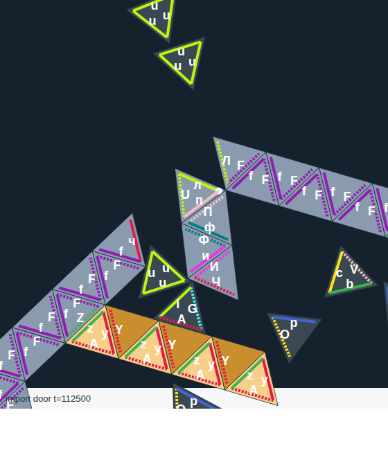
  - Command: `node tri/check.js budgrow split-o lid grow imprint` (about 15 minutes).
  - Enables: membranes, pores and doorways are now sealed for anything wider than the gap; claims about what gets in
    or out (pore feeding, controls) no longer depend on a leak.

## 2026-10-02 (autorun run 20261002-0921, build)

- **A cell fed through a pore (genome on copies, food from outside)** — works (4 of 4 worlds). A ring with a pore
  copies its genome from copy blanks that come in from outside; no new rule. This answers the core change candidate's
  design (b) ("a pore: the rings' outer walls take every blank"): that was true only with plain walls. With every free
  side spent (`&` on the outer, inner and pore-edge sides of a complete ring, which hears no open signal), nothing on
  the cell's surface can be copied, so blanks pass the pore and copy only what lies inside.
  - Set-up (`node tri/demos.js imprint k 100000 runs 150p`, labelled): the sealed ring of `imprint m` (R 6) without
    the 3 wall cells in the middle of its top wall (a pore), an anchor `W|` in the middle of the bottom inner wall,
    the founder `aAaA` (seeded as `seedCopyGenome`) inside, 150 copy blanks outside only (world 20 x 20).
  - Evidence (100000 steps): 6 / 5 / 5 / 5 strands inside (17 / 14 / 6 / 12 in all: copies leave through the pore
    and are copied outside too); all 150 copies are of genome triangles, none of the wall. Controls: no pore (`150pc`):
    0 copies, the founder alone; plain walls with the pore (`150pn`): all 150 copies are of wall cells, no genome copy.
    Checks `imprint-pore` (need 3 of 4 with 4 or more strands inside and no wall copies), `imprint-pore-c`,
    `imprint-pore-n`. Picture (world 1): 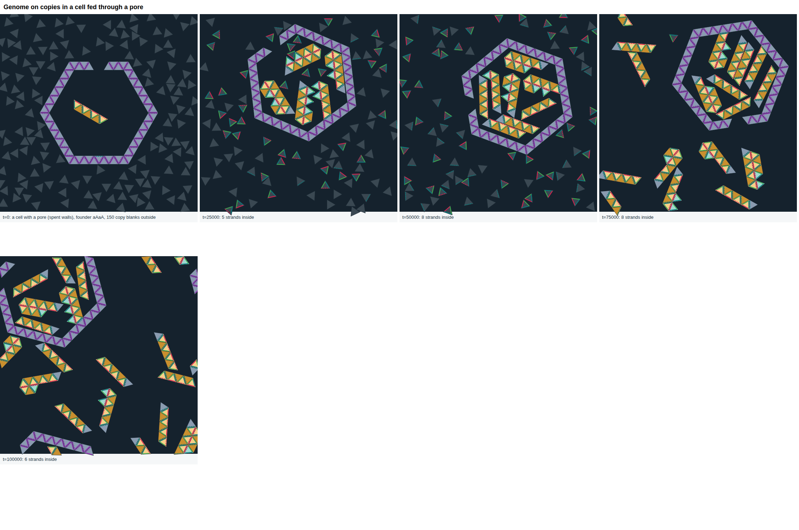
  - **The anchor must sit in the middle of a flat wall.** First placed at a hex corner: the anchored founder lay along
    the next wall with its backs against it, no back could be copied, so no fill existed and the first copy stayed
    docked for good (world 4: 1 strand). In the middle of a flat wall the strand stands at 60 degrees into the cell,
    faces and backs exposed. (The same trap is run 0236's "founder bound to P's anchor at t=0", variant (d).)
  - Limits: the anchor holds one strand (the founder, or a copy if the founder left first); copies leave through the
    pore as freely as blanks come in (no selectivity: a pore is as wide for a strand end as for a blank); food is a
    finite batch outside (150 blanks).
  - Enables: a bud that copies its genome after the split, fed through its own pore (below); the core change
    candidate "bringing copy blanks into a cell" is no longer needed for feeding.

- **Bud pair on copies with a doorway (`budpore`)** — partial: the pair splits in 2 of 4 worlds; the bud never copies
  its genome after the split (M2 of the build line: not yet). Fewer parts than `split q`: no doors, no `&` pairs, no
  open signal on the walls. P (R 7) and D (R 5) are joined by one latch bond beside a single opening that joins P, D
  and the outside; D's anchor next to the latch is `Z@|*`: when it catches a copy's high end its trigger side is bonded
  and the latch lets go (existing rule: a latch lets go while a non-hinge partner has a bonded trigger). With no open
  signal every wall side is spent from t = 0. Command: `node tri/demos.js budpore k 200000 runs 150`. Picture (world 4,
  split at 54000; last frame: the bud, its strand lying along the wall): `docs/pictures/budpore.png`.
  - Evidence (150 blanks outside, 200000 steps): split at 130000 / no / no / 55000; both splits came after the blanks
    were spent; the bud then held 1 strand and made no copy (no food left, and its strand lies along its wall).
    300 blanks: no split (worlds 3 and 4 to 200000 steps, D held 2-3 free strands for over 100000 steps and caught
    none; worlds 1 and 2 stopped at 95000 without a split).
  - **Why D's anchor does not catch (measured):** a probe counted strand ends with seed `z` within `capture` of D's
    anchor site every 20 steps (world 3, 60000 steps): 52-87 approaches, all while the strand was busy (busy 26-30),
    0 capture attempts. A strand's seed is active only while it is not being copied; with blanks around, a blank
    touching a face becomes a docker beside it and zip docks the high end first, so ends are idle only for moments.
    `split g` catches because its dockers come only from P's pocket. Core change candidate, built in run 1551 (RULES, Core changes).
  - **Tried and removed, `split ... qp`** (pores in run 0236's `split q`): the `&` pairs that hold a pair lie on both
    sides of its doorway (P's doorstop and pairs left, D's hinge, doorstop and a pair right), joined only round D, so
    D's anchor needed open range 27 (two anchors: 11); every wall cell in range keeps its free side and outside blanks
    copied them: 200 copies in 5000 steps, 2% of them genome. Pores in a pair's walls also cut the open signal's way to
    the pairs (a second gap). A first `budpore` with `&` pairs on one side of the doorway (range 4, 9 cells hearing)
    still lost 60-90% of the blanks to the neck. Hence the latch hold.
  - Next: the bud needs a mid-wall anchor (a hear chain `+` from the anchor to the latch allows up to 5 bonds) and an
    anchor that catches busy strands (core change), then food lasts past the split.

## 2026-10-02 (autorun run 20261002-0236, build)

- **Genome on copies inside a sealed cell** — works (3 of 4 worlds). A cell copies its genome from copy blanks alone:
  no casting pocket, no dockers or fills in supply. No new rule: two existing pieces combined.
  (1) A genome that is its own reverse complement (faces `aAaA`), so copies of its face triangles are its dockers and
  copies of its backs its fills (`latGlue`: every back carries `W` on its next side, every face triangle `w` on its
  prev side and `z` on its next, so only back copies fill and every strand, founder or copy, exposes `w` at its low end
  and `z` at its high end; `demos.seedCopyGenome`). (2) **Spent walls:** every plain free side of the membrane is a
  completion side `&` (no glue, binds nothing). A complete structure hears no open signal, so these sides are spent at
  once, and spent sides are never copied: every copy blank goes to the genome instead of the wall.
  - Evidence (`node tri/demos.js imprint k 40000 runs 60m`, sealed ring R = 6, founder and 60 copy blanks inside):
    5 / 2 / 5 / 6 free strands (founder included); all 60 copies are of genome triangles, none of the wall. Control
    (`... 60mn`, plain walls): 2 / 2 / 3 / 3 strands; the wall takes 34-42 of the 60 copies. With 40 blanks: 2-4
    strands (control 2). Checks `imprint-cell` (4 seeds, need 3 with at least 4 strands and no wall copies) and
    `imprint-cell-n`. Picture: 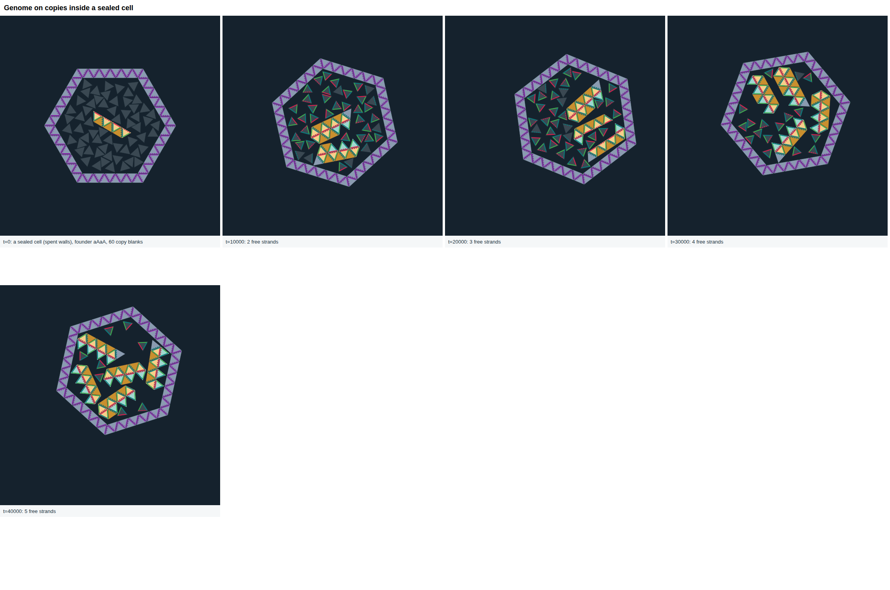
  - Limits: a finite batch: blanks are spent in about 2000 steps; dockers come out unbalanced (`a` against `A`) and a
    copy waiting for a missing docker type stays paired with its template for good. Blanks cannot be imported (a copy
    blank binds only by its copy side, so no key catches it): a core change candidate, found not needed in run 0921 (a pore with spent walls feeds a cell).
  - Enables: a bud that copies its genome after the split without a pocket (it is complete then, so its walls are
    spent); food for the genome is one uniform blank type.
- **Bud pair on copies (`split ... q`)** — partial: 1 of 4 worlds. `split` with the genome above and 70 copy blanks
  inside P as the only food (no stamp pocket, no dockers or fills; P's anchor `W@|`, the founder free in P, all plain
  free sides `&`, `openRange` 30 so D's anchor's open signal reaches the `&` pairs that hold the pair, op 3-10 at t=0,
  but not P's far walls). P makes 1-2 copies of its genome; in world 4 one reaches D's anchor and the pair splits at
  38000 with both doors shut; worlds 1-3: no strand reached D's anchor in 150000 steps (stalled half-copies; strands
  crowded by 70 free copies). P's anchor `W@|` emits the open signal too until it holds a strand (it held none), so
  only 3 of 134 wall cells were spent; with a plain `W|` (tried, 4 worlds, removed) 60 of 134 are spent, P makes 2-4
  strands and strands enter D in 3 worlds, but D's anchor caught none (0 of 4 split; not diagnosed). Command: `node tri/demos.js split k 150000
  runs q` (variant removed 2026-10-02, cleanup run 1821, superseded by `budpore`; code in git at `c11ed14`). Picture (world 4): `docs/pictures/split_copies.png`.
  Tried on the way (each 4 worlds): (a) RP 9 and 140 blanks, plain walls: the walls took 65-70% of the copies, copies
  stall, no anchoring; (b) a pore in P's wall and 400 blanks outside: all 400 were spent on the rings' outer walls,
  none got in; (c) `&` walls with glue-agnostic fills: copies of `&` wall cells became fills and were cut when their
  `&` side heard no open signal (91 cuts in one world), hence `latGlue`; (d) the founder bound to P's anchor at t=0:
  it lay along the wall with its backs hidden, so no fill copies were made.

## 2026-10-02 (autorun run 20261002-0136, explore)

- **Contact copying (programmable synthesis, decided and built)** — works in isolation. The explore run compared part
  templating, translation and kit-free growth through the core-change gate (IDEAS, decision; RULES, Core changes) and
  chose the smallest templating: one mark, the copy side `?`. A copy blank (`-?-?-?`, a free triangle) binds by a copy
  side to any free side of an attached triangle, whatever its glue, takes that triangle's whole type (the partner
  turned about the shared edge: glues, marks, carried marks) and lets go in the same pass. No machine: the body is the
  template. Unlike stamp pockets this closes the loop: any part on a body's surface, stamp casters included, can be
  multiplied from one uniform blank type.
  - **Ring from copies** (`node tri/demos.js imprint k 100000 runs`, world 36, 400 copy blanks, no free parts): a ring
    (R = 3) grown one motif round on an anchor (root and 5 motif cells: one of each part, prepared, labelled) and a bare
    anchor. Copies of the ring's cells and root complete the ring and start and complete a second ring on the bare
    anchor: both closed in 3 of 4 worlds (closures 61353 / 51554, 33960 / 81267, 26388 / 36407 steps); world 3
    stalled at 7 and 3 cells: one part type (an inner-facing cell) got a single copy before the blanks were spent
    (blanks are used up in about 10000 steps, shared by whatever is exposed: anchors, roots and outer faces take most).
    Control (`... c`, blanks without `?`): 6 cells, nothing copied (2 of 2 worlds).
  - **Genome on copies** (`imprint k 30000 runs g`): a founder strand whose faces `aAaAaA` are their own reverse
    complement and 200 copy blanks, no dockers or fills in supply. Copies of its face triangles are its dockers, copies
    of its backs its fills: 10 / 15 / 12 / 8 free strands after 30000 steps (4 of 4 worlds); control `gc`: 1 strand.
  - Pictures: 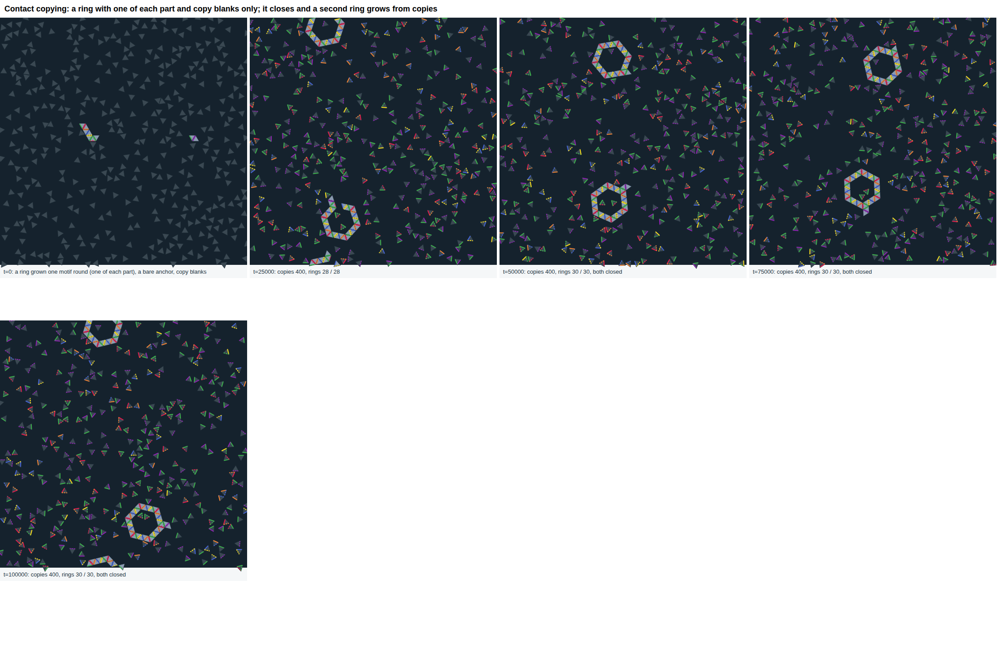 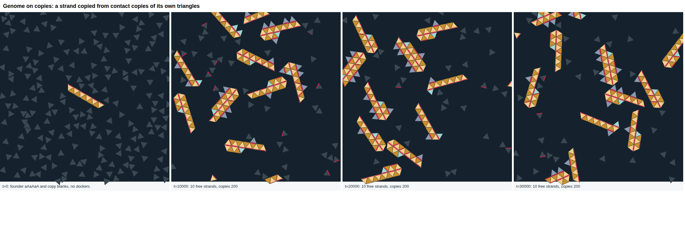
  - Limits (stated in the gate entry): only free sides are copied (5 of the lid pocket's 16 kit cells are enclosed when
    complete; a closed ring's inner faces only from inside); everything exposed is copied, strays and anchors too; a
    finite blank supply goes to whatever is exposed, not to what is needed.
  - Enables: feeding a bud from copies of its parent's own parts and a genome that makes its own dockers, so kit parts
    and casting pockets need no longer be food; a later core-review may remove stamp marks and casting.

## 2026-10-02 (autorun run 20261001-2235, build)

- **Grown bud** — works (4 of 4 worlds). The bud ring is no longer prepared: it grows from free kit parts on a seed
  side of the parent's wall (`structures.grownBud`, demo `budgrow`; the parent, its stamp pocket and blanks are a
  labelled prepared start). Every bud cell is its own type (54 types, 4 copies each). From the root two fronts grow: the
  bud's door panel (7 cells along the contact row, hinged to the root) and the wall the long way round; the wall's last
  cell q meets the panel's far end flush, unbonded. No new rule; the order of events comes from existing signals:
  - **Doors held by the lock signal.** Both door panels (the parent's, 5 cells, and the bud's) are pulse doors (`#`)
    with a built-in trigger, so they open whenever they hear no lock signal. The parent's seed side, the root's seed
    side and every site of the wall front are latch sides (`@~`): while any is unbonded it emits the lock signal. So
    both doors stay shut while the bud grows and open about 150 steps after q arrives (its ring is closed).
  - **Open signal from the panel front and the content.** Latch sites emit no open signal; the panel front's sites
    and the cap seed (on the wall front's second cell) do. The root's seed side is a completion release (`&`): while
    the cap is open the pair holds; the parent's stamp pocket casts cap parts from blanks, they come through the
    doorway and grow the three-cell cap; then nothing is open, the seed bond is cut for good, both seed latches are
    open again, their lock signal swings both doors shut, and the bud drifts off with its panel.
  - **Geometry.** A grown panel hangs only by its hinge (any second bond locks the flap). The panel's far end must
    separate from q when it swings into the bud, so q is an up-triangle in the contact row; one resting on the parent
    would make q's site enclosed (its three sides taken), so the bud sits shifted 2 to the side and q overhangs the
    parent's top corner (its free side faces open space). `grownBud` searches this layout (offset, panels, pins,
    sweeps, cap place).
  - Evidence (`events:` line per world, 250000 steps): ring closed at 141450 / 154150 / 152600 / 172650; the parent's
    door never moved before that (0 degrees); doors open 150 steps later; cap cells 900-4600 steps after closure;
    split 100-200 steps after the last cap cell; both doors shut. Sigma-0 test of the door order in `tri/test.js`.
  - Command: `node tri/demos.js budgrow 1 250000 runs` (about 3 minutes; extra: copies per type). Picture (t=0, growth,
    the closed bud with its cap, the bud after the split): `docs/pictures/budgrow.png`.
  - Limits: the parent is prepared and its door is not regrown; the next bud would need the parent's seed latch only
    (it is free again after the split) and a new kit supply; the content is a cap (no genome or organelle yet); a
    small race remains (if the 7-cell panel completes before the wall front's second cell arrives, nothing is open
    and the root lets go early; not seen in 8 worlds).
  Enables: the BIG goal's "builds its offspring" on a grown bud; next, a genome copy and a pocket in the grown bud.
- **Physics fixes (two leaks through walls)** — found because cap parts left the closed parent ring. (1) A lone block
  that started touching another block (cast products and released parts do) could take its whole kick when that
  reduced its overlap, of any length, and jumped through a one-row wall on kicks above 1.44: the overlap-reducing move
  is now at most 1.0. (2) A lone block's trial checked only blocks in the 3 x 3 grid cells (1.4 wide) around its start,
  but reaches 1.15 + its move; near a cell edge it moved into wall cells it had not checked: the search now covers the
  whole reach. Tests for both (each fails on the old code). Effect on old capabilities: kit pockets grow a little
  slower (blocks no longer tunnel into kit sites); `heir` needs 45000 steps (was 30000) and `cycle` 200000 (was
  120000) on the check's seed (old physics: third generation in 2 of 4 worlds at 120000; new: 0 of 4 at 120000, seed 1
  at 200000), and `split o` 450000 (was 200000: with 200000 two of 4 worlds were still joined; at 450000 all 4
  split at 60000-285000, import 34-51 blanks and copy their genome). `node tri/check.js`: 24 of 25 with the old
  `split-o` horizon (that check then failed 2 of 4); `split-o` at 450000 was run separately on its 4 worlds: 4 of 4.

## 2026-10-01 (autorun run 20261001-2006, harden)

- **Capability checks (`tri/check.js`)** — works. One command runs every capability ROADMAP marks as working (24 checks:
  each an existing demo on fixed seeds with pictures off, `TRI_NOPIC=1`) and reads a pass condition from the demo's
  own last report line (copies made, casts, ring closed, blanks imported, bud split with doors shut, ...), with
  controls (factory without pockets, energy in the dark). Capabilities claimed for several worlds run 4 seeds and need
  3. At most 4 processes, longest jobs first; about 8-9 minutes on a 4-core container (`grown` alone takes 5.5 min).
  First run: 22 of 24 passed; `cells` (2 of 4) and `live` (2 of 4) had fallen below their recorded 3 of 3, fixed below.
  Command: `node tri/check.js` (or `node tri/check.js ring live` for some).
- **A bud that lives alone** — works (4 of 4 worlds, prepared pair; was 2 of 4). An end-of-run report (demo `split`,
  extra `o`) lists each kit cell missing from the bud's pocket, its tree parent, its kit neighbours and where the
  copies of its type are. It found two causes, neither supply: (1) a yolk blank `uuu` that had come in through the
  doorway closed onto two casters' close-only instruction sides `U.` in the pocket's last caster site (cell 1) and
  blocked it for good (seeds 2 and 3); the bud needs `uuu` only after the split, so none starts inside P any more (all
  40 start outside and come in through the bud's own door). (2) Then cell 13 stalled in seeds 3 and 4: its site had a
  side on the bud's wall, so once its parent was there a part could enter only through one side (a narrow site);
  `budPair` now prefers, after kit risk, the organelle placement with the fewest kit cells touching the wall (one with
  none exists, same kit). Result: in all 4 worlds the pocket completes (16/16), the pair splits (t=40000-153000), both
  doors shut, the bud imports 33-50 blanks through its own door, casts its dockers and makes a whole `aaaa` copy of its
  genome (two in world 2). Command: `for k in 1 2 3 4; do node tri/demos.js split $k 200000 runs/sl$k o > runs/sl$k.log
  & done` (about 3 min per world). Picture (world 3 after the split: its pocket, imported `uuu`, the anchored `AAAA`
  and its copy `aaaa`): `docs/pictures/split_alone.png`. Enables: the full BIG-goal sentence on a prepared pair; next,
  grow the pair instead of preparing it.
- **Heritable cells, reliability** — 4 of 4 worlds (was 2 of 4 on the current engine). The founder's first docker races
  the membrane root for its high end; a root there first commits the founder to wrapping before any copy (docks=0).
  Supply changed from 12 dockers per face type and 8 roots to 24 and 4 (one root per cell): every world makes 4 cells
  (47-48 docks per world). `node tri/demos.js cells 1 100000 runs 36`.
- **Grown import door, reliability** — 4 of 4 worlds within 150000 steps (was 2 of 4). With 3 kit copies per cell,
  leftover kit parts trapped inside the closed ring lay in the door's sweep and jammed the panel half open (50000
  stalls, one import). With 2 per cell the ring closes later (54000-57000; one world about 120000) and imports 14-15
  blanks. `node tri/demos.js live 1 150000 runs 6x2`.

## 2026-10-01 (autorun run 20261001-1806)

- **A bud that lives alone: split, import, cast and a whole genome copy made inside the sealed bud** — partial: 2 of
  4 worlds (prepared pair; `split ... o`). First demo run with the lock-signal deafness rule (a trigger side is deaf
  while it hears the lock signal) and with 3 kit parts per organelle type (was 2). In both successful worlds the pair
  splits (t=53328 and t=119988), both doors shut, the bud imports 42-47 blanks `uuu` through its own door, its grown
  pocket casts `aU.w` dockers (16 casts) and a new `aaaa` copy forms in the bud next to its anchored `AAAA`.
  In the other 2 worlds the bud's pocket stalls at 14-15 of 16 cells with the doorway still open, so nothing splits.
  Before the retune (2 parts per type, same rule) 1 of 4 worlds ran fully (split at 119988, 35 imports, two new
  `aaaa` in D); the other 3 stalled at 14-15/16. The rule change caused no regression: `split 1 30000 runs` (cap,
  split at 9000) and `split 1 60000 runs g` (split at 24000) still work. Command:
  `for k in 1 2 3 4; do node tri/demos.js split $k 200000 runs/sj$k o > runs/sj$k.log & done` (about 2 min per
  world on a 4-core container). Picture (world 4 after the split: pocket, imported `uuu`, anchored `AAAA` and its
  copy `aaaa`): `docs/pictures/split_alone.png` (since replaced by the 4-of-4 run's picture). Status: partial (2 of
  4); fixed in run 20261001-2006 (above).

## 2026-10-01 (fourth session)

- **Bud, feed, split: the parent feeds its bud through a doorway; the bud seals and separates when complete** — works
  (4 of 4 worlds, prepared pair). `structures.budPair`: a parent ring P and a bud ring D (prepared, labelled) share a
  flat contact held by completion-release pairs `&`; a doorway runs through both walls. Each door panel (5 cells,
  welded by hear sides, a built-in trigger between its first two cells, so always triggered) is turned open into its
  own ring (P's 120 degrees, D's 60) and held there by a `&` pair to a doorstop cell welded to the wall; that loop
  locks the hinge. While anything bonded to the pair hears an open signal (a growth front in D), all holds. When
  nothing is open: every `&` lets go, P and D drift apart, and each panel swings shut and closes (close-only pair)
  onto the wall cell beyond its doorway, which locks it shut. No new rule: completion release, built-in trigger,
  hinge lock by a bond loop. Two contents tried:
  (1) `split 1 30000 runs`: a stamp pocket in P casts blanks into one part type `A@-a@`; the parts diffuse into D and
  grow a three-cell cap on D's inner wall (one type fills it: the three slots are turns of each other about a vertex).
  The cap completes and the pair splits at 4700-8700 steps in 4 of 4 worlds (rerun on the fixed physics); both doors
  shut; D leaves with its cap and 3-5 blanks; 2-4 free triangles escape while the doors swing (flood-fill count).
  Picture: `docs/pictures/split_cap.png`.
  (2) Genome (`split 1 60000 runs g`, RP 7, RD 5): P holds a chain `aaaa` and a stamp pocket casting its dockers
  `Ay.z` (fills `Y--` as food, latGlue); copies `AAAA` carry seed `z` on their high end. D's wall has an anchor
  `Z@|` (new mark, below), which emits the open signal until it catches a copy. The parent's wall has an anchor `W|`
  for the founder's seed `w` (copies do not carry `w`). Result: a copy is anchored in D and the pair splits at 22000,
  32000, 34000 and 36000 steps; both doors shut in all four; the founder stays in P in all four (anchored there in 2;
  in the first runs without that anchor the founder drifted into D in 1 of 4); one copy slipped out in 1 world. A
  strand lying in the doorway can jam a closing panel (seen once before the parent anchor: P stayed open).
  Picture: `docs/pictures/split_genome.png` (t=0, feeding, split, the bud with its anchored copy and food).
  (3) Organelle (`split 1 150000 runs o`, RP 8, RD 6): the bud also grows its own stamp pocket from a seed `v@` on its
  wall, from kit parts (16 types, 2 each) that start in the parent as food, and the pocket casts `aq.w`, the dockers
  the bud's copy `AAAA` needs. **Yolk**: its blanks `uuu` and fills `Q--` are food only the bud's pocket uses (the
  parent's pocket takes `xxx`; with shared blanks the parent ate them all and the bud left with none). Result: in 3 of 4
  worlds the pair splits at 70000, 75000 and 140000 steps with the bud's pocket complete and a copy anchored; world 4
  had 6/16 pocket cells at 150000. After the split each bud cast 1-3 dockers from its yolk and started a copy, which
  stalled: about a third of the yolk reaches the bud (by area), too little for a whole copy (4 dockers, 3 fills). The
  founder stayed in the parent in 2 of the 3 (anchored there); in one it drifted into the bud before being anchored.
  Some free triangles escape while the doors swing at the split. Picture: `docs/pictures/split_organelle.png` (the bud
  after the split: its grown pocket, the anchored copy with a stalled copy on it).
  (4) Import door (same command, current version): the bud also has a revolving import door (`importD`: key `U*`
  catches blanks `uuu`, deaf until the split), its dockers are `aU.w` (the blanks are also their fills), and 40 `uuu`
  start outside. The bud's closing pair is interlocked with its import door: its wall side is a latch that emits the
  lock signal while the doorway is open, so the import door holds until the closing door is shut (without it the
  import door opened at the split while the doorway was still open; a ring with two gaps fell into two pieces in 2 of
  4 worlds). Result (4 worlds, 200000 steps): splits at 100000, 113000 and 140000 steps (the fourth had 14/16 pocket
  cells). In world 3 everything ran: both doors shut, the bud then imported 36 blanks, cast 4 dockers and is copying
  its anchored genome (docks with fills placed, slow). In worlds 1 and 4 the bud's closing door jammed at 87 degrees
  on a free copy lying in the doorway at the split (P shut; the bud stayed open). Picture:
  `docs/pictures/split_import.png` (the bud after the split, filled with imported blanks, its pocket and its copying
  genome).
  Not yet: a whole copy made in the bud, fewer jams (fewer free copies in the parent, a smaller door sweep), a grown
  pair.
- **Anchor `|`: a structure catches a strand** — works (in `split g`). A strand cannot otherwise join an existing
  structure: capture needs a free triangle and closures need an exact fit. An unbonded anchor side catches a strand
  end's seed (its spare edge, active while the strand is not being copied, complementary glue) when the end comes
  within capture distance of the site, as it would catch a free triangle: the strand moves as one rigid body into the
  flush place if that place is free (physics; chosen by role, the strand end, not by body size).
- **Physics fix: long bodies** — a body's offsets were taken as the torus minimum image from one member, so a body
  longer than half the world (P+D, 21 units in a 32 world) folded: its far cells were turned about a wrong point and
  drifted apart while their bonds stayed (D's wall opened and things leaked out). Offsets are now unwrapped along
  bonds (`Physics._unwrap`). Test added; earlier demos used bodies shorter than half their world.
- **Stamp casting: the metabolism makes the parts of a membrane** — works (4 of 4 worlds). New rule: marks written
  after an apostrophe on a side are *carried*: they do nothing there, and a cast product takes them with that side's
  instruction glue (`Kb.'@X*` casts `b@` onto the product). So a pocket can cast kit parts, which carry attach marks
  `@` (before, casting stripped every mark, and parts could only come from the supply). `structures.stampInstr(type)`
  gives a lid pocket's instruction tokens for any part type. Demo `stamp`: five prepared lid pockets (labelled
  starting condition) stamp blanks `xxx` into the five motif parts of a ring kit (R=3: `A@-b@`, `-B@c@`, ...); an
  anchor with the ring's root (prepared) grows the ring from cast parts only (no parts in the supply). 60 blanks: all
  cast by ~20000 steps (about 12 of each part, unevenly), the ring closes at 36000, 61000, 64000 and 95000 steps in
  worlds 1-4 (the last two or three parts are slow: they must find the one open site). Heritable too: a stamp pocket
  kit (16 types, carried marks kept by `kit`) grows from a seed and casts `A@-b@` (`grow 1 20000 runs 4s`: complete at
  17000 steps, 4 parts cast by 20000). Limits: one pocket per part type (5 pockets of 16 cells for a 30-cell ring); a
  product carries nothing, so a pocket cannot cast stamp casters (no closed loop of part making yet).
  `node tri/demos.js stamp 1 60000 runs`. Picture: `docs/pictures/stamp_factory.png`. Enables: a cell whose pockets
  make its offspring's membrane (feeding), membranes in worlds whose only food is blanks.

## 2026-10-01 (second session)

- **Cell kit: one seed grows a membrane with a pore and an organelle** — partial (in progress). `structures.cellKit`
  turns a door ring kit plus an organelle (two lid pockets joined, `pocketPair`, casting dockers `AXm` and `aXm`) into
  one kit grown from the chain's seed `m` (R=7: 110 cells, 59 types, 62 of 63 glue pairs; the alphabet gained 13
  Cyrillic pairs). Placement by search: organelle on an inward wall cell, slots and lid space clear of wall, door
  sweep and the chain with its dock sites; the door must also not sweep the chain (it did: the panel stalled against
  the chain beside its hinge, flickering its latch 7686 times). New pieces, all local:
  **pore**: a 6-cell panel with a built-in trigger, held to the wall by a completion-release pair `&`; once the cell
  hears no open signal it lets go and swings out for good (a strand leaves through a 6-cell pore in ~5-20k steps; a
  4-cell pore at a hex corner barely lets it out). **Spent sides**: a `&` side whose triangle hears no open signal is
  spent and binds nothing again (with a latch, the open wall side recruited spare panel cells and a second ring grew
  on the first). **Late organelle**: its wall seed is a trigger side, deaf while the wall grows, so the wall closes
  and the pore opens first, then organelle parts come in through the pore (otherwise the ring closed before the
  organelle in 2 of 3 worlds and the cell was stuck). Also fixed: door searches use the direction the hinge really
  turns. Status (4 worlds, 100 blanks, chain `aaaaa`): the wall completes at ~340-380k steps, the pore opens, then
  the organelle grows inside, slowly (its parts must wander in through the pore): complete in 1 of 4 worlds by
  ~900k, the others 1-2 cells short at 1.5M. In that world the organelle cast dockers, the chain copied inside its
  cell, copies were copied again inside (with the second docker type), and **a copy left through the pore**
  (~1.1M steps; four free copies by 2.6M, some copied again outside by dockers that drifted out). A free copy was
  bound by a membrane root and **began its own cell** (root, wall cell and pore panel), but its long wall front stopped
  after one cell: each unique wall part had 3 copies, one went into the parent and one into a ring that a root started
  on a copy *inside* the parent (roots enter through the pore too). Not yet: a complete offspring cell. Lessons: the
  late organelle is safe but slow (parts must find the pore); roots inside the parent waste parts and trap copies;
  supply of unique parts limits the number of cells. Picture: `docs/pictures/birth.png` (world 3 at 2.6M steps: parent
  cell with organelle and copies, free copies above, the offspring's started wall). Long runs continue with
  `TRI_RESUME`. `node tri/demos.js birth 3 900000 runs` (demo removed 2026-10-02, cleanup run 1821; code in git at `c11ed14`).
- **Heritable factory cycle on rigid physics** — works (third generation in 2 of 3 worlds by 150000 steps). Founder
  `aaaaa` with seed `y`; two pocket kits in the supply: P_y casts blanks into dockers `Az-`, P_z casts `ay-`; fills
  `Z--`/`Y--` (latGlue), blanks 60. The founder grows P_y (complete at 35000-40000) and casts `Az-`; its copies
  `AAAAA` carry seed `z` (a docker's lateral glue left free at the copy's end) and grow P_z, which casts `ay-`; their
  copies `aaaaa` carry `y` again. World 1 by 150000: 59 casts (42 `Az-`, 18 `ay-`), five strands, a third-generation
  `aaaaa` that has regrown P_y; world 2: a third-generation strand without its pocket yet; world 3: second generation
  with pockets. Blanks run out (1 left in world 1). No rule changes were needed since the old engine.
  `node tri/demos.js cycle 1 150000 runs`. Picture: `docs/pictures/heritable_cycle.png` (strands with their pockets).
- **Grown protocell: a chain grows its own cell, feeds it and copies inside** — works (4 of 4 worlds). Chain `aaaaa`
  with seed `z` on its low end and `y` on its high end; in the supply: the door membrane kit (R=7, 78 cells, 4 copies
  per cell), a lid pocket kit (16 types that cast blanks `xxx` into dockers `A--`), blanks and junk; `pLoose` 0.05.
  From `y` the pocket grows (complete at 40000-105000 steps), from `z` the membrane with its import door (closed at
  105000-175000). The open signal orders the work without any counter: while the membrane grows, its signal reaches
  the pocket through the chain, so the pocket's sensor stays idle; the membrane cannot let go until the pocket is
  complete. Once the cell is closed: the door imports blanks (36-42 by 250000), the pocket casts dockers inside (20-24
  casts), and the chain copies inside its own membrane (1-4 copies `AAAAA` per world; the first cast always after
  closure, the first copy 10000-25000 steps later). Two fixes on the way: proofreading (`pLoose`) no longer drops a
  key's cargo (the door's blank fell off mid-swing), and the pocket kit gets a richer supply (if the membrane closes
  before the pocket's last cell arrives, that site is inside and the cell is stuck: 2 of 4 worlds with half the
  pocket supply). Not yet: the copies cannot become cells (their dockers carry no seeds, and kit parts cannot enter).
  `node tri/demos.js grown 3 250000 runs`. Picture: `docs/pictures/grown_protocell.png`.
- **A grown membrane with its own import door** — works (3 of 3 worlds at R=6). The door ring kit
  (`structures.doorRingKit`) grows two fronts from its root, which holds the chain's seed: the periodic motif the long
  way round, and a short unique front (one wall cell, then a four-cell door panel attached by its latch side `~`,
  welded by hear sides `+`, whose last cell carries the key `X*` outside and a close-only hinge side). The motif's last
  cell closes onto that hinge side, so the hinge exists only once the ring is closed (a door that swung while the wall
  was open would carry half the wall). Local rules: only unbonded attach sides `@` (growth fronts) emit the open
  signal (`&` sides do not), relayed through every bond (range 120); a trigger side binds nothing (catch or closure)
  while its triangle hears the open signal, so a sensor is live once its structure is complete. So the key stays idle
  until the wall has closed, and the ring lets go of the chain while its key is free. Then a blank binds the
  key, the latch lets go, the panel swings 120 degrees inward, drops the blank and swings back; junk is not caught.
  Chain `aaaaa` (seed `z`), 3 kit copies per cell in a 26x26 world: membranes closed at 28000, 36000 and 44000 steps,
  chain inside, 13-15 blanks imported by 88000 (2 junk slipped in while the door was open). A geometry bug found on the
  way: the "faces outward" test used Euclidean distance, which misjudges sides near hex corners for R >= 6 (the last
  site faced inward and could only be closed by triangles trapped inside); now hex radius everywhere.
  `node tri/demos.js live 1 90000 runs 6x3`. Picture: `docs/pictures/grown_door.png`. Enables a cell that feeds itself:
  the genome grows its membrane and the door that brings in its food.
- **Locality audit (user: "a triangle shouldn't know it is part of a larger structure")** — done. All chemistry rules
  reviewed; three non-local rules removed: closures that asked whether two triangles are in the same body (now one flush
  tolerance, 0.05, for every closure), snapping the smaller of two bonding bodies (removed), copy release reading two
  bonds away (the partner now exposes whether a fill is beside it, computed after bonding). Physics exceptions labelled
  (rigid bodies, flap locked by a loop, binding into free sites). Recorded in AGENTS.md (Locality, with the mistakes),
  RULES.md (Locality audit) and NEXT.md. Re-checked: copying 30-32 docks per 10k steps, factory 4 + 3 copies, conveyor,
  lid, import, grow, bud unchanged.
- **Heritable cells: copies wrap themselves** — works (3 of 3 worlds). Genome `aaaa` with seed `z` on its high end
  (there a smaller membrane fits: R=4, 42 cells, 7 motif types); dockers `Ay.z`/`ay.z` carry `z` on their next side, so
  a copy's high end exposes it again; fills `Y--` (latGlue). In each world the founder made a copy, then founder and copy
  each grew their own membrane and were released inside it: two cells, each with its genome (by 40000-60000 steps).
  Local rules added on the way: a strand end's seed is exposed only while the strand is not being copied, and a high end
  held by a completion-release side starts no copy (commitment: a wrapping genome stops copying, so copy and membrane
  do not jam each other); a kit's growth sites (`@` on an attached triangle) take parts only (a free docker had bound a
  membrane front and seeded a second membrane inside it); the dockers' prev side is close-only (a loose fill had stuck to a copy's end in the membrane's way).
  `node tri/demos.js cells 1 100000 runs 36`. Picture: `docs/pictures/heritable_cells.png`.
- **Encapsulation: a chain grows its own membrane** — works (2 of 2 worlds). The chain's low end exposes seed `z`; a
  periodic ring kit (R=6, 66 cells, 11 motif types) whose root binds the seed by its inner side grows the membrane
  around the chain; the root is chosen so the last two sites face outward (a corner pair), so the ring can close from
  outside; the root's seed side releases on completion (`&`), leaving the chain free inside. The ring size was found by
  a placement check (R=4 and 5 touch the chain or its dock sites). 12 copies per kit type in a 26x26 world: membranes
  complete and released at about 45000 and 65000 steps, chain inside in both. `node tri/demos.js wrap 2 100000 runs`.
  Picture: `docs/pictures/encapsulation.png`. Enables heritable cells: copies carry the seed and can wrap themselves.
- **Budding: a daughter ring grows on the parent and lets go when complete** — works (5 of 5 worlds released a
  complete daughter; 2 released two). New local rule, the open signal: an attached part with an unbonded glued side
  (an open growth front) emits a signal relayed one bond per pass and fading by 1 per bond; a side marked `&` lets go
  once its triangle hears none, i.e. once the part it grew into is complete. The daughter's root carries its seed
  side with `&`: when the ring closes, the last open sides vanish, the signal fades and the daughter detaches; the
  parent's seed is free for the next daughter. Geometry found by search: the seed sits at the tip of a three-cell
  stalk on the parent, so the daughter's closing gap (always next to its root, with one front) is 2.5 away from the
  parent (with the seed on the wall, the last sites faced a crevice and never filled). Two growth fronts were tried
  and dropped: they meet at a random cell, and an inward-facing last cell can only be filled from the closed inside.
  Parent R=3 ring, daughter kit (5 motif types x 14, 6 roots) in a 20x20 world, 50000 steps: first daughter released
  at about 15-30k steps. Test: a complete prepared daughter lets go, an incomplete one holds.
  `node tri/demos.js bud 3 50000 runs`. Picture: `docs/pictures/budding.png`. Enables division: the same signal can
  release a bud that carries a genome copy and a factory.
- **Protocell: import, metabolism and copying inside a membrane** — works (2 of 2 worlds). Combines the import ring
  (R=7), and inside (labelled start, layout found by a search that keeps slots, dock sites and the door's sweep free) the
  chain `aaaaa` and two lid pockets that cast blanks into its dockers `A--` and `a--`; outside 50 blanks and 30 junk
  triangles, no dockers anywhere. 40000 steps: in both worlds the pockets cast 15 dockers inside, the chain made a full
  copy `AAAAA` inside, junk inside 0, products outside 0-1. Control without pockets: blanks accumulate inside (16), no
  casts, no copies. Bottleneck: import (one door; about one catch per 6000 steps; some blanks drift in while it is
  open). `node tri/demos.js cell 2 40000 runs` (`none` = control). Picture: `docs/pictures/protocell.png`.
- **Selective import: a revolving door** — works (2 of 2 worlds). A one-row ring whose door is a 4-cell panel (welded
  with hear sides) hinged at an inner corner, with a catch side (X) on an outer face: a caught blank triggers it, the
  latch hears the trigger through the panel (new: a latch lets go while its triangle hears a trigger), the panel swings
  120 degrees inward carrying the blank, drops it inside, swings back and re-latches. The design was found by sweeping
  panel and carried blank (rigid parts). 12 blanks and 24 junk triangles outside, 20000 steps: 11 and 12 blanks
  inside, junk inside 0 in both worlds (a few blanks slipped out while the door was open and were carried in again).
  The membrane now feeds its inside selectively: the transport step of a metabolism. `node tri/demos.js import 1
  20000 runs`. Picture: `docs/pictures/import.png`.
- **Physics speed (second round)** — a move short enough that it cannot pass through a one-row wall (under 1.0; passing
  needs 1.44) is taken after a single check; one bisection; inlined neighbour loops. A 357-triangle world: 4.2 -> 2.0
  ms per step; binding faster (737 vs 177 catches in the benchmark).
- **Rigid-part physics (user: "let connected parts move as one"; "no deformation and squeezing is fine")** — works.
  `tri/physics.js` rewritten: a body (blocks joined by bonds) is one rigid piece; each step every body tries a
  Brownian translation and turn and moves in sub-steps until contact (move or stop): no overlap, no deformation, no
  tunnelling, no constraint passes. Hinged flaps turn by the same checked move and stall when blocked. Binding:
  a free triangle within 0.6 of a free site beside a complementary side is placed in it (capture; it cannot bind
  into an occupied site); closures inside one body only when flush, between bodies the smaller is placed flush.
  Speed: copy world 1.9 -> 0.5 ms per step, a 357-triangle cycle world 7.6 -> 1.5 ms (about 5x). Re-run on it:
  copying 26 docks in 10k steps (2 copies and copies of copies; was 4-14); lid pocket 6-8 casts per 4000 steps;
  factory 4 new `aaaaa` + 3 `AAAAA` in 30k steps (best so far); energy (lid pocket with fuel) 13 casts paid by 13
  carriers (was 2 casts); ring membrane closed in 2 of 2 worlds at 12939 and 8463 steps (was 40k); gated ring
  (rebuilt) opens and tracers cross (28 crossings in 10k steps); conveyor 4-5 hand-offs and 14-20 drops per 3000;
  grown pocket complete in 2 of 3 worlds by 13.6k steps; heritable pocket: founder, copy and copies of copies grow
  pockets. Fixes the rigid world needed: hand-off flaps no longer re-close on their cargo; flaps catch only at
  rest; in kits only caster B catches (a target in the slot before B arrived closed B's cell off); `pLoose` frees a
  triangle held on one side only. Not yet on rigid physics: the old hatch pocket (its carried target bulges into a
  caster; superseded by the lid pocket) and the airlock (its door panels collide with the wall; rebuild with swept
  doors like the gate).
- **Gated ring rebuilt (swept door)** — works. A hinged panel in a closed wall collides with its latch neighbour
  unless its latch edge moves away during the swing; a search over ring doors found clear 120-degree doors: panels of
  three cells (two at a corner) hinged at an outer vertex, swinging out. `structures.ring` now picks such a door by
  sweeping it, welds the panel with hear sides (the key's signal reaches the hinge two cells away) and puts the key
  trigger next to the latch. `node tri/demos.js gate 1 10000 runs 12`.
- **Heritable factory cycle (progress, old engine)** — partial (works on rigid physics, see above). Two kits (pocket P_y casts `Az-`, pocket P_z casts
  `ay-`), founder `aaaaa` with seed y. By 48000 steps in world 2: the founder grew P_y and cast 50 `Az-`; its copies
  `AAAAA` grew P_z (one complete) which began casting `ay-` (2). Not yet: a third generation. Re-running on rigid
  physics.
- **Aligned bonds (user: "edges don't seem to align, which leads to deformation")** — works. Diagnosis: a free
  triangle bound as soon as its corners were within 0.45 of flush, so cells joined tilted; in a grown strip, cells two
  apart then overlapped, their contact forces pushed against the pins, and the strip jammed bent (flush gaps up to
  0.28-0.40, bonded neighbours overlapping by 0.1; a prepared strip stays at 0.000). Fix (rule): binding pulls the
  free triangle in, placing it exactly flush against its partner's side. Grown rings and pockets now: worst gap
  0.008-0.03.
- **Kit safety: no enclosed cells** — works. The grown pocket stalled at 15/16 (and the cycle worlds too): caster B's
  cell lies between its k cell, the frame below and the slot; in 2D the frame must close around it, so once anything
  sits in the slot B can only squeeze in through it. `kit()` now scores each tree: a cell is risky if, when it
  arrives, all its sides may already face cells no deeper than it (not its descendants) or a slot; the generator picks
  a risk-free root (next to B, so B arrives before the frame closes around it). With binding probability 1
  (`pBond`, was 0.5; binding was limited by flush encounters anyway): grown pocket complete at 6400 steps in 2 of 2
  worlds (was 10-11k, and stalls), 11-13 casts by 16000.
- **Rigid clusters (cluster shape matching)** — works. Even with flush bonds, a grown one-row C curled: each joint's
  tiny angle error bent the same way, and over 28 joints the front overlapped the root region (a prepared 28-cell C
  among free triangles: far end up to 2.15 off its design position). The local pin solver cannot keep long strips
  true. Now blocks joined by full bonds form a cluster whose exact lattice shape follows from the bonds; once per step
  each cluster is pulled onto the best-fit rigid placement of that shape (hinged parts stay free). Far end now within
  0.36. Running it more often than once per step made frames effectively infinitely heavy, and hinged flaps got kicked
  by their frame (conveyor: no hand-offs), so once per step it is.
- **Ring membrane from a periodic kit** — works (closed in 1 world at 40202 steps; others still growing). A one-row hexagonal ring
  of side R is six repeats of a (2R-1)-cell motif; motif types attach in a cycle of unique glues (no counting), the
  root carries the seed on its outer side and closes the ring by a close-only glue. R=3: 30 cells from 5 motif types +
  root. 30000 steps, 12 copies per type: 28/30 cells in 2 of 2 worlds, a clean hexagon with every bond flush (worst gap
  0.03); before the alignment fix the open C crumpled into a spiral. `node tri/demos.js ring 1 60000 runs 3`. Picture: `docs/pictures/grown_ring.png`.
- **Heritable pocket: a chain grows its machine, copies regrow it** — works (2 of 2 worlds). The founder `aaaaa` exposes
  seed `z` on its low end; dockers `Az-`/`az-` carry `z` on their prev side, so every copy's low end exposes the seed
  again (the template's high end becomes the copy's low end). A placement check (`world.partPlacement`) picks the kit
  root and seed side so the grown pocket meets neither the chain, its dock sites nor the cells beside them. Fills must
  be `Z--` (`latGlue`): a docker used as a fill exposed `z` on a hidden back and grew extra pockets mid-chain. 30000
  steps, kit x12: world 1: the founder, its copy `AAAAA` (complete 16-cell pocket, casting) and the copy of the copy
  each grew a pocket at their low end; world 2: founder and copy (copy's pocket complete). The products here (`-A-`)
  lack the seed, so copies built from them would not inherit (fixed in the cycle demo). `node tri/demos.js heir 1
  30000 runs`. Picture: `docs/pictures/heritable_pocket.png`.
- **Greek glue letters** — 24 more glue pairs (α..ω / Α..Ω) so two kits can use disjoint alphabets.
- **Grown pocket (kit generator)** — works (3 of 3 worlds). `structures.kit(tris, root, reserved, seed)` turns a
  prepared structure into kit types that grow it from one root cell: a breadth-first spanning tree (root chosen for the
  shallowest tree), one unique glue pair per tree edge, casters attached by their activator edge (unique glue plus the
  new activator mark `%`), all other shared edges close-only closures. Three problems found and fixed on the way:
  (1) a free caster stuck to a caught target by its recognition side, so the new attach mark `@` makes a free part
  bind only by its attach side (and never dock or fill); (2) a hinge bound at the 0.45 tolerance kept a crooked rest
  angle, so hinge rest angles snap to the lattice; (3) a caster that arrives after the slot caught a target finds its
  cell enclosed (in 2D the frame must close around it), so caught triangles held on only one or two sides now let go
  (option `pLoose`, the user's cooperative-binding idea; a fully recognized target casts at once). Lid pocket for the
  factory part (`-A-`, recognition X), 16 kit types x 12 in a 16x16 world with an anchor + root (labelled start): the
  pocket completed at 11200, 10400, 11200 steps and cast 5, 8, 7 times by 16000. `node tri/demos.js grow 2 16000 runs
  12`. Picture: `docs/pictures/grown_pocket.png`. Enables heritable machines (grow from a strand-end seed next).
- **Factory on lid pockets** — works (2 of 2 worlds). Same factory world (chain `aaaaa`, blanks `xxx`, no dockers),
  two lid pockets casting `A--` and `a--`, 30000 steps: world 1 made 3 new `aaaaa` and 2 `AAAAA` (58 casts), world 2 3
  and 3 (60 casts), all 60 blanks used; control without pockets: nothing. Before (hatch pockets): one generation
  cycle in 1 of 2 worlds in 40000 steps. `node tri/demos.js factory 1 30000 runs Aa`.
- **Lid pocket (bulge-free casting pocket)** — works (3 worlds). Diagnosis of the old hatch pocket's stall: a triangle
  turning 60 degrees about a corner sweeps its far corner along an arc that bulges 0.134 past the chord, straight
  into the fixed caster across the target's far edge, so the carried target jams (seed 1: one catch, then nothing for
  4000 steps). New design: the target slides into an open V notch between two fixed casters (B, R); R's recognition
  side is a trigger, its signal is heard through one frame cell (Q) by a lid hinged to Q (new marks: hear side `+`,
  wide hinge `=` 120 degrees); the lid turns about a corner of the slot, so its leading edge arrives flush and nothing
  bulges into the target; cast; the trigger lets go and the lid reopens. 4000 steps, 16 targets: 5, 5 and 9 casts
  (seeds 1-3) against 0-2 for the hatch pocket. Test: deterministic catch-close-cast-reopen. Enables faster factories;
  the heard trigger wires any sensor side to a flap a few bonds away (signals for budding and division later).
  `node tri/demos.js lid 1 4000 runs`. Picture: `docs/pictures/lid_pocket.png`.
- **Copy deadlock fixed: zip copying** — works (copies complete in 4 of 4 worlds that deadlocked or stalled before).
  Diagnosis: two partial copies on one template leave an empty dock site enclosed on all three sides (template face,
  the lower copy's last fill, the upper copy's dock); no free triangle can reach it since the no-tunnelling fix, so
  the busy relay stays high for ever. Fix (rule): a face docks only while it hears zip from the strand's high end
  (relayed through docked faces and backs), so copies grow one face after another and every dock site is an open
  notch. Sequential docking is slower, so the binding tolerance went from 0.3 to 0.45 (also 2-3x faster conveyor
  hand-offs). copy world (abaabb), 10k steps: zip + 0.45 gave complete copies `BBAABA` in seeds 1-4 (seed 1 also a
  copy of the copy); without zip, seed 3 deadlocked (`BBA*` + `BA*`).
- **Speed** — physics 2.6x faster (cell-grid broad phase, radii cached per pass, allocation-free triangle SAT; same
  results bit for bit): copy world 8.6 -> 3.3 ms per step.

## 2026-10-01

- **Clean engine (`tri/`)** — works. The typed-triangle world was ported out of the old research stack (core letter
  chemistry, half-cells, seeded engine; about 3,500 lines) into `tri/physics.js` + `tri/sim.js` (about 400 lines).
  Same rules and parameters; growth programs, marks, pieces, hands, blades and the damage field were dropped.
  Checks on the new engine: tests pass (`node tri/test.js`); energy demo gives the same numbers (2 casts, 3
  carriers spent, 15 recharges in 10k steps); pocket casts at a similar low rate (5 casts in 3 x 8k steps against
  1-3 per 4k before); conveyor 8 hand-offs in 3k steps (2-4 before); about 3 ms per step.
- **Energy** — works (light on/off, one world each). Charge state; discharged triangles bind nothing (user); a
  hinge with a fuel side spends one charged carrier per swing; carriers recharge in a light zone (environment
  drive). Pocket with fuel, carriers starting discharged, 10k steps: light off: the hatch caught a target and waited
  unfuelled (9692 steps), no casts; light on: 15 recharges, 3 swings, 2 casts.
  `node tri/demos.js energy 1 10000 runs [dark]`. Picture: `docs/pictures/energy.png`.
- **Factory: pockets cast a replicator's parts** — works (closed cycle in 1 of 2 worlds). Chain `aaaaa`; the world
  starts with blanks `xxx` and no dockers. Pockets cast blanks into the dockers `A--`/`a--`. One pocket kind (A--),
  two pockets, 20k steps: 26 casts, a complete copy `AAAAA` by t=10000; control without pockets: nothing. Both kinds
  (Aa), 40k steps: world 2 made `AAAAA`, then the copy of the copy `aaaaa`, then a second `AAAAA` (two generations, 46
  casts); world 1 stalled at a partial copy. `node tri/demos.js factory SEED 40000 runs Aa` (`none` = control).
  Pictures: `docs/pictures/factory.png`, `docs/pictures/factory_cycle.png`.
- **Typed arms** — partial. An arm is a series of distinct types grown from a seed glue on a strand end; each type
  attaches by the complement of its parent's exposed glue and exposes the next glue on side 1 or 2 (the bend); a
  type exposing nothing ends it. Dockers carry the seeds on their side edges, so copies show them again. The shell
  pattern 222112 (mirrored at the far end), 12 of each type in supply: both founder ends grew their planned
  7-triangle arm in 20k steps; copy fragments grew arms too; copying was slow (5 docks).
  `node tri/demos.js arms 1 20000 runs 222112` (demo removed 2026-10-02, cleanup run 1821; code in git at `c11ed14`). Picture: `docs/pictures/typed_arms.png`.
- **Airlock with interlock (user: a double lock)** — partial. One-row ring with a lock: inner door, two-cell
  chamber, outer door; pulse doors (a key opens, is let go, the door swings and re-latches); a lock signal from an
  unlatched door makes the other door ignore its key. Without the interlock both doors opened together and the ring
  tore; with it, in 30k steps the doors never stood open together and the ring kept its shape. Not yet: no key got
  through (it is pushed away by the opening door; a lock is not a pump).
  `node tri/demos.js airlock 1 30000 runs 24` (demo removed 2026-10-02, cleanup run 1821; code in git at `c11ed14`). Picture: `docs/pictures/airlock.png`.
- **No tunnelling (user: jumping single walls is a bug)** — works. Kicks reached 1.8 against a 0.87 wall; a body
  whose centre path enters a block of another structure is moved 1/2, 1/4 of the way or not at all. One-row ring:
  141 crossings in 3k steps before, 0 in 6k after; two-row ring 0 in 8k. Costs: copying and catching slower
  (triangles no longer jump into nooks through structures). Picture: `docs/pictures/sealed_ring.png`.

## 2026-09-30

- **Gated ring membrane** — works (mechanism; the open ring bends). Closed ring; door = two-triangle panel latched
  into the wall, hinged at its outer corner; a key on its outer face unlatches it and it swings 120 degrees out.
  With keys: door opened, tracers crossed; without: none. Once open the ring is a C that bends wide (any doorway
  turns a 2D ring into a C), which led to the airlock. `node tri/demos.js gate 1 10000 runs 12r2`.
  Picture: `docs/pictures/gate.png`.
- **Conveyor (hand-off between hatches)** — works. Hatch 1 catches a block and swings it to hatch 2; once the block
  is bonded twice hatch 1 lets go (hand-off `^`); hatch 2 swings on and drops it (`!`). Lessons: a flap needs free
  space beside the side it swings toward (13% bulge); a loaded flap drives at half rate so a returning one wins.
  `node tri/demos.js conveyor 1 3000 runs`. Picture: `docs/pictures/conveyor.png`.
- **Driven hinges, triggers, latches, close-only sides** — works. Hinges open and close by a trigger (user: not
  floppy), carry what is bonded to the flap; pulse doors; latches; interlock. Rules in docs/RULES.md.
- **Hatch casting pocket** — works. Two fixed casters with close-only recognition sides and a hinged hatch: the hatch
  waits open, catches a target, swings it into the centre, the cast happens, the hatch reopens; 20 casts in 3 x 4k
  steps before the tunnelling fix, all through the hatch. Weakness: the carried target presses on a caster during
  the swing, which then completes only with lucky jostling. `node tri/demos.js pocket 1 4000 runs` (demo removed 2026-10-02, cleanup run 1821; code in git at `c11ed14`).
  Picture: `docs/pictures/hatch_cycle.png`.
- **Casting** — works. A triangle glue-bonded on all three sides to activated casters takes their instruction glues
  and lets go: a permanent, in-simulation type change, general (any type) and rare by chance (needs a frame).
- **Typed triangles; copying reads glue** — works. Types are three side glues in complementary pairs; one binding
  rule; docking needs the complementary face glue. Template `abaabb` -> `BBAABA` (reverse complement) -> `abaabb`.
  `node tri/demos.js copy 1 10000 runs`. Picture: `docs/pictures/typed_copy.png`.
- **Triangle-only chains (foundation)** — works. One block shape; letters T/R/Z by hidden backs (gap 0/1/2); exact
  moulded copying verified geometrically (turns within 4 degrees, corner gaps under 0.05); bent chains copy; fills
  2 - gap; refractory faces stop re-docking under a copy that is still peeling off. Pictures:
  `docs/pictures/letters.png`, `docs/pictures/copy_frames.png`, `docs/pictures/copy_verify.png`; the lattice arm
  planner's shell: `docs/pictures/arm_planner_shell.png`.
